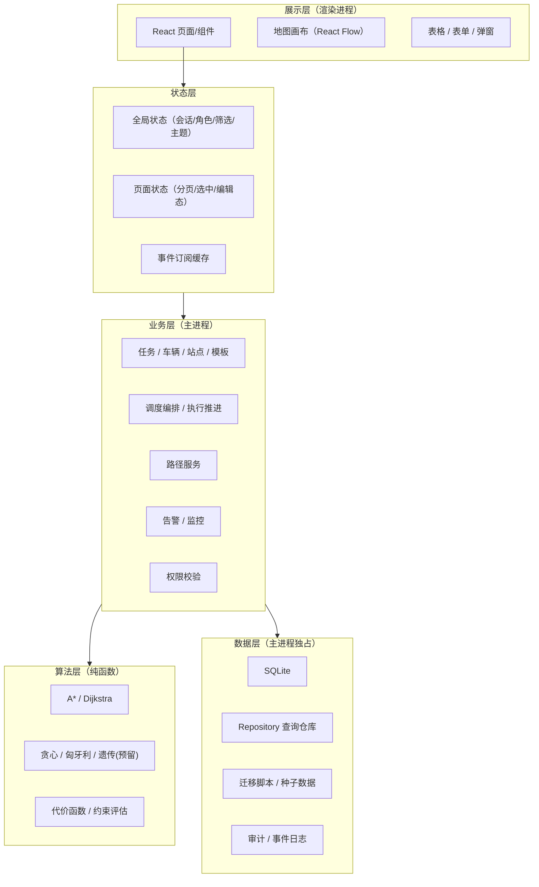
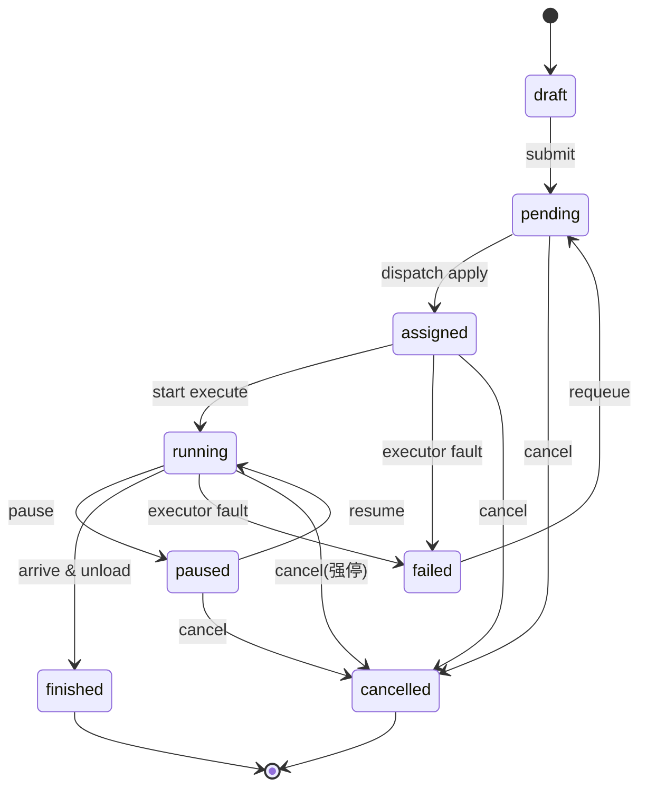

# 无人物流调度管理软件 设计文档

> 版本：v1.0（文档阶段）
> 维护约定：本文档与 `docs/api.md`、`AGENTS.md` 同步更新；规则冲突以本文档与 `AGENTS.md` 的「最新设计决策」为准，并回写相关文档。
> 原始需求存档：`docs/requirement-raw.md`。
> **文档边界**：本文件只负责「模块需求条目（`Req-*`）、状态机、数据模型字段语义」。其余事实按 [`docs/api.md`](docs/api.md) §0「文档事实单一来源」引用，**不复述可漂移的数值**。

## 1. 项目总览

### 1.1 背景与目标

本系统面向**园区、仓储、校园等中小规模场景**，用统一桌面化管理界面，完成无人车队的任务创建、车辆调度、路径规划、执行监控与异常处理，形成完整业务闭环。

业务目标：

1. 用一套本地优先（local-first）的桌面应用管理「任务 → 车辆 → 路线 → 执行 → 异常」全链路。
2. 调度结果可解释、可对比、可复核，而不是黑盒输出。
3. 执行状态可观察、可回放、可审计。

设计原则（源自原始需求）：

1. 先保证业务闭环，再追求算法最优。
2. 先保证可观察、可回放，再追求高自动化。
3. 先保证本地可稳定运行，再扩展云端能力。
4. 业务逻辑、算法逻辑、存储逻辑、UI 逻辑必须解耦。

### 1.2 首期范围

首期实现以下模块（详见第 4 章）：

| 编号 | 模块 | 说明 |
| --- | --- | --- |
| M1 | 登录与权限 | 账号认证、角色鉴权、路由/按钮级权限、审计标识 |
| M2 | 基础数据 | 站点、车辆、路网（节点/边/禁行）、任务模板 |
| M3 | 任务管理 | 任务全生命周期：创建/导入/编辑/暂停/取消/恢复/重派 |
| M4 | 调度引擎 | 候选筛选、代价计算、多策略对比、冲突检测与重算 |
| M5 | 路径规划 | A* / Dijkstra、禁行规避、可解释路线输出 |
| M6 | 地图可视化 | 任务/车辆/站点/路径/告警同图展示与联动 |
| M7 | 运行监控 | 状态刷新、进度跟踪、异常提示、手动接管 |
| M8 | 告警 | 生成、确认、处理、归档；来源/级别/对象/状态留痕 |
| M9 | 审计与日志 | 操作/调度/异常/数据变更日志 |
| M10 | 系统设置 | 全局参数与默认策略，重启生效 |

**不在首期范围**（明确排除）：

- 统计分析模块：仅保留目标与数据基础（见 §4.11），列为二期。
- 真实设备协议接入、云端同步、多租户、复杂权限矩阵、大规模分布式优化。

### 1.3 验收总纲

- 系统本地一键启动；渲染层可独立以 Mock 模式开发运行。
- 演示主线必须跑通：建路网/站点 → 建车辆 → 建任务 → 调度预览/策略对比 → 应用派发 → 执行推进 → 完成或异常 → 告警与监控可见 → 全程审计可查。
- 所有拒绝/失败都必须返回可读的 `code + message + detail`，不允许静默失败。
- 同一数据在列表、地图、详情三处联动一致。

---

## 2. 总体架构

### 2.1 分层



层间规则：

1. 渲染层永不直连数据库，只通过服务契约调用领域接口。
2. 业务层不写算法细节，只编排算法结果并落库留痕。
3. 算法层为纯函数：入参是领域快照（Snapshot），出参是 `Plan / Route / 评估报告`，不持有状态、不直接写库。
4. 数据层由主进程独占，通过 Repository 暴露读写，禁止业务层拼裸 SQL。
5. 状态层只消费服务返回与事件推送，不自行修改业务状态。

### 2.2 运行形态

- 桌面应用：**Electron 主进程**负责窗口、生命周期、SQLite、领域服务与算法执行、本地会话。
- 渲染进程：**React** 负责交互、视图与局部状态，通过 preload 暴露的 `window.dispatchApi` 调用主进程服务。
- 内部通信：统一服务契约（JSON）。调用方不感知传输细节，由三层适配器实现同一契约：
  - `IpcAdapter`：生产形态，`ipcRenderer.invoke` ↔ `ipcMain.handle`。
  - `HttpAdapter`：预留形态（`localhost` 随机端口 + 会话 Token），用于自动化测试与后续接入。
  - `MockAdapter`：浏览器独立开发/演示形态（**纯内存**种子数据，无持久化），接口契约一致。
- 事件推送：主进程 `webContents.send` 推送领域事件（车辆位置、任务状态、告警新增等）；渲染层按事件订阅，并以系统设置的刷新间隔做定时兜底拉取。

### 2.3 技术选型

| 层 | 选型 | 用途与约束 |
| --- | --- | --- |
| 桌面壳 | Electron | 主进程、窗口、本地能力；不引入云端能力 |
| 渲染层 | React 18 + Vite | 页面、组件、状态；纯前端可 Mock 运行 |
| 语言 | TypeScript | 全仓统一，类型与枚举共享 |
| 数据层 | SQLite（Node 内置 `node:sqlite` `DatabaseSync`，仅主进程；见 AGENTS D-14） | 本地持久化，Repository 封装；无原生编译依赖 |
| 迁移 | SQL 迁移脚本 + schema_version 表 | 启动按序执行，seed 幂等可重入 |
| 状态管理 | zustand | 全局状态与订阅缓存；页面态留在组件 |
| 地图 | React Flow（`@xyflow/react` v12，仅 renderer） | 节点/边图渲染，匹配平面 `{x,y}` 路网模型；零在线依赖，详见 `docs/module-M6-map.md` |
| 测试 | Vitest + React Testing Library（+ Electron 冒烟） | 算法、状态机、服务契约单测必测 |
| 打包 | electron-builder | 打包阶段引入 |

### 2.4 目录规划

> **口径**：目录形态的唯一来源是 [`README.md`](./README.md)「目录结构」；
> 下面只标注各层**在 `design.md` 里的设计意图**与实现状态。
> 文档清单不在本树重复 —— 见 [`README.md`](./README.md)「文档入口」。

```text
831/
├── README.md  AGENTS.md  design.md   # 说明 + 文档索引 / 规则日志 / 设计文档
├── docs/                             # 其余文档（清单见 README「文档入口」）
├── shared/src/*.ts                   # 类型 / 常量 / 枚举 / 错误目录（唯一来源，扁平文件）
├── desktop/
│   ├── src/                          # 主进程实现（db / services / ipc / cli / main.ts）
│   ├── migrations/                   # SQL 迁移（0001_init.sql）
│   ├── preload.cjs                   # contextBridge 最小面
│   └── .data/app.db                  # 开发库（gitignore）
├── renderer/src/                     # api / store / app / pages / components / map / styles
│   └── map/                          # 地图图层（React Flow，详见 docs/module-M6-map.md）
└── tests/setup.ts                    # 全局测试 setup（用例与被测代码同目录）
```

模块边界约束：

1. `shared` 不依赖任何进程实现；渲染层与主进程只能从 `shared` 引入类型、枚举、错误定义。
2. `desktop/src/algorithms`（【设计中】）禁止 import `desktop/src/db`；入参必须是调用方组装好的快照。
3. `renderer` 只依赖 `shared` 与自身 `renderer/src/api/` 适配器，禁止直接操作 Node/Electron 能力。

### 2.5 数据与事件主流程

1. **写入流**：渲染层表单 → `dispatchApi.invoke(路径, 载荷)` → 主进程鉴权 → 业务 Service（先状态机校验）→ Repository 写库 → 写审计 → 广播领域事件。
2. **调度流**：任务进入 `pending` 后请求调度预览 → 主进程取**数据库快照** → 算法层产出 `PreviewResult`（多策略对比 + 拒绝原因）→ **先预览、后生效**：确认 `apply` 才写库，生成派发记录与路线。
3. **执行流**：任务进入 `running` 后，首期用**本地模拟执行器**（定时步进 + 轨迹采样）推进车辆位置与任务进度；二期以真实设备协议替换执行器，不改变上层契约。
4. **事件流**：领域事件统一进事件总线并落 `event_log`：`task.changed`、`vehicle.changed`、`alert.created`、`map.updated` 等，供监控刷新与执行回放使用。

---

## 3. 全局规范

### 3.1 命名规范

| 对象 | 规范 | 示例 |
| --- | --- | --- |
| React 组件 | PascalCase | `TaskTable.tsx` |
| 变量 / 函数 / 接口字段 | camelCase | `pageSize`、`fetchTaskList` |
| 常量 / 枚举值 | UPPER_SNAKE_CASE | `MAX_PAGE_SIZE` |
| 状态 / 枚举取值 | 语义化英文小写字符串 | `pending`、`route_blocked` |
| 表名 | 复数小写下划线 | `dispatch_plans` |
| 主键 | `id`（字符串） | `uuid` |
| 关联外键 | `<实体>_id` | `vehicleId` |
| 类型/接口 | PascalCase 前缀 I 不加 | `TaskDTO` |

### 3.2 数据规范

1. 时间统一 ISO 8601，UTC，毫秒精度：`2026-09-07T09:00:00.000Z`；入库与传输同格式，展示层本地化。
2. 坐标统一 `{ x, y }`，单位米，直角平面坐标（x 向右、y 向上）。首期内部模块一律使用平面坐标，禁止混用经纬度；二期如需真实地图，再在 `shared/src/types.ts` 中定义显式转换层。
3. ID 统一字符串型主键（UUID v4）。种子数据允许可读固定 ID（如 `seed-admin`）。
4. 单位固定：距离 `米(m)`、时长 `秒(s)`、速度 `m/s`、载重 `千克(kg)`、电量 `0-100`；字段名用 `distanceM`、`durationS`、`capacityKg`、`battery`。
5. 枚举只在 `shared/src/enums.ts` 定义一份，前后端、主渲染共同引用；任何状态/类型字段存枚举字符串值。

### 3.3 状态规范

1. 任何状态变化必须经过**显式校验**：由服务层统一状态机函数判定，禁止绕过校验直接写状态字段。
2. 页面态与业务态分离：业务态存于主进程/数据库；渲染层只保存筛选、选中、展开、编辑等页面态。
3. 算法输出态不得直接污染原始业务数据：算法只输出快照结果，业务数据仅在用户确认（apply）后变更。
4. 所有状态迁移写入审计日志（before/after），非法迁移返回 `TASK.STATE_CONFLICT` 一类业务错误。

### 3.4 错误规范

统一错误结构（成功与失败统一走信封，见 §3.6）：

```ts
interface DomainError {
  code: string;      // 语义化错误码，如 'TASK.NOT_FOUND'
  message: string;   // 面向用户的可读信息
  source: 'validation' | 'auth' | 'business' | 'system';
  detail?: Record<string, unknown>; // 结构化上下文（字段、对象ID、约束值…）
  traceId?: string;  // 同一请求内联排错
}
```

规则：

1. `source=validation`：参数/格式错误；`auth`：登录与权限；`business`：业务规则与状态冲突；`system`：内部异常，message 不允许泄漏堆栈。
2. 业务错误与系统错误分开处理：业务错误携带可展示 message；系统错误统一记录日志并返回「系统内部错误，请查看日志」。
3. 调度/路径失败必须携带拒绝原因结构 `RejectReason`（见 §4.4、§4.5）。

### 3.5 日志规范

日志统一包含：时间、操作者、模块、对象、结果、耗时（ms）。

| 日志类型 | 表/载体 | 触发 |
| --- | --- | --- |
| 操作日志 | `audit_logs` | 用户关键操作（登录、增删改、状态操作） |
| 调度日志 | `dispatch_logs` | 每次预览/重算/应用，含输入快照与结果快照 |
| 异常日志 | 文件日志 + `alerts` 分类 | 系统异常、业务拒绝、设备异常 |
| 数据变更日志 | `audit_logs`（before/after JSON） | 基础数据、任务、设置等变更 |
| 运行/事件日志 | `event_log` | 领域事件、轨迹推进、状态迁移 |

调度结果与重算结果必须留痕（含策略、代价明细、拒绝原因），用于可复核与回放。

### 3.6 接口规范

#### 3.6.1 服务契约与传输

- 接口以服务路径表达：`/api/{module}/{action}`（模块小写），实现层可映射到 IPC channel 或 HTTP。
- 载荷与返回均为 JSON；请求统一信封 `{ meta?, data }` 由传输层透传，本文档只描述业务 `data` 与返回。

成功返回：

```json
{ "code": 0, "message": "success", "data": { } }
```

失败返回（HTTP 形态附状态码）：

```json
{ "code": "TASK.NOT_FOUND", "message": "任务不存在", "source": "business", "detail": { "taskId": "…" } }
```

#### 3.6.2 会话与鉴权

- 登录成功后返回 `token` 与 `user`；除登录/健康检查外，每次调用须携带会话 Token（IPC 适配器由主进程注入会话，HTTP 适配器用 `Authorization: Bearer`）。
- 权限校验以主进程服务端为准，前端按钮/路由隐藏仅为体验优化。
- Token 存内存会话表（主进程），渲染层只保存于内存变量；`role` 不允许前端声明。

#### 3.6.3 分页与列表

查询参数：`page`（默认 1）、`pageSize`（默认 20，最大 100）；支持 `keyword` 模糊匹配与模块化过滤参数（见各接口）。返回：

```json
{ "records": [], "total": 0, "page": 1, "pageSize": 20 }
```

#### 3.6.4 事件订阅（推送）

渲染层可订阅领域事件，事件名与载荷见 `docs/api.md` 附录；推送给订阅者前先做该用户的权限过滤。

### 3.7 角色与权限

角色（首期三档，权限点为按钮/接口级粗粒度集合，不引入复杂矩阵）：

| 角色 | 说明 | 主要能力 |
| --- | --- | --- |
| `admin` 管理员 | 全量 | 所有模块 + 用户管理 + 系统设置 + 审计 |
| `dispatcher` 调度员 | 日常调度执行 | 任务全操作、调度、路径、监控接管、告警处理 |
| `monitor` 监控员 | 只读 + 告警确认 | 看板/地图/任务/车辆只读、告警查看与确认 |

权限点目录（`shared/src/enums.ts` 定义，接口层按此校验）：

| 权限点 | 允许角色 | 覆盖动作 |
| --- | --- | --- |
| `user:manage` | admin | 账号创建/禁用/重置 |
| `base:read` | admin / dispatcher / monitor | 基础数据查询 |
| `base:write` | admin | 站点/车辆/路网/模板写操作 |
| `task:read` | admin / dispatcher / monitor | 任务查看 |
| `task:write` | admin / dispatcher | 创建/编辑/导入/状态操作/重派 |
| `dispatch:preview` | admin / dispatcher | 调度预览/策略对比 |
| `dispatch:apply` | admin / dispatcher | 应用派发、手动指派、重算 |
| `dispatch:read` | admin / dispatcher | 查看调度策略、日志与结果 |
| `execution:start` | admin / dispatcher | 启动任务执行 |
| `route:plan` | admin / dispatcher | 路线规划/对比 |
| `map:read` | admin / dispatcher / monitor | 地图与概览 |
| `monitor:read` | admin / dispatcher / monitor | 监控数据 |
| `execution:takeover` | admin / dispatcher | 手动接管执行 |
| `alert:read` | admin / dispatcher / monitor | 告警查看 |
| `alert:ack` | admin / dispatcher / monitor | 告警确认 |
| `alert:resolve` | admin / dispatcher | 告警处理 |
| `alert:archive` | admin / dispatcher | 告警归档 |
| `audit:read` | admin | 审计与调度日志查询/导出 |
| `settings:read` | admin / dispatcher | 设置查看 |
| `settings:write` | admin | 设置修改 |

种子账号（仅供演示）：`admin` / `dispatcher` / `monitor` 各一个，**账号与默认密码的唯一来源是
`shared/src/constants.ts` 的 `SEED_ACCOUNTS`**（此处不复述密码，避免与代码漂移）。
各角色**实际**拥有的权限点由同文件 `shared/src/enums.ts` 的 `ROLE_PERMISSIONS` 计算得出
（本项目不复述权限点总数与各角色条数；登录接口返回的 `permissions` 即该计算结果，见 `docs/api.md` §3.1.1，
权限点清单与总数以 `docs/api.md` §3 为准）。

---

## 4. 模块设计

> 需求条目编号约定：`Req-<模块>-<序号>`，实现与测试必须可追溯到条目；「接口概览」中的路径与完整契约见 `docs/api.md`。

### 4.1 登录与权限（M1）

**目标**：提供登录、退出与会话管理；区分调度员/管理员/监控员角色；限制敏感操作范围；为审计提供操作者标识。

**职责**：账号认证、角色鉴权、路由与按钮级权限控制、会话失效处理、操作者身份透传给审计。

**需求条目与要求规范**：

| 编号 | 要求 | 验收口径 |
| --- | --- | --- |
| Req-M1-1 | 用户名+密码登录，失败原因需区分「用户不存在/密码错误/账号禁用」 | 明确 message |
| Req-M1-2 | 登录成功返回 token + 当前用户（含角色与权限点列表） | 前端据此控制路由与按钮 |
| Req-M1-3 | 未登录不可进入业务页；会话失效后业务请求被拒并跳转登录 | 路由守卫 + 服务端校验 |
| Req-M1-4 | 无权限用户看不到操作入口，且直连接口也被拒绝（双重校验） | 前端隐藏 + 服务端 403 |
| Req-M1-5 | 支持退出、修改本人密码、管理员维护账号（增/禁/启用/重置密码） | 全流程审计 |
| Req-M1-6 | 登录/退出/密码变更记审计，含执行人、时间、对象、结果 | 审计可查 |
| Req-M1-7 | 同一账号密码错误锁定策略（连续 N 次锁定 X 分钟，参数可配） | 见系统设置 |

**接口概览**：`/api/auth/login`、`/api/auth/logout`、`/api/auth/session`、`/api/users/me/password`、`/api/users`（列表/创建/更新/禁用/重置）。权限点：`user:manage`。

**验收**：未登录访问业务接口返回 `AUTH.REQUIRED`；monitor 无写权限时接口层返回 `AUTH.FORBIDDEN`；三类种子账号可登录并看到符合角色的菜单。

### 4.2 基础数据（M2）

**目标**：维护站点、车辆、路网（节点/边/禁行规则）、任务模板，为调度与路径计算提供稳定输入。

**职责**：四类主数据 CRUD 与启停；数据变更即时影响调度候选集（调度每次取最新快照）；提供列表筛选与详情。

**需求条目与要求规范**：

| 编号 | 要求 | 验收口径 |
| --- | --- | --- |
| Req-M2-1 | 站点增删改查：编码唯一、坐标、类型、状态 | 编码重复被拒 |
| Req-M2-2 | 车辆增删改查：编码唯一、型号、载重、速度、电量、位置、状态 | 状态驱动参与调度与否 |
| Req-M2-3 | 路网节点与有向边维护；边支持长度（可自动按坐标算）与通行状态 | 删除节点前校验引用 |
| Req-M2-4 | 禁行规则：作用于节点/边，可指定生效时间窗、原因、适用车辆类型 | 调度与路径按生效规则规避 |
| Req-M2-5 | 任务模板：默认优先级、载重、时间窗、目标类型等默认参数 | 创建任务时可套用 |
| Req-M2-6 | 主数据变更写审计（before/after） | 审计可查 |
| Req-M2-7 | 车辆离线/故障/停用不应进入调度候选集 | 由快照筛选保证 |

**接口概览**：`/api/sites`、`/api/vehicles`、`/api/nodes`、`/api/edges`、`/api/restrictions`、`/api/task-templates`（均为列表/详情/新增/更新/状态操作）。权限点：`base:write` / `base:read`。

**验收**：主数据可持久化并可随时查询；新增禁行规则后重新调度/规划路径会规避该边/节点。

### 4.3 任务管理（M3）

**目标**：完成任务从创建到结束的全生命周期管理。

**职责**：单任务创建、批量导入、编辑、暂停、取消、恢复、重派；任务状态机维护与非法迁移拒绝；任务与调度、执行、告警的状态联动。

**状态机（本设计唯一来源）**：



迁移规则摘要：

| 从 | 到 | 触发动作 | 前置/副作用 |
| --- | --- | --- | --- |
| draft | pending | submit | 校验必填：起终点、载重、时间窗 |
| pending | assigned | dispatch apply / manual assign | 派发车辆并生成计划、路线 |
| assigned | running | start | 车辆到达起点或执行开始 |
| running | paused | pause | 仅运行中可暂停；写暂停原因 |
| paused | running | resume | 继续执行 |
| running / assigned | finished | complete | 到达终点并完成卸货 |
| assigned / running | failed | fail | 执行器/车辆异常 |
| pending / assigned / running / paused | cancelled | cancel | 必须传原因；已派发需先回收车辆 |
| failed | pending | requeue | 允许重新进入候选池 |
| draft / pending | (删除) | delete | 仅草稿可物理删除；其余软删见 cancel |

**需求条目**：

| 编号 | 要求 | 验收口径 |
| --- | --- | --- |
| Req-M3-1 | 创建任务（套模板/手填），字段含起终点、载重、时间窗、优先级、备注 | 默认 draft |
| Req-M3-2 | 批量导入：CSV/JSON 数组；返回成功/失败明细与原因 | 部分失败不影响成功项 |
| Req-M3-3 | 编辑仅限 draft / pending / failed(待重派) | 其它状态编辑被拒 |
| Req-M3-4 | 暂停/恢复/取消/重派动作具备明确前置状态 | 非法迁移返回业务错误 |
| Req-M3-5 | 取消与重派必须二次确认（前端），且记录原因 | 审计含原因 |
| Req-M3-6 | 取消已派发任务时车辆回到 idle 并回收 | 车辆状态正确 |
| Req-M3-7 | 列表支持状态/优先级/车辆/时间范围过滤与关键词 | 联动地图 |

**接口概览**：`/api/tasks`（列表/创建/详情）、`/api/tasks/batch-import`、`/api/tasks/{id}`（更新）、`/api/tasks/{id}/submit|pause|resume|cancel|requeue|reassign`。权限点：`task:write` / `task:read`。

**验收**：每个状态迁移有明确前置条件；非法迁移被拒绝且 detail 说明当前状态与期望状态。

### 4.4 调度引擎（M4）

**目标**：在约束条件下为任务匹配最合适车辆，并生成可执行计划；支持多策略结果对比与拒绝原因说明。

**职责**：候选车辆筛选、代价函数计算、算法策略切换、多车并发分配、冲突检测与重算；**只产出快照结果**，确认后由上层应用。

**约束范围**（候选筛选与代价评估顺序固定）：

1. 车辆状态可用（`idle`，且非禁用/故障/离线）；载重 ≥ 任务载重（含当前负载）。
2. 位置可达：起点/终点连通（存在路线且不违反禁行规则）。
3. 时间窗：任务 `timeWindowStart/End` 内可完成「空驶到起点 + 任务执行」，冲突则拒绝并说明。
4. 电量：预计行驶耗电 ≤ 车辆电量（按里程估算），不足则拒绝。
5. 区域/路段通行限制（禁行规则）在路径层解析并反馈到代价。
6. 任务优先级进入目标函数：高优任务优先分配好车/近车。

**策略**（首期实现 greedy 与 hungarian；genetic 预留）：

| 策略 | 定位 | 输出 |
| --- | --- | --- |
| `greedy` 贪心 | 默认，快：按优先级/时间窗排序，逐个挑最优候选 | 可行解 + 总代价 |
| `hungarian` 匈牙利 | 任务↔车辆整体指派，求解最小总代价 | 指派矩阵 + 总代价 |
| `genetic` 遗传 | 二期/可选 | 预留接口，结果同构 |

**输出结构**：`PreviewResult` = 每任务一个 `Plan`（车辆、预估路线、代价明细、约束结论）+ `rejected[]`（任务ID + 拒绝原因）+ 策略汇总（任务数/指派数/总代价/计算耗时）。所有代价明细必须可解释（见 §5）。

**需求条目**：

| 编号 | 要求 | 验收口径 |
| --- | --- | --- |
| Req-M4-1 | 同一批任务可输出多个策略结果用于对比 | 对比视图并排展示 |
| Req-M4-2 | 约束不满足时给出明确拒绝原因（结构化的 `reason`） | 用户可读 |
| Req-M4-3 | 预览不落业务库（只存调度日志），确认后 apply 才生效 | 业务数据不被污染 |
| Req-M4-4 | 支持手动指派指定车辆（带原因），绕过自动策略但同样留痕 | 审计可查 |
| Req-M4-5 | 车辆/任务数据变化后重算（recompute） | 结果与日志成对 |
| Req-M4-6 | 每次预览/应用/重算写调度日志（含输入快照、结果快照、策略） | 可复核可回放 |
| Req-M4-7 | 同一车辆不能在同一时间窗被重复指派 | 冲突检测 |

**接口概览**：`/api/dispatch/strategies`、`/api/dispatch/preview`、`/api/dispatch/apply`、`/api/dispatch/manual-assign`、`/api/dispatch/recompute`、`/api/dispatch/logs`。权限点：`dispatch:read` / `dispatch:preview` / `dispatch:apply`。

**验收**：同一批 3 个任务 + 2 辆车，greedy/hungarian 均给出结果与总代价；无可达/超载任务返回结构化拒绝。

### 4.5 路径规划（M5）

**目标**：为单车、单任务或多任务计划生成可执行路线，且路线可解释、可复核。

**职责**：图建模、最短路计算（A* 默认、Dijkstra 基线对比）、禁行规避、路线回显、路段级说明。

**要求**：

1. A*：带启发式快速搜索，默认路径算法（启发式=欧氏距离，一致性保证）。
2. Dijkstra：作为稳定基线，用于对比与校验（`compare` 接口同时返回两者结果与差异）。
3. 禁行规则在构图时剪枝：生效时间窗内封闭的节点/边不进入搜索图。
4. 结果结构：`Route` = 起点/终点、经过节点 `nodeIds[]`、`distanceM`、`durationS`、算法名、代价明细、警告（如绕行）。每条路线可展示起终点、经过节点、总距离、预计耗时。
5. 无解时返回明确原因（不连通 / 禁行导致不可达 / 图为空）。

**需求条目**：

| 编号 | 要求 | 验收口径 |
| --- | --- | --- |
| Req-M5-1 | 指定起终点（可加途经点）规划路线 | 支持途经点 |
| Req-M5-2 | A* 与 Dijkstra 结果可同时输出对比 | compare 接口 |
| Req-M5-3 | 禁行边/节点生效后不再出现在新路线 | 规避验证 |
| Req-M5-4 | 路线结果含完整可解释字段 | 回显验收 |
| Req-M5-5 | 任务取消/重派后旧路线不删除，留版本对比 | 计划版本化 |

**接口概览**：`/api/routes/plan`、`/api/routes/compare`、`/api/routes/{id}`。权限点：`route:plan`。调度应用产生的路线归任务详情查看。

**验收**：每条路线可展示起点、终点、经过节点、总距离、预计耗时；人为封一条必经边后重算会绕行。

### 4.6 地图可视化（M6）

**目标**：把任务、车辆、站点、路径、告警直观展示在同一空间视图，并与列表/详情联动。

**职责**：地图渲染（React Flow 平面图）、图层控制、车辆定位与图标、路线高亮、告警标记、实时刷新。
**实现方案**：见 [`docs/module-M6-map.md`](./docs/module-M6-map.md)（选型依据 / 数据映射 / 节点与边类型 / 动画与性能护栏 / 测试与打包）。

**需求条目**：

| 编号 | 要求 | 验收口径 |
| --- | --- | --- |
| Req-M6-1 | 渲染路网（节点/边/站点）、车辆、任务起终点、路线、告警五类图层 | 图层可开关 |
| Req-M6-2 | 点击实体（车/任务/站点）与列表、详情双向联动 | 高亮+详情抽屉 |
| Req-M6-3 | 车辆位置随执行推进实时更新（事件推送 + 定时兜底） | 秒级可见 |
| Req-M6-4 | 支持缩放、平移、复位视角、图例 | 交互可用（React Flow 内置视口，缩放范围 0.1–4） |
| Req-M6-5 | 概览快照接口一次返回画布所需数据，减少多次请求 | `map/overview`（画布唯一数据入口，禁止自行拼多次请求） |
| Req-M6-6 | 车辆轨迹可回放（时间轴） | 轨迹采样点查询 |

**接口概览**：`/api/map/overview`、`/api/map/tracks/{vehicleId}`。权限点：`map:read`。图层开关、缩放、选中态均为页面态，不落库。

**验收**：在列表点选任务，地图高亮其路线与起终点；执行中车辆图标按轨迹移动。

**渲染层约束**（与 `docs/module-M6-map.md` 一致，实现前先读该文档）：

1. 坐标由 `map/overview` 唯一提供；渲染层的像素换算是展示变换，不得写回业务数据（D-05）。
2. 地图只渲染 `overview.routes`，**不自行搜索路径**（路径权威在 M5，自行搜索会绕过禁行规则）。
3. 车辆位置以事件推送为权威，插值仅用于补帧；**禁止外推预测**。

### 4.7 运行监控（M7）

**目标**：持续展示车辆运行、任务执行与异常状态，提供手动接管入口。

**职责**：状态刷新、进度跟踪、异常提示、手动接管、概览指标。

**需求条目**：

| 编号 | 要求 | 验收口径 |
| --- | --- | --- |
| Req-M7-1 | 概览指标：运行中/待派/异常任务数、可用车辆数、未处理告警数等 | 刷新及时 |
| Req-M7-2 | 任务执行进度条（基于已行/总距离，暂停/恢复反映进度） | 与执行器一致 |
| Req-M7-3 | 关键状态变化（开始/完成/失败/告警）实时推送并在监控页提示 | 事件驱动 |
| Req-M7-4 | 异常任务提供「手动接管」：暂停并生成告警 + 给出下一步建议 | 见告警建议 |
| Req-M7-5 | 接管操作写审计与调度日志 | 留痕 |

**接口概览**：`/api/monitor/overview`、`/api/monitor/tasks`、`/api/monitor/vehicles`、`/api/execution/tasks/{id}/start`、`/api/execution/tasks/{id}/takeover`、事件订阅。权限点：`monitor:read`、`execution:start`、`execution:takeover`。

**验收**：任务开始/暂停/完成/失败的状态变化可在监控页及时看见；手动接管后任务暂停且产生告警。

### 4.8 告警（M8）

**目标**：对异常事件归类、提示与留痕，形成「生成 → 确认 → 处理 → 归档」闭环。

**告警字段基线**：每个告警必须有来源（source/对象类型+ID）、级别、时间、对象、状态。

**状态机**：`new` →（确认）`acknowledged` →（处理）`processing` →（解决）`resolved` →（归档）`archived`；确认/处理/解决都可跳过中间态直接归档（超 90 天自动归档，参数可配）。

**告警类型与触发规则**（首期）：

| 类型 | 触发 | 级别建议 | 提示下一步 |
| --- | --- | --- | --- |
| `vehicle_offline` | 车辆心跳超时（阈值可配） | critical | 检查车辆/重启执行器 |
| `task_timeout` | 任务执行超过预计+阈值 | warning | 暂停并人工接管 |
| `task_failed` | 任务进入 failed | critical | 查看失败原因，重派或取消 |
| `route_blocked` | 路线上的边/节点被封或重算失败 | warning | 重新规划路线 |
| `data_error` | 数据异常（坐标越界、负载重、重复编码等） | warning | 检查基础数据 |

**需求条目**：

| 编号 | 要求 | 验收口径 |
| --- | --- | --- |
| Req-M8-1 | 告警自动生成（执行器/校验器上报） | 触发即生成 |
| Req-M8-2 | 告警确认/处理/归档动作记录操作者与时间 | 留痕 |
| Req-M8-3 | 列表按类型/级别/状态/对象过滤；详情含上下文与关联任务/车辆 | 过滤可用 |
| Req-M8-4 | 同一对象同一原因未解决前不重复刷屏（去重窗口可配） | 去重 |
| Req-M8-5 | 新告警实时推送监控页与地图角标 | 事件推送 |

**接口概览**：`/api/alerts`（列表/详情）、`/api/alerts/{id}/acknowledge|resolve|archive`。权限点：`alert:*`。

**验收**：告警记录含来源、级别、时间、对象、状态五项字段；手动生成一次 `task_failed` 后可走完确认→处理→归档。

### 4.9 审计与日志（M9）

**目标**：记录所有关键行为，支持追责与排查。

**职责**：操作日志、调度日志、异常日志、数据变更日志的统一写入与查询。

**审计字段基线**：每条关键操作可追踪到 执行人、时间、模块、对象、结果、耗时；数据变更含 before/after JSON。

**需求条目**：

| 编号 | 要求 | 验收口径 |
| --- | --- | --- |
| Req-M9-1 | 登录/退出、主数据写、任务状态操作、调度应用、接管等全部写审计 | 行为可回溯 |
| Req-M9-2 | 审计查询支持模块/动作/操作者/时间范围/对象过滤与分页 | 检索可用 |
| Req-M9-3 | 调度结果与重算结果留痕（输入快照、结果、策略、耗时） | `dispatch_logs` |
| Req-M9-4 | 审计数据导出 CSV（仅 admin） | 导出成功 |
| Req-M9-5 | 审计写入失败不影响主流程（异步落库 + 本地兜底日志） | 降级不丢数据 |

**接口概览**：`/api/audit/logs`、`/api/audit/logs/export`；调度日志查询见 `/api/dispatch/logs`（§4.4）。权限点：`audit:read`（admin）。

**验收**：执行「创建任务 → 调度应用 → 暂停 → 取消」后，审计页可按操作者与时间查到对应记录。

### 4.10 系统设置（M10）

**目标**：管理全局参数与默认运行策略，设置项保存后下次启动生效。

**职责**：调度默认策略、路径算法偏好、超时阈值、刷新间隔、主题与显示偏好；提供键值元数据（类型/单位/范围）供前端动态渲染。

**设置键目录（首期）**：

| 键 | 类型 | 默认值 | 说明 |
| --- | --- | --- | --- |
| `dispatch.defaultStrategy` | select | `greedy` | 默认调度策略 |
| `route.defaultAlgorithm` | select | `aStar` | 默认路径算法 |
| `task.timeoutToleranceS` | number | `300` | 超时容忍（在预估时长上叠加） |
| `alert.dedupeWindowS` | number | `300` | 同类告警去重窗口 |
| `auth.maxLoginAttempts` | number | `5` | 密码错误锁定阈值 |
| `auth.lockMinutes` | number | `10` | 锁定时长 |
| `monitor.refreshIntervalMs` | number | `1000` | 定时兜底刷新间隔 |
| `alert.autoArchiveDays` | number | `90` | 自动归档天数 |
| `ui.theme` | select | `light` | light / dark |

**需求条目**：

| 编号 | 要求 | 验收口径 |
| --- | --- | --- |
| Req-M10-1 | 设置按 schema 校验后保存（类型/范围） | 非法值被拒 |
| Req-M10-2 | 修改写审计 | 可追踪 |
| Req-M10-3 | 主进程启动从库读取设置，缺失用默认值 | 重启生效 |
| Req-M10-4 | 前端提供设置项 schema 接口以动态渲染表单 | `GET /api/settings/schema` |

**接口概览**：`/api/settings`、`/api/settings/{key}`、`/api/settings/schema`。权限点：`settings:write` / `settings:read`。

**验收**：修改刷新间隔并重启后生效；非法范围值被拒绝。

### 4.11 统计分析（二期预留）

**目标（预留）**：让运营方看见系统效率与瓶颈。

**数据基础（首期已铺）**：完成率、车辆利用率、响应时长、异常率所需的原始字段（任务时间戳、车辆占用区间、告警时间、派发时间）在现有表结构中预留，二期只做聚合视图与口径文档，不做实现。

> 明确：统计模块**不在首期交付范围**，首期不新增相关页面与接口。

---

## 5. 算法设计

### 5.1 输入快照与解耦

算法层入参是 `DispatchSnapshot`：

```ts
interface DispatchSnapshot {
  tasks: TaskView[];          // pending 候选任务（含时间窗/载重/优先级/起终点）
  vehicles: VehicleView[];    // 可用车辆（位置/载重/速度/电量/当前占用区间）
  graph: GraphModel;          // 由有效节点/边/禁行规则组装（构图在调用方完成）
  settings: DispatchSettings; // 策略与阈值
  now: string;                // ISO 时间，保证确定性
}
```

算法输出：

```ts
interface DispatchOutput {
  strategy: DispatchStrategy;
  plans: Plan[];              // 每任务：车辆、route、cost 明细
  rejected: RejectItem[];     // taskId + reason + message + detail
  summary: { totalTasks, assigned, rejectedCount, totalCost, elapsedMs };
  explain: string[];          // 人读解释（为何这么派）
}
```

### 5.2 代价函数（cost）

单任务指派代价 = 空驶代价 + 执行代价 + 惩罚项，全部字段可解释：

```
cost = w1 * deadheadTime      // 车辆当前位置 → 任务起点的空驶时间
     + w2 * executeTime       // 起点 → 终点行驶时间（任务本体）
     + w3 * waitTime          // 早到等待（若早于时间窗开始）
     + w4 * penaltyLate       // 预计晚于 timeWindowEnd 的超出量（未达则拒绝）
     + w5 * chargeRisk        // 预计剩余电量过低惩罚
```

权重 `w1..w5` 为系统设置内可调常量；每条 `Plan` 的 `costDetail` 输出各分项数值，保证可复核。

### 5.3 策略细节

1. **greedy**：任务按 `priority`（urgent→high→normal→low）再按 `timeWindowStart` 升序排序；依次对每个任务评估全部车辆，取满足约束且代价最小的车，锁定该车占用区间后进入下一任务。
2. **hungarian**：构建任务×车辆代价矩阵（不可行格置 ∞），用匈牙利算法求最小总代价指派；车辆不足时剩余任务进 `rejected`（reason=NO_AVAILABLE_VEHICLE）。
3. 车辆占用区间模型：车辆被指派后，其 `busy` 占用区间 = 空驶时段 + 执行时段；后续任务的时间窗冲突检测基于占用区间做区间相交判断（Req-M4-7）。

### 5.4 冲突检测与重算

- 预览时冲突 = 约束不满足；拒绝条目给 `reason` 枚举与人类可读 message。
- 已 apply 的派发若因禁行/车辆故障需要重算：先产生新 `preview`，用户确认后 `apply` 生成新计划与路线；旧计划置 `superseded` 留痕。
- 所有重算成对写 `dispatch_logs`（原因、前后计划、耗时）。

### 5.5 路径搜索

- 图模型：有向边带 `lengthM`、限速（默认由车辆类型决定）→ 边权 = 时间（`lengthM / speedMps`）。
- A*：启发式 h = 当前节点到终点欧氏距离 / 参考速度，h 满足一致性；open/closed 用二叉堆。
- Dijkstra：作为基线，接口层提供 compare；两者结果必须一致时才标记「验证通过」，不一致以日志提示排查。
- 构图剪枝：禁行规则按 `now` 与生效时间窗过滤后的节点/边剔除；孤立车辆（无邻边）报 `GRAPH.DISCONNECTED`。

---

## 6. 数据模型

存储：SQLite（仅主进程访问）。约定：所有表 `id TEXT PRIMARY KEY`；时间字段存 ISO 8601 UTC 字符串（见 §3.2）；枚举字段存枚举字符串；变更留痕字段 `createdBy/updatedBy` 为执行人用户名（审计主表存 ID）；布尔统一 `0/1`。

> **规模口径**：首期 **16 张业务表** + `schema_version` = 合计 17 张表、18 条索引（实测）。
> 建表 DDL、索引与约束的**唯一来源**是 [`docs/database.md`](./docs/database.md) §2/§3；本节只给字段语义。
>
> **第二个迁移**：四类导入数据文件（订单 CSV / 仿真地图 / 车辆参数 / 算法配置）所需的表与列
> 归 `0002_data_import.sql`，**草案、待评审**，不在本节展开 —— 见 `docs/data-interfaces.md` §10
> 与 `docs/order-data-map-design.md` §3，编号登记见 `docs/database.md` §6。

### 6.1 关系总览

```mermaid
erDiagram
  users ||--o{ audit_logs : writes
  sites ||--o{ tasks : from
  sites ||--o{ tasks : to
  nodes ||--o{ edges : from
  nodes ||--o{ edges : to
  vehicles ||--o{ tasks : assigned
  vehicles ||--o{ vehicle_tracks : has
  tasks ||--o{ dispatch_plans : has
  tasks ||--o{ alerts : "task_failed/timeout"
  routes ||--o{ dispatch_plans : referenced
```

### 6.2 核心表字段

**users（账号）**：`id`、`username`(唯一)、`passwordHash`、`role`(admin/dispatcher/monitor)、`displayName`、`status`(active/disabled)、`lastLoginAt`、`createdAt`、`updatedAt`、`createdBy`。

**sites（站点）**：`id`、`code`(唯一)、`name`、`type`(depot/dock/charging/gate/other)、`nodeId`(绑定路网节点，可空)、`x`、`y`、`status`(enabled/disabled)、`remark`、`createdAt`、`updatedAt`、`createdBy`。

**vehicles（车辆）**：`id`、`code`(唯一)、`name`、`type`(agv/carrier/drone/other)、`status`(idle/reserved/busy/charging/offline/fault/disabled)、`capacityKg`、`maxSpeedMps`、`battery`(0-100)、`x`、`y`、`currentNodeId`、`loadKg`、`online`(0/1)、`lastHeartbeatAt`、`remark`、`createdAt`、`updatedAt`。

**nodes（路网节点）**：`id`、`code`(唯一)、`name`、`x`、`y`、`status`(enabled/disabled)、`remark`。

**edges（有向边）**：`id`、`fromNodeId`、`toNodeId`、`lengthM`、`speedLimitMps`(可空，缺省用车辆默认)、`status`(enabled/disabled)、`remark`；唯一约束 `(fromNodeId,toNodeId)`。

**restrictions（禁行规则）**：`id`、`type`(node/edge)、`targetId`(节点或边 ID)、`startAt`(可空)、`endAt`(可空)、`vehicleType`(可空，空=全部)、`reason`、`status`(active/expired)、`createdAt`、`createdBy`。

**task_templates（任务模板）**：`id`、`code`(唯一)、`name`、`priority`、`defaultCargoKg`、`timeWindowMinutes`、`fromSiteType`、`toSiteType`、`remark`、`createdAt`、`updatedAt`。

**tasks（任务）**：`id`、`code`(唯一，展示用)、`templateId`(可空)、`title`、`status`(见 §4.3)、`priority`(low/normal/high/urgent)、`cargoKg`、`cargoDesc`、`fromSiteId`、`toSiteId`、`timeWindowStart`、`timeWindowEnd`、`assignedVehicleId`、`planId`(当前生效计划)、`progress`(0-1)、`cancelReason`、`failReason`、`timestamps: submittedAt/assignedAt/startedAt/finishedAt/cancelledAt/failedAt`、`createdAt`、`updatedAt`、`createdBy`、`updatedBy`。

**dispatch_plans（派发计划）**：`id`、`requestId`(一次预览/应用共用)、`taskId`、`vehicleId`、`strategy`、`status`(applied/superseded/cancelled)、`cost`、`costDetail`(JSON)、`routeId`、`occupiedFrom`、`occupiedTo`、`rejectReason`(可空)、`snapshotId`、`appliedAt`、`appliedBy`、`createdAt`。

**dispatch_logs（调度日志）**：`id`、`requestId`、`action`(preview/apply/recompute/manual_assign)、`strategy`、`taskIds`(JSON)、`inputSnapshot`(JSON)、`outputSnapshot`(JSON)、`summary`(JSON)、`rejected`(JSON)、`elapsedMs`、`operatorId`、`createdAt`。

**routes（路线）**：`id`、`taskId`(可空)、`algorithm`(aStar/dijkstra)、`fromNodeId`、`toNodeId`、`viaNodeIds`(JSON，含途经)、`nodeIds`(JSON，有序全节点)、`edgeIds`(JSON)、`distanceM`、`durationS`、`costDetail`(JSON)、`warnings`(JSON)、`createdAt`、`createdBy`。

**alerts（告警）**：`id`、`type`、`level`、`objectType`(vehicle/task/route/data/system)、`objectId`、`message`、`detail`(JSON)、`status`(new/acknowledged/processing/resolved/archived)、`dedupeKey`、`createdAt`、`ackAt`、`ackBy`、`resolveAt`、`resolveBy`、`resolution`、`archivedAt`、`archivedBy`。

**audit_logs（审计）**：`id`、`ts`、`actorId`、`actorName`、`role`、`module`、`action`、`objectType`、`objectId`、`before`(JSON)、`after`(JSON)、`result`(success/failure)、`message`、`errorCode`、`costMs`、`traceId`。

**event_log（事件）**：`id`、`seq`(自增)、`ts`、`type`(task.changed/vehicle.changed/alert.created/map.updated/…)、`objectType`、`objectId`、`payload`(JSON)。

**vehicle_tracks（轨迹）**：`id`、`vehicleId`、`ts`、`x`、`y`、`status`、`speedMps`、`taskId`(可空)。索引：`(vehicleId, ts)`。

**settings（设置）**：`key`(PK)、`value`(JSON 字符串)、`updatedAt`、`updatedBy`。**schema_version**：`version`、`appliedAt`。

索引建议：`tasks(status)`、`tasks(priority,timeWindowStart)`、`alerts(status,type)`、`audit_logs(ts)`、`dispatch_logs(requestId)`、`vehicle_tracks(vehicleId,ts)`、`edges(fromNodeId)`。

### 6.3 数据一致性要点

- 车辆指派回收：apply 事务内同时更新 `vehicle.status` 与 `task.assignedVehicleId/planId`；cancel/fail/requeue 同步回收，杜绝双写不一致。
- 计划与路线版本化：apply 产生新 `routes` 行；旧 plan 置 `superseded` 而不删除，支撑对比与回放。
- 删除策略：站点/车辆/节点/边不做物理删除，一律 `disabled`（节点若被边引用则拒绝禁用），草稿任务可物理删除。

---

## 7. 交互与页面设计

### 7.1 页面清单与路由

| 菜单 | 路由 | 主能力 | 可见角色 |
| --- | --- | --- | --- |
| 登录 | `/login` | 登录 | 匿名 |
| 监控工作台 | `/` | 概览指标、异常任务、事件流 | 全部 |
| 地图 | `/map` | 五类图层、联动、轨迹回放 | 全部 |
| 任务管理 | `/tasks` | 列表/筛选/导入/操作 | 全部（写操作按权限） |
| 任务详情 | 任务列表抽屉/路由 `/tasks/:id` | 详情、路线、告警、审计 | 全部 |
| 调度中心 | `/dispatch` | 预览/策略对比/应用/手动指派/日志 | admin/dispatcher |
| 基础数据 | `/base-data` | 站点/车辆/路网/禁行/模板 分页签 | admin 写、其余只读 |
| 告警中心 | `/alerts` | 列表、确认/处理/归档 | 全部 |
| 审计日志 | `/audit` | 审计与调度日志、导出 | admin |
| 系统设置 | `/settings` | 设置表单 | admin |
| 用户管理 | `/users` | 账号管理 | admin |

### 7.2 交互原则落地

1. 常用操作放一级入口（任务、地图、监控、告警常驻导航）。
2. 列表/地图/详情三方联动：共享全局 `selection`（对象类型+ID），点击任一处高亮其余两处。
3. 高风险操作（取消、重派、接管、删除、手动指派）弹二次确认，确认内容含对象与影响。
4. 算法结果先预览后生效：调度中心默认展示预览对比，用户点「应用派发」才落地。
5. 异常处理给出明确下一步：告警卡片带「建议操作」按钮，点击跳转对应页面。
6. 空态与加载态：列表空/无路线/无候选时给出可读文案而非空白。

---

## 8. 非功能需求

| 类别 | 指标 |
| --- | --- |
| 性能 | 本地节点 ≤ 2000、边 ≤ 6000；A* 单次 < 100ms；调度 50 任务 + 30 车 < 1s（不含构图） |
| 可靠性 | 主进程崩溃重启后基于 event_log/轨迹可恢复展示；关键写操作事务化 |
| 数据安全 | 密码 bcrypt；本地 DB 文件默认放用户数据目录；审计只增不改不删 |
| 可测试 | 算法纯函数、状态机、服务契约均有单测；无 UI 可跑通演示主线（契约测试） |
| 可演示 | 内置 seed 场景（园路网 + 3 车 + 示例任务）；重置走 `npm run db:reset`（脚本已实现，UI 入口**未实现**） |
| 可回放 | 所有状态变化、位置变化可依据日志/轨迹按时间回放 |
| 兼容 | 渲染层可在浏览器 Mock 运行；Electron 包可离线启动 |

---

## 9. 实施顺序与里程碑

| 阶段 | 内容 | 出口标准 |
| --- | --- | --- |
| P0 文档冻结 | 本文档 + `docs/api.md` + AGENTS.md 评审通过 | 需求可追踪 |
| P1 地基 | monorepo 脚手架、shared 枚举/类型/错误、DB 迁移与 seed、IPC 骨架 | `npm run dev` 与主进程可启动 |
| P2 认证与主数据 | M1 + M2 全链路（UI + 服务 + 审计） | 三角色登录、CRUD 可用 |
| P3 任务与地图 | M3 + M6 骨架 | 任务列表/创建/地图静态图层联动 |
| P4 算法内核 | M4 + M5 + 模拟执行器 | 预览对比 + 执行推进闭环 |
| P5 监控告警 | M7 + M8 + 事件推送 | 异常→告警→接管闭环 |
| P6 收尾 | M9 查询页 + M10 设置 + 演示种子/手册 | 验收总纲通过 |

> 每阶段结束且提交前，按 `AGENTS.md` 纪律在 AGENTS.md 完整记录后再提交。
> 构建落地方案（仓库形态、脚本、迁移/seed、阶段验收门）见 [`docs/build-plan.md`](docs/build-plan.md)；建表 DDL 见 [`docs/database.md`](docs/database.md)。

---

## 10. 附录

### 10.1 术语表

| 术语 | 含义 |
| --- | --- |
| 站点 site | 装卸/充电/闸口等业务位置，可绑定路网节点 |
| 路网 | 由 node/edge 组成的有向图 |
| 禁行规则 restriction | 节点/边在时间窗内的通行限制 |
| 派发计划 plan | 「任务×车辆」一次指派的结果（预览或已应用） |
| 请求批次 requestId | 一次「预览/应用/重算」共享的标识 |
| 接管 takeover | 人工暂停任务并介入处理的动作 |
| 占用区间 | 车辆被指派后的 busy 起止时间区间 |

### 10.2 文档索引

> **文档索引的唯一来源是 [`README.md`](./README.md) 的「文档入口」表。**
> 本节不再维护副本 —— 三份副本正是历史上文档漂移的成因之一（见 `docs/issues.md` ISS-032）。
> 本节只声明**本文件自己的定位**：模块需求条目（`Req-*`）、状态机、数据模型字段语义的权威来源，
> 其余事实（接口、DDL、脚本、问题、决策）分别由 `docs/api.md`、`docs/database.md`、
> `docs/build-plan.md`、`docs/issues.md`、`AGENTS.md` 负责，对应关系见 `docs/api.md` §0。
