# 无人物流调度管理软件 · 架构图集

> 版本：v1.0（2026-09-14）
> 用途：可直接导出为 PPT / Word / PDF / 图片的 Mermaid 架构图集合。
> 关联：[`design.md`](../design.md) §2 · [`docs/api.md`](./api.md) · [`docs/database.md`](./database.md) · [`docs/build-plan.md`](./build-plan.md)

## 图例与阅读说明

每张图都用统一的实现状态标记，避免把「设计」误读成「已完成」：

| 标记 | 含义 |
| --- | --- |
| 【已实现】 | 已实现，且有代码/实测支撑 |
| 【设计中】 | 设计中，文档已定稿但尚无代码 |
| 【二期】 | 二期预留，首期明确不做 |

图中节点若带 `→ 缺口` 或 `TODO` 字样，表示该环节当前为空。

### 如何导出

| 目标格式 | 方法 |
| --- | --- |
| GitHub / GitLab / VS Code 预览 | 无需导出，浏览器原生渲染 Mermaid |
| Word / PPT | 用下方命令 1 导出「Markdown + PNG 图集」，图片自动替换进 md，再整体粘贴 |
| PDF（评审传阅） | 用下方命令 2 |
| 可再编辑的矢量图 | 用下方命令 3 导出 SVG |

以下命令均已实测通过：

```bash
# 1) 导出 Markdown + PNG 图集（本文件全部 23 张图一次性导出）
npx -y @mermaid-js/mermaid-cli \
  -i docs/architecture.md \
  -o docs/export/architecture.md \
  -e png -w 1500 -s 2 \
  -a docs/export/assets

# 2) 导出单文件 PDF
npx -y @mermaid-js/mermaid-cli -i docs/architecture.md -o docs/export/architecture.pdf -f

# 3) 导出 SVG 图集（矢量无损，适合放大投影或二次编辑）
npx -y @mermaid-js/mermaid-cli -i docs/architecture.md \
  -o docs/export/architecture-svg.md -e svg -a docs/export/svg
```

| 参数 | 作用 |
| --- | --- |
| `-i` 传 `.md` | 自动抽取文件中全部 Mermaid 图，无需逐张导出 |
| `-e png / svg / pdf` | 输出格式 |
| `-w 1500` | 画布宽度，图宽超过该值会整体缩放 |
| `-s 2` | 2 倍缩放，避免文字在高分屏或投影上发虚 |
| `-a <目录>` | 图片输出目录，不指定则与 md 同目录 |
| `-f` | 仅 PDF：缩放页面以适配图形 |

> 首次运行会下载 Puppeteer / Chromium，耗时较长，之后走缓存。若网络受限，可改用 VS Code 插件「Markdown Preview Mermaid Support」在预览中右键导出。

> macOS 本地导出中文显示正常（已验证）。若在 Linux / CI 上导出后中文变成方块，是容器缺 CJK 字体，安装 `fonts-noto-cjk` 即可。**不建议用 `-C` 覆盖 font-family**：字体度量在布局之后才生效，会导致文字溢出节点框。

> **建议优先导出 SVG**：架构图会随 P2-P6 频繁改版，SVG 缩放不糊、可二次编辑，且体积通常小于高分辨率 PNG。

---

## 1. 系统总体架构（分层 · 含实现状态）

图例：<span>蓝=唯一来源</span> · <span>绿=已实现</span> · <span>黄=纯函数算法层</span> · <span>紫=设计中</span>

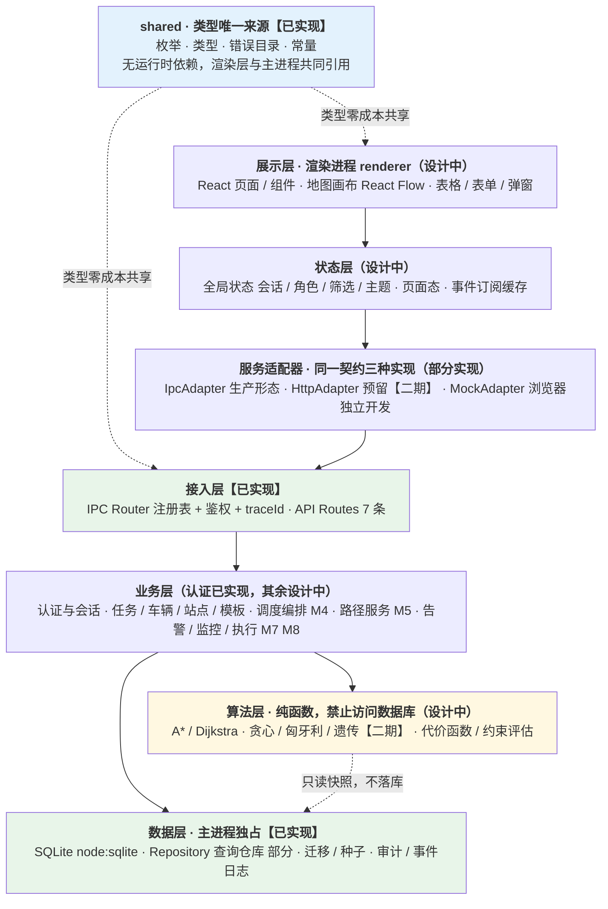

**五条层间铁律**（`design.md` §2.1，评审与重构时按此判定违规）：

1. 渲染层永不直连数据库，只通过服务契约调用领域接口。
2. 业务层不写算法细节，只编排算法结果并落库留痕。
3. 算法层是纯函数：入参为领域快照，出参为 `Plan / Route / 评估报告`，不持有状态、不写库。
4. 数据层由主进程独占，仅经 Repository 暴露读写，禁止业务层拼裸 SQL。
5. 状态层只消费服务返回与事件推送，不自行修改业务状态。

---

## 2. 运行形态与进程模型

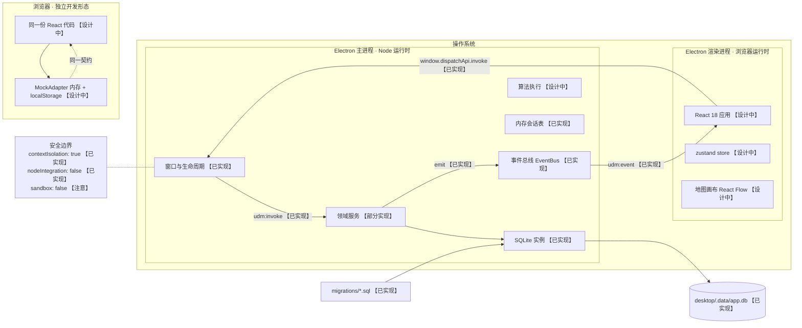

要点：

- **渲染进程拿不到 Node 能力**：只暴露 `invoke` / `on` 两个方法，敏感能力全部留在主进程。
- **`sandbox: false` 是当前配置**（`desktop/src/main.ts`）；因为 preload 使用 CommonJS，尚未启用沙箱。若要收紧，需评估 `preload.cjs` 的兼容性。
- **浏览器形态不需要 Electron**：`MockAdapter` 让 UI 独立开发，不被原生依赖阻塞（D-13）。

---

## 3. 一次调用的完整链路（统一信封与鉴权）

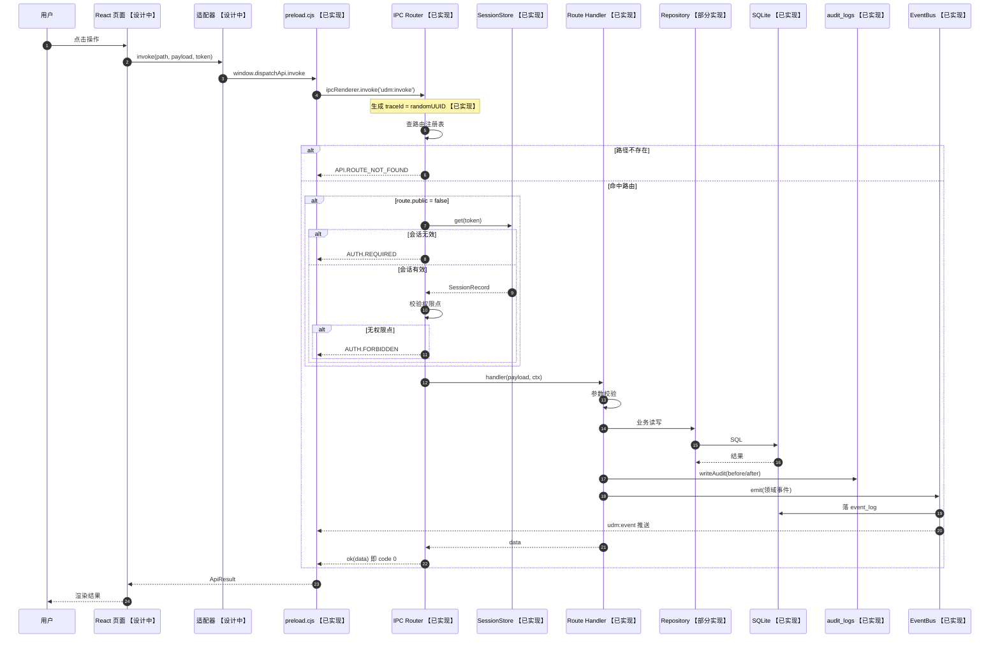

**统一信封**（`shared/src/types.ts`，成功与失败互斥）：

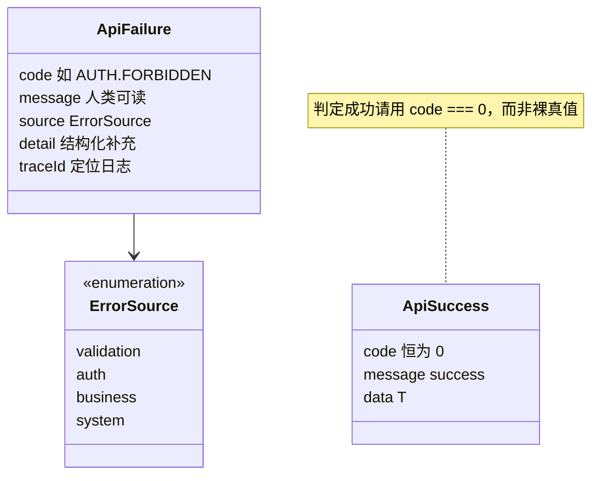

---

## 4. 认证、角色与会话

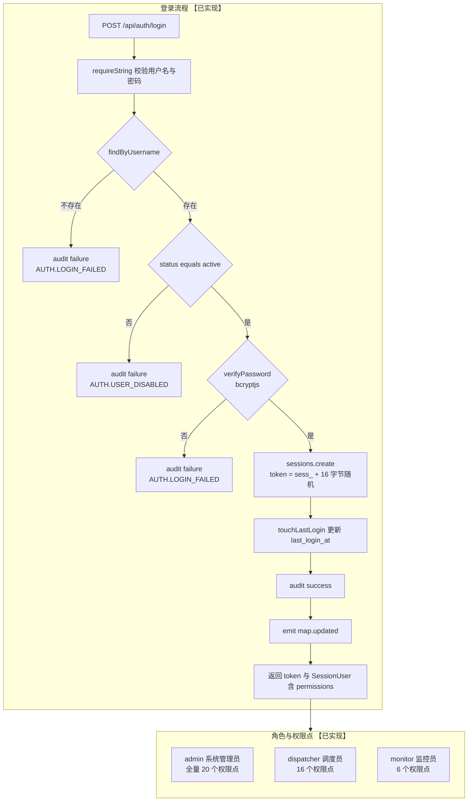

**权限点分配**（`shared/src/enums.ts` → `ROLE_PERMISSIONS`，共 20 个权限点）：

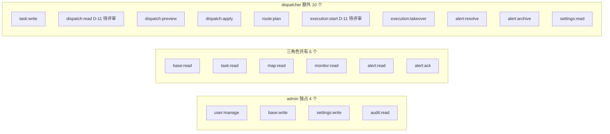

> **双轨制（D-08）**：前端隐藏按钮只算体验优化，权限判定一律以主进程 `Router` 为准。鉴权在 handler 之前完成，handler 内不得再信任前端传入的角色或用户 ID。

### 会话模型

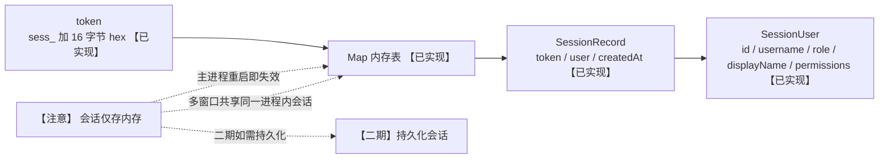

---

## 5. 任务状态机（`design.md` §4.3 为唯一来源）

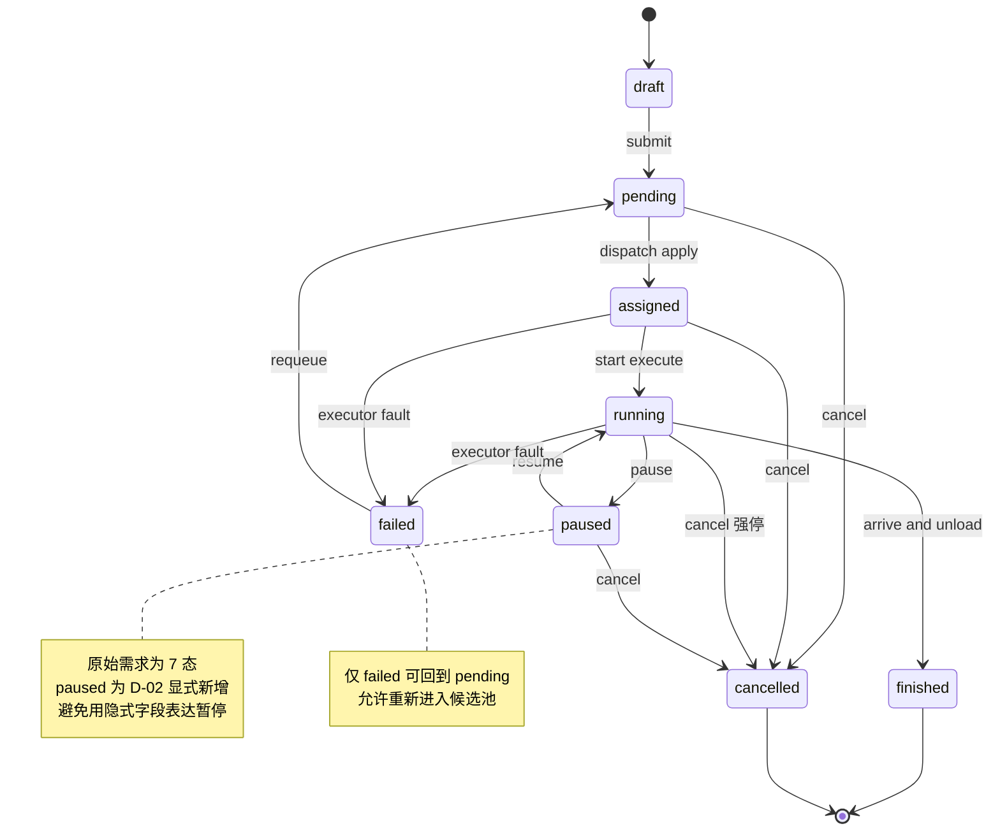

**迁移前置与副作用**：

| 从 | 到 | 触发 | 前置 / 副作用 |
| --- | --- | --- | --- |
| draft | pending | submit | 校验必填：起终点、载重、时间窗 |
| pending | assigned | dispatch apply / manual assign | 派发车辆，生成计划与路线 |
| assigned | running | start | 车辆到达起点或执行开始 |
| running | paused | pause | 仅运行中可暂停，写暂停原因 |
| paused | running | resume | 继续执行 |
| running / assigned | finished | complete | 到达终点并完成卸货 |
| assigned / running | failed | fail | 执行器或车辆异常 |
| pending / assigned / running / paused | cancelled | cancel | 必须传原因；已派发需先回收车辆（Req-M3-6） |
| failed | pending | requeue | 允许重新进入候选池 |
| draft / pending | 删除 | delete | 仅草稿可物理删除（D-07） |

> **硬性约束**：任何状态变化必须经服务层统一状态机函数判定，禁止直接 UPDATE 状态字段；非法迁移返回 `TASK.STATE_CONFLICT`，且 detail 需说明当前状态与期望状态。

### 关联状态机

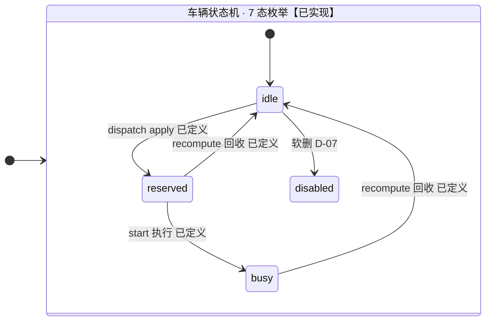

> 上图为**已定义迁移**的子集：`charging` / `offline` / `fault` 的进入与退出条件尚未在文档中成稿，故不在此臆测，待 M2 与 M7 落地时补齐完整迁移表。

> 车辆 7 态枚举与 CHECK 约束已落地，但**完整迁移表未定稿**：上文仅列出 `module-M4-dispatch.md` §10 与 `docs/api.md` §3.4 已明确定义的迁移（apply → `reserved`、start → `busy`、recompute → 回收至 `idle`）。`charging` / `offline` / `fault` 的进入退出按 M2 与 M7 落地时补写，避免此处先入为主。

---

## 6. 数据模型 · 17 张业务表【已实现】

> 完整 DDL 见 [`docs/database.md`](./database.md)；此处只表达**关系与分组**，字段级细节以 DDL 为准。

### 6.1 核心业务实体

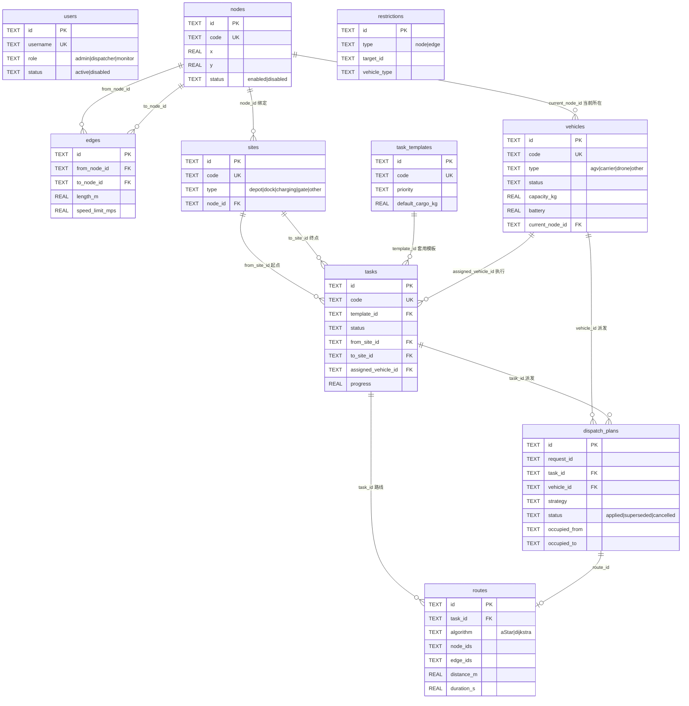

> 注意：`tasks.plan_id` **没有外键约束**（见 `0001_init.sql`），是刻意留给「当前生效计划」的指针；`dispatch_plans.route_id` 才是 FK。为避免误示为强约束，图中未画 `plan_id` 关系。

### 6.2 日志、审计与运行追踪（只增不改）

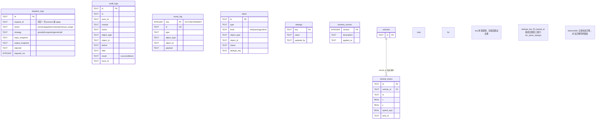

> `object_type` / `object_id` 是跨表弱引用（可指向 task / vehicle / site / node / edge / user / system / alert / settings），因此**不建外键** —— 这是为了让审计与告警能记录「已删除对象」的痕迹，是 D-07 软删策略的配套设计。

### 6.3 表与索引规模（实测）

| 项 | 数量 | 说明 |
| --- | --- | --- |
| 业务表 | 17 | 另有 `schema_version` 用于迁移追踪 |
| 索引 | 18 | 覆盖任务状态与优先级、边起点、派发占用区间、告警去重、审计与轨迹时间序 |
| seed 数据 | 12 节点 · 34 边 · 3 站点 · 3 车辆 · 2 模板 · 3 账号 · 9 设置 | 4×3 网格路网，步长 20m，双向边 |

---

## 7. 调度引擎 M4（核心算法流程 【设计中】）

> 详细开发口径见 [`docs/module-M4-dispatch.md`](./module-M4-dispatch.md)。以下为架构视角的骨架图。

### 7.1 先预览、后生效（D-03）

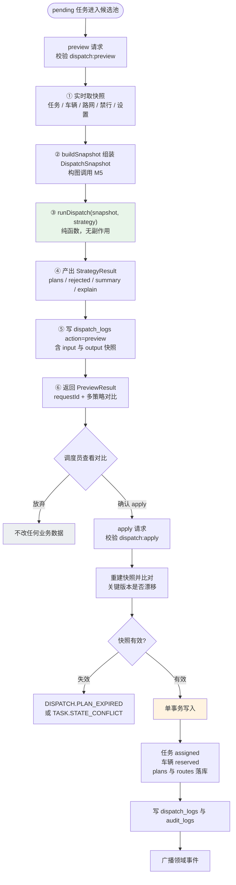

**为什么必须分两步**：算法只输出快照结果，业务数据仅在用户确认后变更。`preview` 零副作用，`apply` 才产生持久化变更（D-03）。这条边界是「算法可以随便重跑、业务数据不会被污染」的前提。

### 7.2 单车 × 单任务约束评估（固定短路顺序）

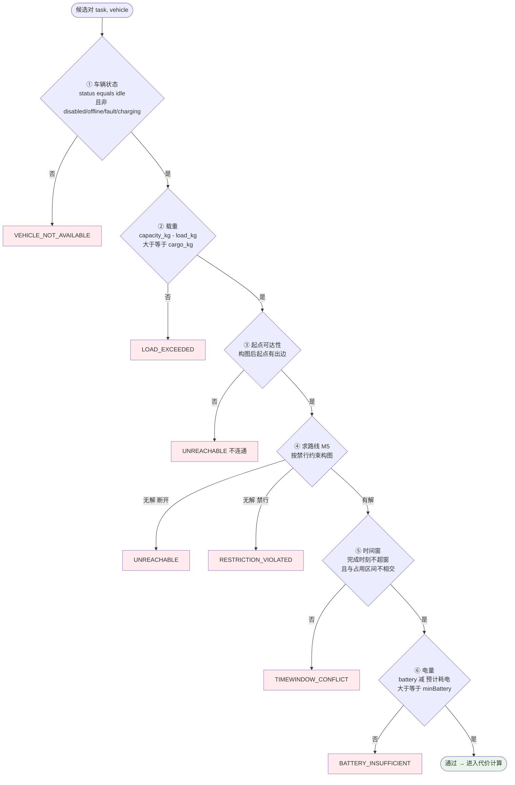

> **顺序即优先级**：命中即短路返回。同一任务多个候选都不满足时取第一个失败原因，并按车辆排序保证稳定 —— 这是「拒绝可解释」（Req-M4-2）的实现基础。`message` / `detail` 必须带车辆编码与具体数值。

### 7.3 占用区间模型（防重复派车）

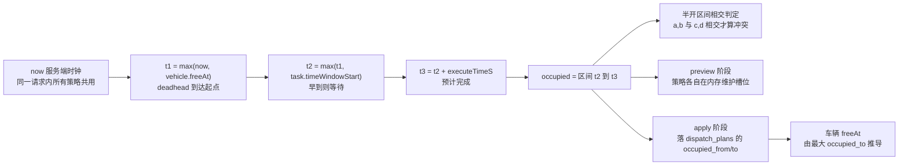

### 7.4 多策略对比与代码边界

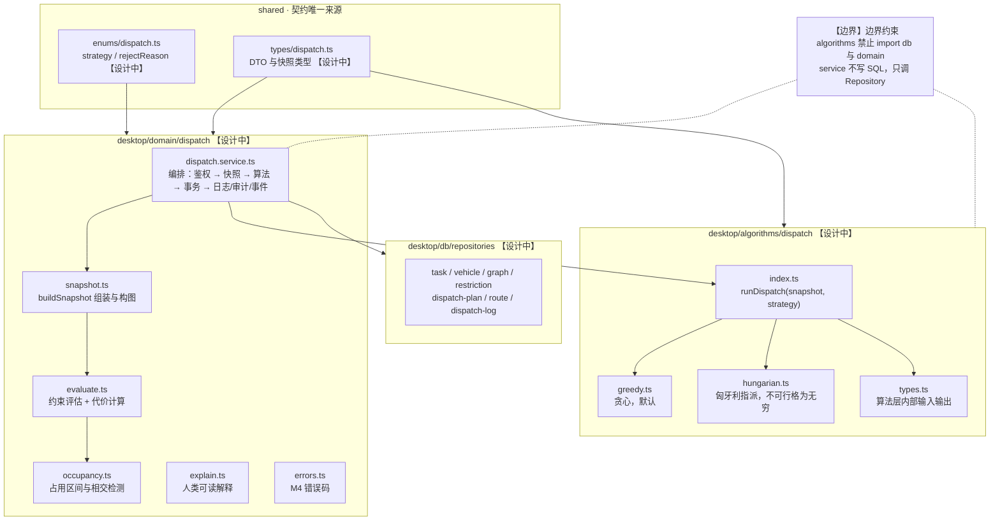

**代价函数**（`DISPATCH_COST_WEIGHTS` 已落地为常量，D-12）：

| 分量 | 权重 | 含义 |
| --- | --- | --- |
| deadhead | 1 | 空驶时间 |
| execute | 1 | 执行时间 |
| wait | 0.8 | 等待时间（早到） |
| late | 2 | 迟到惩罚 |
| chargeRisk | 1000 | 电量风险罚项，用于把高风险指派推到队列末尾 |

---

## 8. 模块全景与依赖顺序

### 8.1 十个首期模块

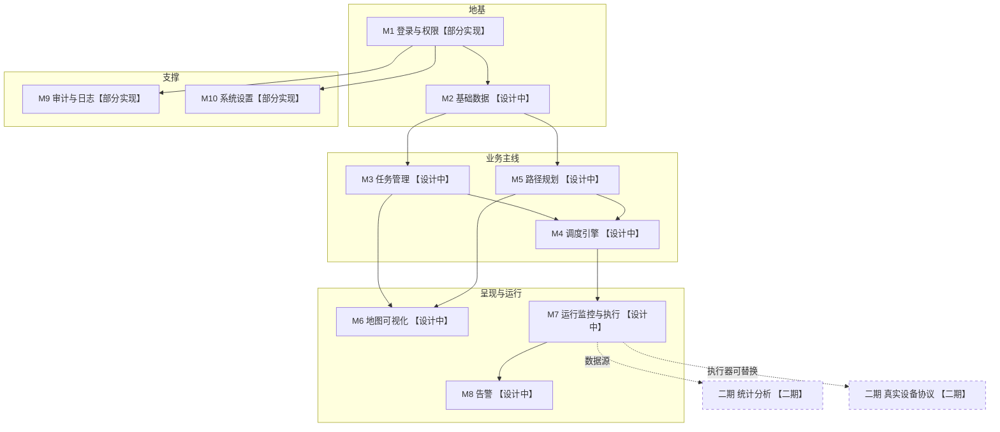

> `M11` / `M12` 为二期预留。`M7` 首期用**本地模拟执行器**（定时步进 + 轨迹采样），二期以真实协议替换执行器但**不改上层契约**（D-10）。

### 8.2 地图渲染链路（M6 · React Flow 方案 【设计中】）

> 选型与实现细节见 [`module-M6-map.md`](./module-M6-map.md)。此图只表达**数据流与职责边界**。

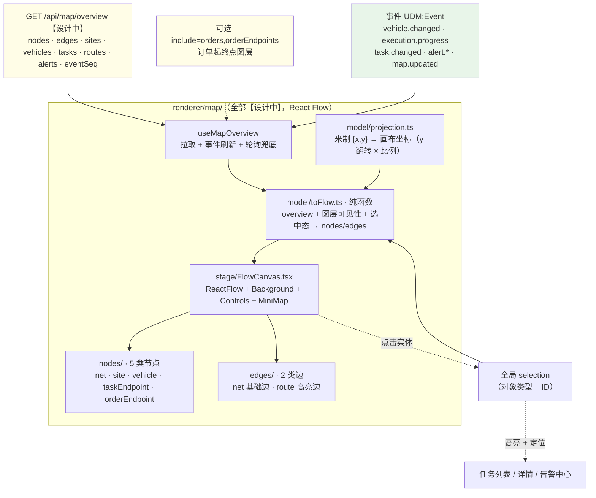

**三条边界**（违反即为架构违规）：

1. `overview` 是画布**唯一**数据入口；地图不读 CSV、不调多次接口拼装。
2. 地图只渲染 `routes`，**不自行搜索路径** —— 禁行规则与可达性判定只在 M5。
3. 车辆位置以事件为权威、插值仅补帧且**禁止外推**；所有选中/缩放/图层开关都是页面态。

**M6 实现缺口**（截至本文档更新日）：

| 缺口 | 说明 |
| --- | --- |
| `map/overview` 服务端未实现 | M6 接口在 `docs/api.md` §3.6 已成稿，主进程侧尚未落地 |
| renderer 无入口 | 连 `src/main.tsx` 都没有，整层未实现 |
| `EventBus` 未按会话权限过滤 | 与第 10 章同一问题，M6/M8 落地时一并补 |
| 组件测试 setup 阻塞 | `tests/setup.ts` 缺依赖导致 0 测试可收集，且 jsdom 还需 `ResizeObserver` stub |

### 8.3 已实现 vs 待实现（截至 2026-09-14 实测）

```mermaid
flowchart LR
  subgraph DONE["【已实现】已落地且有实测支撑"]
    D1["shared 枚举 8 类<br/>权限点 20 个"]
    D2["错误目录 34 条"]
    D3["SQLite 连接与事务"]
    D4["迁移 0001 幂等"]
    D5["seed 可重入"]
    D6["IPC Router 鉴权 + traceId"]
    D7["登录 / 登出 / 会话"]
    D8["审计写入"]
    D9["事件总线落库"]
    D10["health / settings / users 接口"]
  end

  subgraph TODO["【设计中】待实现"]
    T1["renderer 全部<br/>入口 / 适配器 / 页面 / 地图"]
    T2["M2 站点车辆路网 CRUD"]
    T3["M3 任务状态机"]
    T4["M4 调度引擎"]
    T5["M5 路径规划与图搜索"]
    T6["M6 地图图层"]
    T7["M7 执行器与监控"]
    T8["M8 告警闭环"]
    T9["M10 设置写接口"]
    T10["测试 setup 修复"]
  end

  DONE -.下一阶段.-> TODO
```

---

## 9. 构建路线图 P1-P6

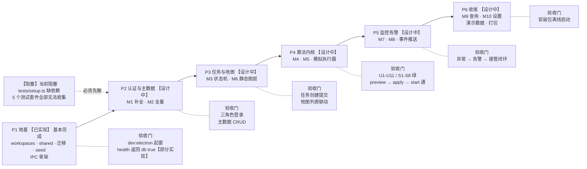

> **P1 剩余缺口**：`renderer` 无 `src/main.tsx`，导致 `npm run build` 失败、`npm run dev:electron` 必然白屏；`tests/setup.ts` 缺 `@testing-library/jest-dom`，导致 `npm test` 跑 0 个测试。

---

## 10. 事件流与实时推送

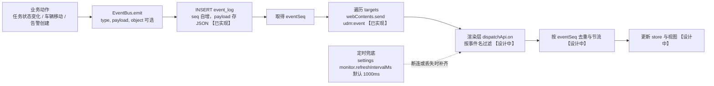

**七类领域事件**（`docs/api.md` §4）：

| 事件 | 载荷要点 | 触发时机 |
| --- | --- | --- |
| `task.changed` | taskId, code, status, transition, vehicleId | 任务任何状态变化 |
| `vehicle.changed` | vehicleId, code, status, x, y, battery | 位置 / 状态 / 电量变化 |
| `alert.created` | alertId, type, level, objectType, objectId | 新告警（角标 + toast） |
| `alert.updated` | alertId, status | 告警状态变化 |
| `map.updated` | eventSeq | 通用刷新信号 |
| `execution.progress` | taskId, vehicleId, progress, x, y | 高频进度（节流 ≥ 250ms） |
| `settings.changed` | key, value | 设置变更广播 |

> **当前实现差距**：`EventBus` 已能落库并推送，但**尚未按会话权限过滤事件**（`docs/api.md` §4 要求「由主进程按会话权限过滤后推送」）。M6/M8 落地时需补该过滤，否则监控员可能收到超出其权限的事件。另：`EventBus` 目前没有「一个事件推给多个窗口时每窗口独立权限」的处理，多窗口场景需一并设计。

---

## 11. 部署与数据存储形态

```mermaid
flowchart TB
  subgraph DEV["开发形态"]
    DEV1["npm run dev<br/>仅 Vite，浏览器 + MockAdapter 【设计中】"]
    DEV2["npm run dev:electron<br/>Vite 加 Electron，真实 SQLite 【部分实现】"]
  end

  subgraph PROD["生产形态 · 打包后 【二期】"]
    PR1["Electron 主进程"]
    PR2["loadFile renderer/dist/index.html<br/>base 为相对路径 【已实现】"]
    PR3["用户数据目录 SQLite 【二期】"]
  end

  subgraph DBFILES["数据库文件"]
    F1["开发<br/>desktop/.data/app.db 【已实现】"]
    F2["环境变量覆盖<br/>UDM_DB_PATH 【已实现】"]
    F3["WAL 模式<br/>app.db-wal / app.db-shm 【已实现】"]
  end

  DEV2 --> F1
  F2 -.覆盖默认路径.-> F1
  F1 --> F3
  PR3 -.待定：打包后库位置需评估.-> F2
```

| 配置项 | 默认值 | 说明 |
| --- | --- | --- |
| `UDM_DB_PATH` | `desktop/.data/app.db` | 数据库路径，测试用 `:memory:` |
| `UDM_RENDERER_URL` | `http://localhost:5173` | 开发期加载的渲染层地址 |
| `VITE_PORT` | `5173` | 渲染层 dev 端口，严格占用 |
| `VITE_API_ADAPTER` | `mock` | `mock` / `ipc` / `http` |
| `VITE_API_BASE_URL` | `/api` | 仅 http 适配器使用 |

> **日志与隐私**：SQLite 已开启 WAL、外键与 `busy_timeout = 5000ms`。`audit_logs` 会记录操作者与 before/after，落地真实数据前需确认**不写入敏感信息**（提交纪律「禁止项」第 4 条）。

```mermaid
stateDiagram-v2
  state "告警状态（D-09）" as A {
    [*] --> new
    new --> acknowledged : ack
    acknowledged --> processing : 开始处理
    processing --> resolved : 解决
    resolved --> archived : 归档
    new --> archived : 直接归档
    acknowledged --> archived : 直接归档
    processing --> archived : 直接归档
    note right of archived
      已解决告警超期自动归档
      默认 90 天，参数 alert.autoArchiveDays
    end note
  }
```

```mermaid
stateDiagram-v2
  state "派发计划状态（D-04）" as P {
    [*] --> applied : apply 写入
    applied --> superseded : 新计划生效，旧计划置位
    applied --> cancelled : 取消
    note right of superseded
      旧计划不删除
      保留可对比、可复核、可回放
    end note
  }
```
