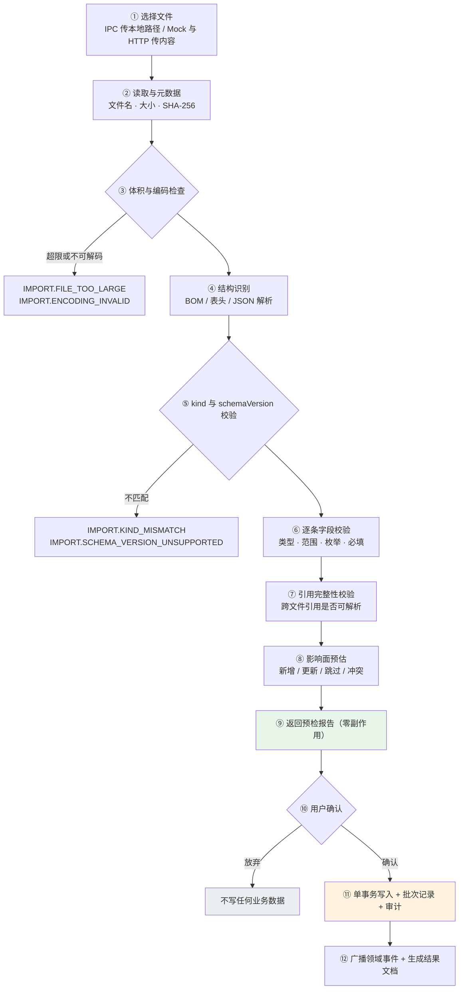
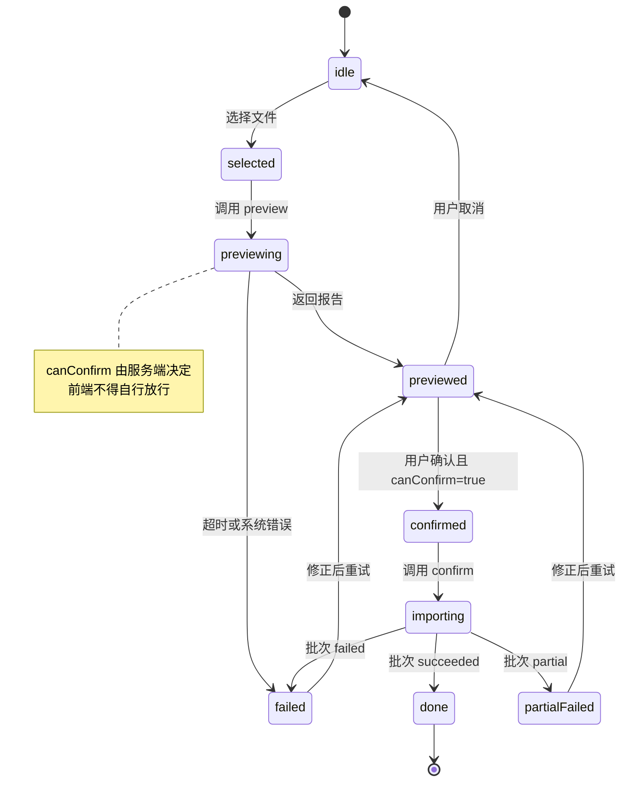

# 数据文件接口规范（订单 / 地图 / 车辆 / 算法）

> 版本：v0.3（**草案，调研中**；2026-09-21 按真实样本逐字段核对）
> 状态：仅接口与文件契约设计，**不包含实现**；字段与接口均待评审确认。
> 样本依据：`第三次课_数据准备/1_仿真地图` · `2_订单数据集` · `3_车辆参数`（实测数值见 §13）。
> 范围声明：本次**未**逐字段核对 `4_调度约束` / `5_数据校验` / `6_数据说明文档`（F4 章因此未更新，见 §12 Q16）。
> 例外：§5.9 的 `[A/B/C/D]` 可信级别统计**读取了** `5_数据校验/数据可信级别.csv`（该文件正是级别数据本身的载体，
> 且两处口径差异已由它暴露出来）；这是一次有意的越界读取，不改变「F4 未核对」的结论。
> 关联：[`design.md`](../design.md) §5（算法）· §6（数据模型）· [`docs/api.md`](./api.md) §1（通用约定）· [`docs/database.md`](./database.md)
> **文档边界**：本文件只负责「四类导入数据文件的**字段契约**（订单 CSV / 仿真地图 / 车辆参数 / 算法配置）与统一导入管线」。其余事实按 [`docs/api.md`](./api.md) §0「文档事实单一来源」引用，**不复述可漂移的数值**。

### 与 `docs/order-data-map-design.md` 的分工（去重后）

两份文档曾有重叠并已出现实际分歧（错误码命名、批次表名、导入接口路径），现已一次性去重。
**同一主题只保留一处**，引用时请按下表取用，不要在两处各写一份：

| 主题 | 唯一来源 |
| --- | --- |
| 文件格式与字段契约（四类文件）、导入管线、错误模型、`mode`、幂等、导入接口、批次表、**错误码登记** | **本文件** |
| 地区目录（`regions` / `region_aliases` / `region_dataset_versions`）与匹配语义 | `order-data-map-design.md` §3 |
| 订单数据文档内容与表（`orders` / `order_import_rows`） | `order-data-map-design.md` §4 |
| 订单与地图的联动、订单专属接口、订单落地节奏 | `order-data-map-design.md` §5-§8 |
| 地图渲染与图层交互（React Flow） | `module-M6-map.md` |

> **本次核对引发的待办**：§3.9 的解析链在样本上恒走第 1 档（编码直命中），
> 地区目录（`order-data-map-design.md` §3）的**别名与歧义场景在样本中无实例**，
> 其设计仍属「未经验证」。后续若引入真实订单，需补一批含别名/歧义的样本，否则该章无法验证。

## 0. 阅读提示

本文件把四类「外部文件 → 系统数据」的入口统一成一套契约，四类分别是：

| 编号 | 文件 | 承载 | 实测样本形态 | 系统侧标准形态 |
| --- | --- | --- | --- | --- |
| F1 | 订单数据集 | 待配送订单 | CSV **26 列**（另有一变体 32 列） | 同 CSV（无信封） |
| F2 | 仿真地图 | 路网节点 / 有向边 / 站点 / 泊位 / 障碍 | **5 个文件**（3 CSV + 1 XML + 1 GeoJSON） | 单文件 JSON 信封 |
| F3 | 配送车辆参数 | 车队物理参数与服务能力 | YAML（权威）/ JSON 同构 | 单文件 JSON 信封 |
| F4 | 配送算法配置 | 策略、代价权重、约束阈值 | 无样本，纯设计 | 单文件 JSON 信封 |

设计基调：**格式契约（文件长什么样）+ 导入管线（怎么安全落库）** 两件事分开描述。
后者面向实现者与前端。

> **v0.3 变更说明（2026-09-21）**：本次按真实样本 `第三次课_数据准备/` 的
> `1_仿真地图` / `2_订单数据集` / `3_车辆参数` 三个目录做了**逐字段实测核对**，
> 修正了 F1/F2/F3 三章在时间口径、优先级枚举、站点绑定方式、能耗单位等方面与实际数据不符的假设。
> 凡标「实测」的数值均来自对样本文件的全量脚本核对，不是抽样估计。
> **F4 未随本次核对**（样本目录 `4_调度约束` 与 `5_数据校验` 不在本次范围内）。

**样本来源分层（前端必须区分展示）**：

| 层 | 含义 | 在样本中的体现 |
| --- | --- | --- |
| ① 真实公开基准 | Solomon VRPTW 56 例 + Li & Lim PDPTW 56 例 + BKS 最优解 | `2_订单数据集/solomon/`、`li_lim_pdptw/` |
| ② 文献/公开资料参数 | 速度 / 续航 / 载重 / 成本等，附原文摘录 | F3 的 `[B]` / `[C]` 级字段 |
| ③ 仿真构造数据 | 校园路网 + 200 条订单 + 部分车辆与约束参数 | `campus_*.csv`、`campus.geojson` |

**③ 类数据的 200 条订单不是真实订单**——文件内已用 `data_origin` 列明示。
导入向导必须把来源层显示出来，避免仿真数据被误当真实业务数据展示。

---

## 1. 目标与边界

### 1.1 目标

1. 让四类文件都有**唯一、可校验、可版本化**的格式定义，避免「按当前代码猜字段」。
2. 导入必须**先预览、后生效**：预检零副作用，确认才写库（沿用 D-03 的既有原则）。
3. 错误必须**可定位、可解释、可导出**：CSV 给到行列，JSON 给到 JSON Pointer。
4. 同一份文件重复导入**结果可比对**，且默认不产生重复业务数据。
5. 支撑「离线仿真」：地图 + 车辆 + 算法三件套可组合成一个**场景包**（见 §2.7），同一场景可重复跑出可复现结果。

### 1.2 首期不做

- 不做真实地图服务与联网地理编码（沿用 `order-data-map-design.md` §1）。
- 不做文件内容的长期归档与云同步；只留元数据与校验和。
- 不做多租户隔离、不做增量同步协议（只做整文件导入）。
- 不做文件可视化编辑器；导入页只做预览、校验与确认（编辑走既有 CRUD 界面）。

---

## 2. 通用文件契约

以下约定对 F1-F4 **全部适用**，各章只描述差异部分。

### 2.1 编码与体积

| 项 | 约定 |
| --- | --- |
| 编码 | F1 支持 `UTF-8`（含 BOM）与 `GB18030/GBK`；F2-F4 固定 `UTF-8`（含 BOM） |
| 换行 | `LF` / `CRLF` 均可 |
| 体积上限 | 单文件默认 20 MB；F1 行数上限 10,000（沿用订单接入设计） |
| 超限行为 | 解析**之前**即拒绝，返回 `IMPORT.FILE_TOO_LARGE`，不进入逐行校验 |
| 解析方式 | 流式解析，禁止把不受限文件一次性读入内存（前端不得先整份读进内存再上传） |
| 失败码 | 解码失败 `IMPORT.ENCODING_INVALID`；分隔符为推断值 `IMPORT.DELIMITER_ASSUMED`（见下表） |

> **为什么 F1 要支持 GBK**：中文场景下由 Excel 另存为的订单 CSV 常为 GBK，一味按 UTF-8 解码会把中文列名变成乱码，导致「表头识别失败」这种看似无解的问题。编码嗅探顺序：BOM → UTF-8 严格解码成功则采信 → 否则按 GB18030 解码并返回 `IMPORT.ENCODING_ASSUMED` 警告，**要求用户在预览页确认**，不静默采信。

### 2.2 信封与版本

**系统侧**统一为单个 JSON 信封（F2-F4），或 CSV + 导入参数（F1）。
但**实测样本的形态与信封不同**，因此必须区分两个概念：

| 概念 | 含义 | 谁负责 |
| --- | --- | --- |
| **原生形态** | 数据方实际交付的文件（4 个地图文件；YAML；26 列 CSV） | 数据方 |
| **标准形态** | 导入管线内部的规范化载荷 | 系统（§4/§5/§6 的字段契约） |

「原生 → 标准」的适配是**导入器职责**，逐字段映射见 §3.2 / §4.1.2 / §5.3。
前端只消费标准形态与 `ImportIssue`，**不感知原生形态差异**。

```json
{
  "schemaVersion": 1,
  "kind": "map",
  "meta": {
    "name": "校园仿真路网",
    "description": "30 节点 / 90 有向边 / 13 站点",
    "source": "sumo-network",
    "sourceFiles": ["campus_nodes.csv", "campus_edges.csv", "campus_stations.csv", "campus.add.xml", "campus.geojson"],
    "coordinateSystem": "planar-meters",
    "createdAt": "2026-09-21T00:00:00.000Z"
  },
  "data": { }
}
```

| 字段 | 必填 | 说明 |
| --- | --- | --- |
| `schemaVersion` | 是 | 整数。当前统一为 `1`；未知版本直接拒绝 |
| `kind` | 是 | `orders` / `map` / `vehicle-fleet` / `dispatch-algorithm`，与接口 `{kind}` 必须一致（**四类**，与 §7.2 对齐） |
| `meta` | 否 | 仅供展示与审计，不参与业务校验 |
| `meta.sourceFiles` | 否 | 原生形态为多文件时，记录原始文件名清单（F2 必需，用于批次溯源） |
| `meta.coordinateSystem` | 否 | 仅 F2：固定 `"planar-meters"`；其它值拒绝（D-05） |
| `data` | 是 | 各自的有效载荷（§4/§5/§6） |

> **F3 的信封差异（实测）**：样本 YAML/JSON 的顶层是 `meta` + `fleet` + `vehicles{}` + `consistency_rules` + `references`，
> **没有 `kind` 与 `data`**。适配为信封时：`fleet` → `data.fleet`，`vehicles` → `data.vehicles`，
> `consistency_rules` → `data.consistencyRules`，`references` → `meta.references`。
> 缺失 `kind` 不算错误（样本本就没有），由用户在向导第一步选定。

版本策略：

1. **只增不改**：新增可选字段 → `schemaVersion` 不变；语义变化、必填项变化、类型变化 → 必须升版本。
2. 旧版本文件在声明「兼容读取」前一律拒绝，**不做静默猜测式迁移**。
3. 拒绝时返回 `IMPORT.SCHEMA_VERSION_UNSUPPORTED`，并在 `detail` 中给出 `supportedVersions` 与升级建议。
4. **样本文件不携带 `schemaVersion`**（原生形态里没有该字段），此时按 `schemaVersion = 1` 处理，
   并在预检报告给 `IMPORT.SCHEMA_VERSION_ASSUMED` **info**（提示「按 v1 解析」，让用户知情）。
   不报错：要求数据方凭空补一个系统内部字段是不现实的，但也不能静默假设。

### 2.3 统一导入管线



阶段约束（实现时按此判定违规）：

1. **预检绝不写业务库**。允许写「批次临时状态」以便前端轮询，但不得新增/修改任何业务实体。
2. **确认在单个事务内完成**；任一致命错误整体回滚，批次标记为失败（`IMPORT.BATCH_FAILED`）。
3. **轻量错误（warning）不阻断导入**，但必须在结果文档与批次记录中留痕。
4. **导入不触发业务流转**：地图/车辆/算法导入后，任务状态、车辆运行态均不得被隐式改变。

### 2.4 统一错误模型 `ImportIssue`

前端渲染导入结果只需要处理这一种结构：

```json
{
  "severity": "error",
  "code": "ORDER.FIELD_FORMAT",
  "locator": { "type": "csv", "row": 17, "column": "cargoKg", "columnIndex": 5 },
  "field": "cargoKg",
  "value": "五十",
  "message": "载重必须是数字",
  "suggestion": "改为 50",
  "autoFixable": false
}
```

JSON 文件用 JSON Pointer 定位：

```json
{
  "severity": "error",
  "code": "NODE.NOT_FOUND",
  "locator": { "type": "json", "pointer": "/data/edges/3/fromCode" },
  "field": "fromCode",
  "value": "N09",
  "message": "边引用了不存在的节点编码 N09",
  "suggestion": "在 nodes 中补充 N09，或修正该编码"
}
```

| 字段 | 说明 |
| --- | --- |
| `severity` | `error` 阻断该条目（不影响其它条目） / `warning` 导入但提示 / `info` 仅告知 |
| `code` | 错误码，见各章；**前端文案按 code 本地化，不解析 message** |
| `locator` | `type=csv` 用 `row`(1 基，含表头行号口径见 §3.1) + `column`/`columnIndex`；`type=json` 用 `pointer` |
| `field` | 标准字段名，便于前端按列聚合 |
| `value` | 原始值（可能为 `null`）；敏感字段需脱敏后再返回 |
| `message` | 服务端生成的人类可读描述（中文） |
| `suggestion` | 修复建议，前端显示为提示 |
| `autoFixable` | 预留：是否可一键修复（首期一律 `false`） |

> **对前端的硬性要求**：`message` 仅供展示，判断与分组一律用 `code` + `severity` + `field`。否则服务端改文案就会打挂前端逻辑。

### 2.5 幂等与批次

| 项 | 约定 |
| --- | --- |
| 幂等键 | `contentSha256 + schemaVersion + mappingVersion + targetScope`；**`contentSha256` 为「全部输入文件」按文件名排序后逐个哈希再合并**（地图包 4 份文件 ⇒ 4 个哈希），单文件时退化为该文件哈希 |
| 默认行为 | 命中相同幂等键 → 返回**上一次成功批次**结果，不重复写业务数据 |
| 显式重导 | 请求带 `forceReimport: true` 才创建新批次（需前端二次确认） |
| 批次记录 | 每次导入无论成败都落一条批次记录：文件摘要、统计、操作者、耗时、错误摘要；**多文件输入时逐文件记录文件名 + 大小 + 哈希**（`source_files` 列，见 §10） |
| 结果文档 | 批次完成后生成**不可变快照**，可再次下载；修正后重导生成新版本并保留旧版（与订单接入设计一致） |

> `targetScope` 用于区分「导进哪套数据」：地图为 `mapId`（首期仅一套，值固定 `default`），车辆为车队范围（首期固定 `default`），算法配置为配置集键（首期固定 `default`）。无此分量会导致「同一份地图导进两个场景」被误判为重复。

### 2.6 导入模式

四类文件共用 `mode`，语义必须一致，避免「地图是合并、车辆是覆盖」这类隐性差异：

| mode | 语义 | 明确不做的事 |
| --- | --- | --- |
| `validateOnly` | 只预检，不写库 | — |
| `merge`（默认） | 按业务主键 upsert；未出现的既有数据**保持不动** | 不删除任何既有数据 |
| `replace` | 先校验，后在单事务内清空该 scope 的既有数据再写入 | 不清空其它 scope；不影响历史任务与日志 |
| `appendOnly` | 只新增，已存在即跳过或报错（由 `onDuplicate` 决定） | 不更新既有数据 |

`replace` 的高危约束：

1. 必须前端二次确认（与 D-07 软删、D-04 版本化留痕同级的破坏性操作）。
2. **被引用的对象不得因 replace 消失**。例如地图 `replace` 时，若某节点被「进行中任务的路线」或「启用中的禁行规则」引用，则该节点必须保留或整体拒绝。首期简化为：存在非终态任务引用路网时，直接拒绝 `replace`（`IMPORT.IN_USE_CONFLICT`，`detail.refs` 列出引用者）。
3. 旧数据不物理删除：按 D-07 置 `disabled` 并保留，历史路线仍可回放。

### 2.7 场景包（仿真组合）

地图 + 车辆 + 算法是仿真的最小可复现单元。首期**不做压缩包格式**，而是用「同一 `scenarioId` 顺序导入」表达，批次记录中写入同一 `scenarioId`，即可复现「当时用了哪版地图、哪版车队、哪版算法」。

**地图是 5 个文件、车辆与算法各 1 个文件**，故一个完整场景包含 **7 份文件输入**（实测样本形态）。
`scenarioId` 的幂等计算必须覆盖**全部 7 份文件的内容哈希**，而不是只取主文件——
只哈希 `campus_edges.csv` 会漏掉站点泊位或 GeoJSON 的变更，导致「地图改了但幂等键没变」。

组合校验（三件套齐备时执行，返回为 warning 而非阻断）：

| 校验 | 不通过时 |
| --- | --- |
| 车队中每辆车类型在算法配置中都有对应参数 | `SCENARIO.VEHICLE_TYPE_UNCOVERED` warning |
| 算法配置要求的必需参数均已由全局默认或车辆级参数提供 | `SCENARIO.PARAM_MISSING` warning |
| 车辆参数的 `speedMps` 与地图边限速不冲突 | `VEHICLE.SPEED_LIMIT_CONFLICT` info |
| 车辆 `speedLimitsKmh` 的键在地图 `roadTypes` 中都存在 | `VEHICLE.ROAD_TYPE_UNKNOWN` warning |
| 站点（含泊位）所在边在地图 `edges` 中都存在 | `EDGE.NOT_FOUND` error |

> 缺失参数不阻断导入，但**阻断调度预览**（M4）时由既有约束评估给出 `BATTERY_INSUFFICIENT` 等具体拒绝原因，避免两处各自报错、口径不一。

**样本的三件套自洽性实测**（可直接作为场景包校验的验收基线）：

| 校验 | 实测结果 |
| --- | --- |
| 订单起终点编码 ⊆ 站点编码 | ✅ 13/13 |
| 订单坐标 == 站点坐标 | ✅ 0 偏差 |
| 站点所在边 ⊆ 地图边 | ✅ 13/13 |
| 车辆 `speedLimitsKmh` 键 == 地图道路类型 | ✅ 3/3 完全一致 |
| 订单最大货重 ≤ 最小车型载重 | ✅ 147.33 ≤ 200 |
| 站点泊位区间在边长内 | ✅ 13/13 |

> 这三份样本本身是**自洽**的。因此实现时若对样本报出上述任一 error，应当先怀疑自己的校验代码，
> 而不是怀疑数据——这条提示能省掉大量「到底谁错了」的排查时间。

---

## 3. F1 订单数据集（CSV）

### 3.1 输入形态与来源分层（**以实测样本为准**）

样本目录 `2_订单数据集/` 下并存三类订单数据集。它们**列契约基本一致（26 列），差异只在扩展列与取值域**，
因此共用同一套导入向导，但必须在预览页把「来源层」显式标出来。

| 文件 | 条数 | `order_type` 取值 | 来源层 | 用途 |
| --- | --- | --- | --- | --- |
| `campus_orders.csv` | 200 | `送件` / `寄件` / `站间调拨` | ③ 仿真构造 | 工程贯通（主用） |
| `campus_orders_small.csv` | 20 | 同上 | ③ 仿真构造（前 20 条） | 联调冒烟 / 前端演示 |
| `solomon/solomon_c101_orders.csv` | 100 | `送件` | ① 真实公开基准 | 算法对标（VRPTW）。**目录内 56 个 JSON 算例，但只转了 `c101` 这一个 CSV** |
| `li_lim_pdptw/*_orders.csv`（56 个） | 50–55 | `取送（pickup-delivery）` | ① 真实公开基准 | 算法对标（PDPTW，取送配对）；同目录另有 `BKS.json` 与 `_li_lim_summary.csv` |

> **前端硬性要求**：`data_origin` 的取值前缀是机器可读的（`SYNTHETIC-` / `PUBLIC-BENCHMARK `），
> 来源徽标按**前缀**判定并着色，**不得解析整串中文**——与 §2.4「按 code 判逻辑、不解析 message」同一条纪律。
> 三类数据混在同一批次里是合法但危险的用法：仿真订单被当成真实订单展示，是本项目最容易发生的一次误读。

### 3.2 字段契约（26 列）

以下 26 列即 `campus_orders.csv` / `campus_orders_small.csv` / `solomon_*_orders.csv` 的表头，**逐列对齐**。
`li_lim_pdptw/*_orders.csv` 在此基础上多 6 列（见 §3.7），并少 6 列派生列。

| 分组 | 列名 | 必填 | 类型 | 约束（实测取值域） | 落库目标 |
| --- | --- | --- | --- | --- | --- |
| 标识 | `order_id` | 是 | string | 唯一；`ORD0001` / `C101-001` / `lc101-003` 三种风格 | `orders.external_no` |
| 标识 | `order_type` | 是 | enum | `送件`(132) / `寄件`(40) / `站间调拨`(28) / `取送（pickup-delivery）` | `orders.order_type` |
| 起点 | `pickup_id` | 是 | string | `DEPOT` 或 `ST01…ST12`（13 个取值，全部命中站点编码） | `orders.from_site_id`（解析后） |
| 起点 | `pickup_name` | 是 | string | 中文名，必须与站点表 `name` 一致 | 冗余展示字段 |
| 起点 | `pickup_x` / `pickup_y` | 是 | number | 平面米制（D-05）；必须等于站点坐标 | 校验用，不落库 |
| 终点 | `dropoff_id` | 是 | string | 同上；**不得与 `pickup_id` 相同** | `orders.to_site_id` |
| 终点 | `dropoff_name` | 是 | string | 同上 | 冗余展示字段 |
| 终点 | `dropoff_x` / `dropoff_y` | 是 | number | 同上 | 校验用，不落库 |
| 时间 | `order_time` | 是 | `HH:MM(:SS)` | 下单时刻（**非 ISO 8601**，见 §3.3） | 展示用 |
| 时间 | `order_time_s` | 是 | integer | 当日 0 点起的**秒数**：29226–71299（08:07–19:48） | `orders.order_time_s` |
| 时间 | `tw_start` / `tw_end` | 是 | `HH:MM` | 时间窗文本 | 展示用 |
| 时间 | `tw_start_s` / `tw_end_s` | 是 | integer | 30066–75600；`tw_end_s` 上界 75600 = 21:00（服务窗结束） | `orders.tw_start_s` / `tw_end_s` |
| 数量 | `weight_kg` | 是 | number | 1.00–147.33（mean 21.85） | `orders.cargo_kg` |
| 数量 | `volume_l` | 是 | number | 3.0–832.0（**升**，非立方米） | `orders.volume_l`（新增列） |
| 数量 | `priority` | 是 | integer | `1`(159) / `2`(13) / `3`(28)，**数字不是枚举名**（见 §3.4） | `orders.priority` |
| 数量 | `service_time_s` | 是 | integer | 仅 `{60, 90, 120}` | `orders.service_time_s`（新增列） |
| 派生 | `euclid_dist_m` | 是 | number | 113.10–573.80；= 两端站点欧氏距离 | 不落库（可复算） |
| 派生 | `min_travel_min` | 是 | number | = `euclid_dist_m / 1000 / 20 × 60`（按 20 km/h 主干道限速） | 不落库 |
| 派生 | `tw_feasible` | 是 | 0/1 | 全部为 1 | 不落库 |
| 溯源 | `data_origin` | 是 | string | 见 §3.1 前缀约定 | `orders.data_origin`（新增列） |
| 溯源 | `generator` | 是 | string | 生成脚本 + 随机种子，如 `scripts/02_generate_orders.py (random seed=20260921)` | 批次元数据 |
| 溯源 | `generation_method` | 是 | string | 生成方法说明（泊松到达 / 站点类型定时间窗长度 / Gamma 货重） | 批次元数据 |

字段级通用错误（上表未逐列重复标注）：

| 情况 | code | severity |
| --- | --- | --- |
| 必填列为空 | `ORDER.FIELD_REQUIRED` | error |
| 类型/格式非法（如 `weight_kg` 填了中文数字） | `ORDER.FIELD_FORMAT` | error |
| 数值被规范化（千分位 `1,200`、前后空白） | `ORDER.NUMBER_NORMALIZED` | warning |

三条**与既有草案不同**的地方，必须按本节执行：

1. **时间是「当日秒数 + `HH:MM` 文本」，不是 ISO 8601 时间戳**（§3.3）。
2. **`priority` 是 1/2/3 数字**，需要显式映射到内部 `TaskPriority` 四值枚举（§3.4）。
3. **新增 `volume_l` 与 `service_time_s`**，且存在 3 列溯源字段——既有草案的字段表里没有它们的位置。

### 3.3 时间口径（本类文件最容易踩的坑）

样本文件**同时给出两列**：人类可读文本（`order_time` = `08:07:06`）与机器可读秒数（`order_time_s` = 29226）。
两者是同一时刻的两种表示，**秒数是权威值**。约束如下：

| 项 | 约定 |
| --- | --- |
| 语义 | 当日 0 点起的秒数，**无日期、无时区**。基准日由批次参数 `serviceDate`（默认导入当天）决定 |
| 权威列 | `*_s` 列为权威；文本列仅用于展示与人工核对 |
| 一致性 | 必须能互相对上，否则 `ORDER.TIME_TEXT_MISMATCH` warning |
| 精度差 | `tw_start` / `tw_end` 文本是**分精度**，秒数可含非零秒（实测 197/200 行 `tw_start_s` 不是 60 的整数倍）。因此**比对时向分钟下取整**，不得按秒严格相等 |
| `HH:MM` 与 `HH:MM:SS` | `order_time` 为 `HH:MM:SS`，时间窗为 `HH:MM`。解析器必须同时接受两种宽度 |
| 越界 | `tw_start_s >= tw_end_s` → `ORDER.TIMEWINDOW_INVALID` error；`order_time_s > tw_start_s` → `ORDER.ORDER_TIME_AFTER_WINDOW` warning |
| 跨日 | 首期不跨日。`tw_end_s > 86400` 视为跨日并报 `ORDER.TIMEWINDOW_CROSS_DAY`（error，需人工确认） |

**为什么不能沿用 ISO 8601 的单列口径**：ISO 列无法表达「仿真重跑时固定在同一个服务日」这一诉求，
且会把「无日期」的仿真数据强行钉到一个日期上。保留秒数口径后，重跑同一文件得到完全相同的调度输入——
这是「场景可复现」（§2.7）的前置条件。

> **前端要点**：预览页时间列要**双列并排**显示（原始秒数 + 换算后的 `HH:MM`），
> 且提供「按 `serviceDate` + 秒数」渲染的绝对时间。只显示 `29226` 没人看得懂，只显示换算值又无法与数据方对账。

### 3.4 优先级映射（数字 ↔ 内部枚举）

内部 `TaskPriority` 是四值枚举 `low/normal/high/urgent`（`shared/src/enums.ts`，权重 1/2/3/4），
样本与内部**数量级一致但有 1 个级别的偏移**，必须显式映射，不得直接按数值透传：

| 样本 `priority` | 实测分布 | 与 `order_type` 的相关性 | 映射到 | 理由 |
| --- | --- | --- | --- | --- |
| `1` | 159 | 送件 125 / 寄件 34 | `normal` | 常规单，占绝对多数 |
| `2` | 13 | 送件 7 / 寄件 6 | `high` | 加急件 |
| `3` | 28 | 站间调拨 28 | `urgent` | 站间调拨全部为 3，属计划性高优先 |
| （无 `4`） | 0 | — | — | 样本不产生 `low`；导入时 `low` 只可能来自人工新建 |

| 情况 | code | severity |
| --- | --- | --- |
| `priority` 不在 `{1,2,3}` | `ORDER.PRIORITY_OUT_OF_RANGE` | error |
| `priority` 与内部枚举同名值混入（如写了 `high`） | `ORDER.PRIORITY_FORMAT` | error（**不做字符串容错**，避免两套口径并存） |
| 映射表由批次参数 `priorityMapping` 覆盖 | — | info（提示「本批次使用自定义优先级映射」，并写入批次记录） |

> `priorityMapping` 支持整体覆盖（如把 `3` 也当 `normal`）。**默认映射固定在代码里**，不在设置表；
> 若要改默认值，走 `docs/api.md` 的枚举变更流程并回写本节。

### 3.5 订单类型与端点不变量（必须校验）

`order_type` 与 `pickup_id` / `dropoff_id` 是否等于 `DEPOT` 之间存在**严格对应关系**，实测 200/200 成立：

| `order_type` | `pickup_id` | `dropoff_id` | 语义 |
| --- | --- | --- | --- |
| `送件` | `DEPOT` | ≠ `DEPOT` | 配送中心 → 站点 |
| `寄件` | ≠ `DEPOT` | `DEPOT` | 站点 → 配送中心 |
| `站间调拨` | ≠ `DEPOT` | ≠ `DEPOT` | 站点 ↔ 站点 |
| `取送（pickup-delivery）` | 基准取货点 | 基准卸货点 | PDPTW 配对（`li_lim` 专有） |

校验规则：

| 校验 | code | severity |
| --- | --- | --- |
| 违反上表对应关系 | `ORDER.TYPE_ENDPOINT_MISMATCH` | error（阻断该行） |
| `pickup_id == dropoff_id` | `ORDER.SAME_ENDPOINT` | error |
| `order_type` 不在已知取值内 | `ORDER.TYPE_UNKNOWN` | error |

> 这类不变量必须**由服务端在预检阶段校验**，不能只靠前端下拉框约束：
> 订单文件来自外部，绕过 UI 直接改 CSV 是最常见的出错方式。

### 3.6 派生列：校验而非信任

`euclid_dist_m` / `min_travel_min` / `tw_feasible` 三列**均可用其它列 + 路网参数复算**，
因此定位为「**校验列**」：读入后重算并比对，**不落库、不参与调度计算**（调度用真实路网路径，见 M5）。

| 派生列 | 复算式（实测 0 处偏差） | 不一致时 |
| --- | --- | --- |
| `euclid_dist_m` | 两端站点坐标欧氏距离 | `ORDER.DERIVED_DIST_MISMATCH` warning |
| `min_travel_min` | `euclid_dist_m / 1000 / 20 × 60`（主干道 20 km/h） | 同上（容差 0.02 min） |
| `tw_feasible` | 该值恒为 1，无独立语义 | 出现 `0` → `ORDER.TW_INFEASIBLE_ROW` warning |

**`min_travel_min` 的隐含假设要显式说出来**：它按 `campus_main` 的 20 km/h 直线折算，
既不是实际路径时间，也不是按车型限速算的。前端展示时必须标注口径，否则会被当成真实行驶时间。
车型实际时长由 §5 的 `speed_limits_kmh` + M5 路径规划给出。

同理，`pickup_x`/`pickup_y` 必须与站点表坐标一致（实测 0 处偏差），不一致报
`ORDER.PICKUP_COORD_MISMATCH` warning——它几乎总是意味着「订单文件与地图版本不匹配」，
这是**比单行错误更严重**的信号，前端应在预览页顶部整体提示。

### 3.7 数据集变体：`li_lim` 扩展列

`li_lim_pdptw/*_orders.csv` 共 **32 列**，在上表 26 列基础上：

- **多出 12 列**：`depot_id/depot_x/depot_y`、`vehicle_capacity`、`vehicle_limit`、
  `pair_delivery_tw_start(_s)`、`pair_delivery_tw_end(_s)`、`source`、`source_file`、`source_url`；
- **共 56 个文件**，行数 50–55（各算例客户数不同），不是固定行数；
- **缺少 6 列**：`euclid_dist_m`、`min_travel_min`、`tw_feasible`（属 §3.6 派生列）与 3 列溯源列的等价物。

约束：

| 项 | 约定 |
| --- | --- |
| 基准集标记 | `source` / `source_file` / `source_url` 为**基准集元数据**，整批同值；写入批次记录而非每行 |
| 配对语义 | `pair_delivery_tw_*` 是**卸货点**的时间窗，与取货点时间窗不同 → 导入为任务的两个时间窗（取货窗 + 送达窗） |
| 容量口径 | `vehicle_capacity` / `vehicle_limit` 是**基准算例的自带容量与车数上限**，与 §5 车队参数是两套体系：基准集只用于算法对标，**不覆盖**车队参数 |
| 缺失派生列 | 缺列不报错；服务端按 §3.6 复算补上（预检报告中标注为「服务端补算」） |
| 混批次 | 同一批次内**不允许**混入 26 列与 32 列两种骨架 → `ORDER.HEADER_INCONSISTENT` error |

> 基准集与车队参数的边界必须写进 UI 文案：「导入 Li & Lim 基准用于算法验证，不改动本系统的车队配置。」
> 否则用户会以为 `vehicle_capacity=200` 把车队容量改成了 200。

### 3.8 列名映射

外部系统列名不可能与我们一致，故提供两层映射（`solomon` / `li_lim` 花名册已证实这一点：同一语义列在不同来源里有不同命名）：

1. **别名自动识别**：内置别名表（`order_id/订单号/orderNo` → `order_id`，`pickup_id/起点/发货地` → `pickup_id` …），
   预检返回建议映射与置信度。
2. **显式映射覆盖**：确认导入时传 `mapping`，优先级高于自动识别。

```json
{
  "mapping": {
    "order_id": "订单编号",
    "pickup_id": "发货仓",
    "dropoff_id": "收货点",
    "weight_kg": "重量(kg)"
  }
}
```

规则（沿用 D-17/D-18 的统一口径）：

- 标准列**必须全部有来源**；`mapping` 未覆盖且别名识别失败 → `IMPORT.MAPPING_INCOMPLETE`，列出缺失列。
- 一个标准列不可映射到多列；多列指向同列 → `IMPORT.MAPPING_CONFLICT`。
- 未被映射的列**原样保存在该行 `extraJson`**（`li_lim` 的 12 个扩展列多半走这条路），
  且**不得覆盖**任何标准列名。
- 映射结果参与幂等键（`mappingVersion`），映射变了即视为不同批次。

### 3.9 名称解析与歧义（与 D-15 的关系）

`pickup_id` / `dropoff_id` 在样本中**直接就是站点标准编码**（`DEPOT` / `ST01…ST12`），
因此匹配走 D-15 优先级链的**第 1 档（精确标准编码）**即可命中，`confidence = 1.0`、`matchType = "code"`。

完整解析优先级仍以 [`docs/order-data-map-design.md`](./order-data-map-design.md) §3.1 为唯一来源
（标准编码 → 规范化名称 → 别名 → 归一化唯一命中；**多候选与无候选都不猜测**），本节只登记错误码与 severity。

匹配结果需保存 `inputValue` / `matchedRegionId` / `matchedCode` / `matchType` / `confidence` / `datasetVersion`，
字段含义见 `order-data-map-design.md` §3.2。

| 情况 | code | severity |
| --- | --- | --- |
| 无命中 | `ORDER.REGION_NOT_FOUND` | error |
| 多候选 | `ORDER.REGION_AMBIGUOUS` | error（`detail.candidates` 给出候选编码） |
| 命中但站点已禁用 | `ORDER.SITE_DISABLED` | warning（保留订单，导入后不可调度） |
| 命中但路网不可达 | `ROUTE.NOT_FOUND_PATH` | warning（地区存在 ≠ 路径可达，两者不可混同） |
| `pickup_name` 与命中的站点 `name` 不一致 | `ORDER.NAME_CODE_MISMATCH` | warning（实测 0 处；出现即提示数据方） |

> **前端要点**：`REGION_AMBIGUOUS` 必须能把 `detail.candidates` 渲染成候选选择器，供用户选定后重试该行；
> 这是「部分成功导入」体验的关键。
> 另外，样本文件**同时给出 `_id` 与 `_name`**，当二者冲突时以 **`_id` 为准**（编码是稳定标识，名称会被改名），
> 但要给 warning 让人看见冲突——静默取其一会让数据方以为自己的改动生效了。

### 3.10 重复订单策略

| `onDuplicate` | 语义 |
| --- | --- |
| `skip`（默认） | 已存在则跳过，计入 `skipped` |
| `update` | 仅更新仍为 `draft` 的本地订单；已进入流程的**禁止覆盖**，记 warning `ORDER.UPDATE_SKIPPED_STATE` |
| `reject` | 已存在即报 `ORDER.DUPLICATE_ORDER`（error） |

> `order_id` 的唯一性是**全局**还是**批次内**必须明确：样本里 `ORD0001` 与 `lc101-003` 天然不冲突，
> 但同一份 `campus_orders.csv` 重复上传会整批同名。首期取**全局唯一**（`orders.external_no` 唯一索引），
> 配合 §2.5 的 `contentSha256` 幂等，重复上传整份文件根本不会走到逐行判重。

### 3.11 安全

- CSV 内容视为不可信输入：限制体积与行数，禁止公式注入（导出时对 `= + - @` 起始字段加前缀），禁止把原始值拼接进 SQL。
- 行数上限：首期 10,000 行；样本最大 200 行，余量充足。
- 原始值与错误详情可能含地址等个人信息，日志只记摘要；下载接口必须鉴权并写审计。

> **样本实测结论**（写入契约的数值均来自 `2_订单数据集/campus_orders.csv` 200 行全量核对）：
> `order_id` 无重复；`pickup_id`/`dropoff_id` 全部命中站点编码且无同行相同；坐标与站点表 0 处偏差；
> 派生列 0 处偏差；`HH:MM:SS` 与 `order_time_s` 0 处偏差；时间窗文本为分精度、秒数列 197/200 带非零秒。

## 4. F2 仿真地图（JSON）

### 4.1 输入形态：**五个文件的捆绑包**，不是一个文件

样本目录 `1_仿真地图/` 是一套 SUMO 路网工程（共 17 个文件）。可直接导入的**五个文件**构成「地图包」，
另有一个**辅助输入** `campus.obstacles.rou.xml`（障碍物 → 边的关联声明，见 §4.1.3）；
其余（`*.nod.xml` / `*.edg.xml` / `*.net.xml` / `campus*.sumocfg` / `*.typ.xml` / `*.png` /
`build_network.*` / `campus_demo.rou.xml` / `tripinfo.xml`）是 SUMO 侧产物、跑批结果或构建脚本，**不参与导入**：

| 文件 | 角色 | 行数 | 必需 |
| --- | --- | --- | --- |
| `campus_nodes.csv` | 节点 | 30 | 是 |
| `campus_edges.csv` | 有向边 | 90 | 是 |
| `campus_stations.csv` | 站点 / 泊位 | 13 | 是 |
| `campus.add.xml` | 泊位（`parkingArea`）与障碍物（`poly`） | 14 + 15 | 否¹ |
| `campus.geojson` | 几何（边线 + 节点 + 站点 + 图层） | 133 features | 否（缺失时坐标为唯一来源） |

> ¹ `campus.add.xml` 缺失时地图仍可导入，但 `obstacles[]` 与「泊位区间 / 容量」失去来源 ——
> 站点表自带 `start_pos`/`end_pos`/`berth_capacity`，**与 `add.xml` 实测 13/13 完全一致**，
> 故泊位可退回用站点表；障碍物则**没有**替代来源，只能为空并给 `MAP.OBSTACLES_UNAVAILABLE` warning。
> `campus.obstacles.rou.xml` 是 `construction` → 边的**关联声明**（见 §4.1.3），
> 与 `add.xml` 一起构成障碍物的完整输入。

坐标沿用平面 `{x,y}` 米制（D-05）。**实测确认**：`campus.geojson` 无 `crs` 成员、坐标形如 `[[0,0],[150,0]]`，
量级为 0–760，与节点表逐点吻合——**它不是经纬度**，不得按经纬度解析或投影。

#### 4.1.1 系统侧标准形态：单文件 JSON 信封

导入管线内部统一为单个 JSON 信封（沿用 §2.2），多个文件只是**摄入期的一种形态**：

```json
{
  "schemaVersion": 1,
  "kind": "map",
  "meta": {
    "name": "校园仿真路网",
    "source": "sumo-network",
    "sourceFiles": ["campus_nodes.csv", "campus_edges.csv", "campus_stations.csv", "campus.add.xml", "campus.geojson"],
    "coordinateSystem": "planar-meters"
  },
  "data": {
    "roadTypes": [
      { "code": "campus_main", "name": "校园主干道", "speedKmh": 20, "numLanes": 2, "priority": 10 },
      { "code": "campus_secondary", "name": "校园次干道", "speedKmh": 15, "numLanes": 1, "priority": 5 },
      { "code": "campus_gate", "name": "校门通道", "speedKmh": 10, "numLanes": 1, "priority": 20 }
    ],
    "nodes": [ { "code": "N00", "x": 0, "y": 0, "type": "traffic_light" } ],
    "edges": [
      { "code": "E_N00_N10", "fromCode": "N00", "toCode": "N10", "roadType": "campus_main", "codeOfReverse": "E_N00_N10_R" }
    ],
    "sites": [
      {
        "code": "ST01", "name": "南苑学生宿舍", "type": "dock", "category": "学生宿舍",
        "x": 220, "y": 0, "onEdgeCode": "E_N10_N20", "laneCode": "E_N10_N20_0",
        "berthStartPosM": 55, "berthEndPosM": 85, "berthLengthM": 30, "berthCapacity": 4
      }
    ],
    "obstacles": [
      { "code": "CONST_1", "type": "construction", "shape": [[146,345],[154,345],[154,405],[146,405]], "affectsEdgeCodes": ["E_N12_N13"] }
    ],
    "restrictions": []
  }
}
```

`meta.coordinateSystem` 固定 `"planar-meters"`；收到其它值一律拒绝（`MAP.COORDINATE_SYSTEM_UNSUPPORTED`），
避免有人把经纬度文件导进来后才在图上一片空白地排查。

#### 4.1.2 样本文件 → 标准字段（逐列映射）

> 下面覆盖 3 份 CSV 与 GeoJSON 四者；XML（`campus.add.xml`）的映射见 §4.1.3 ——
> 它是「泊位区间 / 容量」与「障碍物」两个标准字段组的来源。

**`campus_nodes.csv`（4 列）**

| 列 | 标准字段 | 说明 |
| --- | --- | --- |
| `node_id` | `nodes[].code` | `N00…N44`（5×5，步长 150 m）+ `GATE_S/N/E/W` + `DEPOT` |
| `x` / `y` | `x` / `y` | 米制；范围 −160…760 |
| `type` | `type` | `traffic_light`(9) / `priority`(21)。**交通信号交叉口**语义，供 M5 转弯代价与 M6 图标使用 |

**`campus_edges.csv`（8 列）**

| 列 | 标准字段 | 说明 |
| --- | --- | --- |
| `edge_id` | `edges[].code` | 约定 `E_<from>_<to>`；反向边加 `_R` 后缀 |
| `from_node` / `to_node` | `fromCode` / `toCode` | 必须存在于 `nodes` |
| `road_type` | `roadType` | 关联 `roadTypes[].code`（见下） |
| `num_lanes` | （由 `roadTypes` 派生） | 与 `road_type` 一致，不一致报 `MAP.LANE_COUNT_MISMATCH` warning |
| `speed_kmh` | （由 `roadTypes` 派生） | 同上；不一致报 `MAP.SPEED_LIMIT_MISMATCH` warning |
| `length_m` | `lengthM` | 实测**每条边都等于两端欧氏距离**（0 处偏差） |
| `priority` | （由 `roadTypes` 派生） | SUMO 通行优先级，**与订单 `priority` 无关**，切勿混用同一字段名 |

`road_type` ↔ 限速/车道/优先级映射（来源 `campus.typ.xml`，实测 90/90 行一致）：

| `road_type` | 边数 | `speed_kmh` | m/s | `num_lanes` | `priority` |
| --- | --- | --- | --- | --- | --- |
| `campus_main` | 48 | 20.0 | 5.556 | 2 | 10 |
| `campus_secondary` | 32 | 15.0 | 4.167 | 1 | 5 |
| `campus_gate` | 10 | 10.0 | 2.778 | 1 | 20 |

**`campus_stations.csv`（11 列）**——本类文件与既有草案差异最大的一处：

| 列 | 标准字段 | 说明 |
| --- | --- | --- |
| `station_id` | `sites[].code` | `ST01…ST12` + `DEPOT` |
| `name` | `sites[].name` | 中文名；与订单的 `pickup_name` / `dropoff_name` 必须一致 |
| `category` | `sites[].category` | 8 类：公共建筑(3) / 教学楼(3) / 学生宿舍(2) / 生活服务 / 办公楼 / 体育设施 / 教工住宅 / 配送中心 |
| `x` / `y` | `x` / `y` | 站点坐标（**在边上，不在节点上**，见 §4.3） |
| `edge_id` | `onEdgeCode` | **站点绑定到「边」而非「节点」** |
| `lane_id` | `laneCode` | 车道，命名 `<edge_id>_<车道号>`（如 `E_N10_N20_0`） |
| `start_pos` / `end_pos` | `berthStartPosM` / `berthEndPosM` | 沿边的泊位起止位置（米） |
| `berth_length_m` | `berthLengthM` | 泊位长度；实测 30（12 个站点）/ 50（`DEPOT`） |
| `berth_capacity` | `berthCapacity` | 同时可停车辆数；实测 4（12 个站点）/ 6（`DEPOT`） |

> **站点绑定到边而不是节点**，这是既有草案必须修正的核心假设。
> 既有 `sites.node_id` 模型无法表达「泊位在第 55–85 m 处、只能停 4 台车」。
> 实测：13/13 站点都在其 `edge_id` 上（`start_pos`/`end_pos` 落在 `[0, length_m]` 内），
> 站点几何偏移均为 70 m（`ST01–ST12`）或 0 m（`DEPOT`）。**泊位容量为后续 M7 泊位占用约束的输入**。

**`campus.geojson`（133 features）**

| 几何 | 数量 | `properties` | 用途 |
| --- | --- | --- | --- |
| `LineString` | 90 | `id` / `road_type` / `lanes` / `speed_kmh` | 与 `campus_edges.csv` 一一对应（同一套 `id`） |
| `Point` + `kind=junction` | 30 | `id` / `kind` / `node_type` | 对应 `campus_nodes.csv`；`node_type` 与 `type` 同义。**实测无 `name`**（`name` 只有 `berth` / `depot` 有） |
| `Point` + `kind=berth` | 12 | `id` / `name` / `kind` / `category` | 12 个配送站点 |
| `Point` + `kind=depot` | 1 | `id` / `name` / `kind` | 配送中心（`betth` 之外的单独 kind） |

GeoJSON 是**几何视图**，不是权威数据源：CSV 与 GeoJSON 冲突时**以 CSV 为准**并报
`MAP.GEOJSON_MISMATCH` warning（提示两侧版本不一致）。缺失 GeoJSON 时地图仍可导入，仅失去渲染几何。

#### 4.1.3 障碍物与禁行

样本用 `campus.add.xml` 描述两类静态对象：

| 对象 | 数量 | 标准字段 | 说明 |
| --- | --- | --- | --- |
| `parkingArea` | 14 | `sites[].berth*` | 与站点一一对应；`DEPOT` 占 2 个（`DEPOT_PARK` 正向 + `DEPOT_PARK_IN` 反向） |
| `poly` | 15 | `obstacles[]` | 12 `building` + 2 `construction` + 1 `water` |

`construction` 障碍通过 `campus.obstacles.rou.xml` 与具体边关联（实测 2 处：`E_N12_N13`、`E_N32_N33`）。
导入时：

- `type=building` / `water` → 仅渲染图层，**不参与路径计算**；
- `type=construction` 且 `affectsEdgeCodes` 非空 → 生成**边级禁行**（`restrictions`），参与路径计算；
- 多边形阻塞了边但未声明 `affectsEdgeCodes` → `MAP.OBSTACLE_EDGE_UNLINKED` warning（交给人工确认，
  **不自动做几何求交**：自研几何判定带来的误判比漏判更难排查）。

### 4.2 引用规则（本文件的关键设计）

文件内**一律用 `code` 引用，不用数据库 ID**（D-18）：ID 由系统生成，外部文件无法预知；用 code 引用才能让地图文件自洽、可手写、可 diff。

| 引用方 | 字段 | 指向 |
| --- | --- | --- |
| `edges` | `fromCode` / `toCode` | `nodes[].code` |
| `edges` | `roadType` | `roadTypes[].code` |
| `edges` | `codeOfReverse` | 另一条 `edges[].code`（可省，缺省按 `_R` 约定推导） |
| `sites` | `onEdgeCode` | `edges[].code` |
| `sites` | `laneCode` | `onEdgeCode` 派生的车道 |
| `obstacles` | `affectsEdgeCodes[]` | `edges[].code` |
| `restrictions` | 目标 | 节点 `code` / 边 `fromCode+toCode` |

约束：

1. `code` 在各自集合内唯一；重复 → `MAP.CODE_DUPLICATE`。
2. **引用必须能在同一文件内解析**，否则 `NODE.NOT_FOUND` / `EDGE.NOT_FOUND` /
   `MAP.RESTRICTION_TARGET_NOT_FOUND` / `MAP.ROAD_TYPE_NOT_FOUND`。不跨批次引用（避免导入顺序耦合）。
3. 允许引用 `merge` 模式下已存在于库中的 code（如只导入新增边）；预检需区分「文件内解析」与「库内解析」，
   后者失败报 `MAP.REFERENCE_UNRESOLVED_IN_DB`。

**反向边约定（对样本的显式支持）**：样本把 45 条无向通道写成 **45 条正向 + 45 条 `_R` 反向**，
实测每一对都存在、`(from,to)` 无重复。因此：

| 写法 | 落库 |
| --- | --- |
| `E_N00_N10` + `E_N00_N10_R` 成对出现（样本写法） | 两条有向边，实测 90 条全覆盖 |
| 只写 `E_N00_N10` 且标 `"bidirectional": true` | 自动生成反向边，`code` 为原 code + `_R` |
| 只写 `E_N00_N10`（无标记、无反边） | 仅单向边，预检给 `MAP.ONE_WAY_EDGE` **info**（合法但常见于编辑遗漏） |

同时显式写反向边又标 `bidirectional` → `MAP.EDGE_DUPLICATE`（error）。

### 4.3 字段契约

`nodes`

| 字段 | 必填 | 类型 | 约束 |
| --- | --- | --- | --- |
| `code` | 是 | string | 1-32 字符，唯一 |
| `x` / `y` | 是 | number | 有限数值，米制 |
| `type` | 否 | enum | `traffic_light` / `priority`（缺省 `priority`）；用于 M5 转弯代价与 M6 图标 |
| `name` | 否 | string | ≤100 字符 |
| `status` | 否 | enum | `enabled`(默认) / `disabled` |

`edges`

| 字段 | 必填 | 类型 | 约束 |
| --- | --- | --- | --- |
| `code` | 是 | string | 唯一；缺省按 `E_<fromCode>_<toCode>` 生成 |
| `fromCode` / `toCode` | 是 | string | 必须存在；**二者不得相同** |
| `roadType` | 否 | string | 必须存在于 `roadTypes`；缺省按 §4.4 推断 |
| `lengthM` | 否 | number | >0；缺省按两端坐标欧氏距离计算（与样本一致） |
| `speedLimitMps` | 否 | number | >0；缺省取 `roadTypes[roadType].speedKmh / 3.6` |
| `numLanes` | 否 | integer | ≥1；缺省取 `roadTypes` 值 |
| `status` | 否 | enum | `enabled`(默认) / `disabled` |
| `bidirectional` | 否 | boolean | 默认 `false`；见 §4.2 |
| `codeOfReverse` | 否 | string | 显式指定反向边 code（样本的 `_R` 约定为缺省推导） |

`sites`

| 字段 | 必填 | 类型 | 约束 |
| --- | --- | --- | --- |
| `code` | 是 | string | 1-32 字符，唯一 |
| `name` | 是 | string | ≤100 字符 |
| `type` | 是 | enum | `depot` / `dock` / `charging` / `gate` / `other` |
| `category` | 否 | string | ≤50 字符；业务分类（8 类），仅展示与筛选，不参与算法 |
| `x` / `y` | 是 | number | 平面米制 |
| `onEdgeCode` | 否 | string | 站点所在边；有值时 `laneCode` / `berth*` 才有意义 |
| `laneCode` | 否 | string | 车道；缺省 `onEdgeCode + "_0"` |
| `berthStartPosM` / `berthEndPosM` | 否 | number | 沿边位置；`0 ≤ start < end ≤ lengthM` |
| `berthLengthM` | 否 | number | = `end - start`，不一致报 `MAP.BERTH_LENGTH_MISMATCH` warning |
| `berthCapacity` | 否 | integer | ≥1；缺省 `1`；**泊位并发上限**，M7 泊位占用约束的输入 |
| `status` | 否 | enum | `enabled`(默认) / `disabled` |

`obstacles`

| 字段 | 必填 | 类型 | 约束 |
| --- | --- | --- | --- |
| `code` | 是 | string | 唯一 |
| `type` | 是 | enum | `building` / `water` / `construction` / `other` |
| `shape` | 是 | number[][] | ≥3 个 `[x,y]` 顶点，闭合多边形 |
| `affectsEdgeCodes` | 否 | string[] | 仅 `construction` 有意义；元素必须存在于 `edges` |

`restrictions`

| 字段 | 必填 | 类型 | 约束 |
| --- | --- | --- | --- |
| `type` | 是 | enum | `node` / `edge` |
| `target` | 是 | object | `type=node` 用 `{ "code": "N03" }`；`type=edge` 用 `{ "fromCode","toCode" }` |
| `vehicleType` | 否 | enum | `agv/carrier/drone/other`；缺省 `null` = 全部车型 |
| `startAt` / `endAt` | 否 | datetime | ISO 8601；`endAt` 必须晚于 `startAt`。**与订单的时间口径不同**（订单是当日秒数）：禁行规则是「设施状态」而非「当日计划」，按绝对时间建模 |
| `reason` | 是 | string | ≤200 字符，禁止为空 |

### 4.4 `roadType` 缺失时的推断

样本一律显式给出 `road_type`，但外部文件可能没有。推断顺序（**只做保守推断，不收口到猜测**）：

1. 文件内 `roadTypes` 精确 `code` 命中；
2. 按 `speedLimitMps` 精确匹配已声明的 `roadTypes`（如 `5.556` → `campus_main`）；
3. 都不命中 → 生成一个 `custom-<speedKmh>` 临时类型并给 `MAP.ROAD_TYPE_INFERRED` **warning**，
   由用户在预览页确认或改派到既有类型。

不得把「匹配不到」静默归入某个默认类型——那会让限速与车道数错误地影响后续路径与时长计算。

### 4.5 图结构校验

除字段级校验外，预检必须做图级检查。表内「实测」列为 `campus_edges.csv` / `campus_nodes.csv` 的真实结果：

| 校验 | code | severity | 实测 |
| --- | --- | --- | --- |
| 边数为 0 | `GRAPH.EMPTY` | warning | 90 边 ✅ |
| 存在孤立节点（无任何边） | `GRAPH.ISOLATED_NODE` | warning | 0 个 ✅ |
| 图不连通（多个连通分量） | `GRAPH.DISCONNECTED` | warning | 1 个分量 ✅ |
| 站点未绑定边 | `MAP.SITE_WITHOUT_EDGE` | warning | 0 个 ✅ |
| 泊位越界（`endPosM > lengthM`） | `MAP.BERTH_OUT_OF_RANGE` | error | 0 处 ✅ |
| 存在自环边 | `MAP.EDGE_SELF_LOOP` | error | 0 条 ✅ |
| 重复有向边 | `MAP.EDGE_DUPLICATE` | error | 0 条 ✅ |
| 限速为 0 或负 | `MAP.EDGE_INVALID_SPEED` | error | 0 条 ✅ |
| `lengthM` 与两端坐标距离不符 | `MAP.EDGE_LENGTH_MISMATCH` | warning | 0 条 ✅（容差 0.01 m） |

> 设计取舍：图不连通只报 warning 不阻断。「多园区各自成网」是合法场景，硬性阻断会挡住正常用法；
> 但必须让用户在预览页**一眼看到**，否则后续到达不了的报错会被误当成算法缺陷。

### 4.6 导入模式差异

| mode | 地图行为 |
| --- | --- |
| `merge` | 按 code upsert 节点/边/站点/障碍/禁行；未出现的既有对象保持不动 |
| `replace` | 校验通过后置既有对象为 `disabled`（D-07 软删），再写入；**存在非终态任务引用路网时整体拒绝**（`IMPORT.IN_USE_CONFLICT`，`detail.refs` 列出任务） |
| `appendOnly` | 仅新增；命中的 code 按 `onDuplicate` 处理 |

局部导入（只传 `edges` 或只传 `stations`）是允许的，但引用需能在**库内**解析（§4.2 第 3 条）；
只传 `edges` 而不传 `nodes` 时，`fromCode`/`toCode` 全部走库内解析，失败即 `MAP.REFERENCE_UNRESOLVED_IN_DB`。

### 4.7 与既有数据模型的关系（**待评审**）

样本的站点模型与既有 `sites` 表结构有实质差异，需要一次迁移变更：

| 既有 `sites` | 样本需要 | 处理建议 |
| --- | --- | --- |
| `node_id`（指向节点） | `edge_id` + `lane_id` + 泊位区间 | 新增 `edge_id`/`lane_id`/`berth_start_pos_m`/`berth_end_pos_m`/`berth_length_m`/`berth_capacity`；`node_id` 可空 |
| `type`（5 值） | 另有 8 类 `category` | `type` 继续承载功能类型（`depot`/`dock`…），`category` 新增为业务分类列 |
| 无节点类型 | `traffic_light` / `priority` | `nodes` 新增 `node_type` 列 |
| 无边属性 | `road_type` / `num_lanes` / `priority` | `edges` 新增 `road_type`/`num_lanes`/`priority` 列（`speed_limit_mps` 已有） |
| 无道路类型字典 | 3 种类型 | 新增 `road_types` 表（`code`/`speed_kmh`/`num_lanes`/`priority`） |
| 无障碍物 | 15 个多边形 | 新增 `obstacles` 表（`code`/`type`/`shape_json`/`is_routable`） |

> 这张表是 §10 数据模型建议的一部分，需与 `docs/database.md` 的 `0002_data_import.sql` 一并评审。
> 关键取舍：**站点保留 `node_id` 但允许为空**（兼容既有 seed 与 M6 渲染），而不是一次性改成边绑定——
> 既有 3 个 seed 站点与已通过的 M6 测试不建议在同一迁移里推倒重来。

### 4.8 导入后的表现

- `GET /api/map/overview` 立即返回新路网（地图为快照读取，无需重算缓存）。
- **不自动触发**「任务重算」或告警评估；仅在预览报告中提示「有 N 个进行中任务的路线可能受影响」，
  由调度员决定是否 `recompute`（与 M4 既有语义一致）。
- 站点泊位信息随快照下发，供 M6 在站点节点上展示「容量 4/6」；渲染契约见 `docs/module-M6-map.md`。

## 5. F3 配送车辆参数（JSON）

### 5.1 输入形态与既有 `vehicles` 表的关系

样本目录 `3_车辆参数/` 提供**同一份参数的四种表示**（YAML 权威、JSON 机器可读、CSV 速览、SUMO 车流 vType）：

| 文件 | 内容 | 导入用 |
| --- | --- | --- |
| `vehicle_params.yaml` | 权威源：**逐字段带 `[A/B/C/D]` 可信级别标注** + `references` 原文摘录 | ✅ 首选 |
| `vehicle_params.json` | 与 YAML 同构（`fleet` + `vehicles` + `consistency_rules` + `references`） | ✅ 等价可导入 |
| `vehicle_params.csv` | 3 型 × 20 列速览（表头 `id`/`名称`/…/`车队数量`） | ⚠️ 列不全，仅人工速览 |
| `sumo_vtypes.add.xml` | SUMO `vType`（含 `vClass`/`guiShape`/`lcStrategic`） | ❌ SUMO 侧配置，不导入 |

**文件结构不是 §2.2 的 `data`+`meta`+`kind` 扁平信封，而是三段式**：
顶层 `meta`（`config_name`/`scene`/`version`/`updated`/`tier_legend`）+ `fleet[]`（车型清单：`id`/`name`/`role`/`reference_product`/`count`）
+ `vehicles{}`（按 `id` 索引的参数体）+ `consistency_rules[]` + `provenance` + `references[]`。

因此本类文件的导入适配规则：**`fleet` 是权威清单，`vehicles` 的键必须与 `fleet[].id` 一一对应**；
`vehicles` 中出现 `fleet` 未声明的车型 → `VEHICLE.TYPE_NOT_IN_FLEET` error（反之只报 `VEHICLE.FLEET_TYPE_MISSING` warning，视为预留车型）。

既有 `vehicles` 表字段（`capacityKg` / `maxSpeedMps` / `battery` / `loadKg` …）描述**运行态**，由管理接口与执行器维护；
本文件描述**物理参数与服务能力**，是仿真输入，**不是运行态**。二者关系：

| 本文件字段 | 既有 `vehicles` 列 | 处理 |
| --- | --- | --- |
| `max_payload_kg` | `capacity_kg` | 导入时写入（物理参数） |
| `max_speed_kmh` | `max_speed_mps` | 导入时换算写入（`÷ 3.6`，见 §5.6） |
| `fleet[].count` | — | 车队编制数，落 `vehicle_type_params.count`；与库中实际车辆条数不一致时给 info |
| `operating_speed_kmh` 及以下其余字段 | 无对应列 | 存参数表（§10），供 M4/M5 读取 |

明确禁止出现在本文件中的**运行态字段**（出现即 `VEHICLE.RUNTIME_FIELD_REJECTED` error，不静默忽略）：

| 禁止字段 | 原因 |
| --- | --- |
| `status` | 运行态，由调度与执行器管理；导入不得把车直接置 `busy` |
| `x` / `y` / `currentNodeId` | 运行态位置 |
| `battery` / `soc` | 运行态电量（注意：`soc_min_pct` / `soc_target_pct` 是**策略阈值**，允许） |
| `loadKg` / `load_kg` | 运行态载重 |

### 5.2 完整示例（对齐样本）

```json
{
  "schemaVersion": 1,
  "kind": "vehicle-fleet",
  "meta": {
    "name": "校园无人配送车队",
    "source": "vehicle_params.yaml",
    "configVersion": "2.0",
    "scene": "校园（高校主校区）",
    "tierLegend": { "A": "公开真实数据集", "B": "公开资料原文记载", "C": "由 B 级按公式推导", "D": "本文工程假设" }
  },
  "data": {
    "fleet": [
      { "code": "UGV-S", "name": "小型无人配送车", "role": "末端楼宇配送", "referenceProduct": "新石器 X3", "count": 6 },
      { "code": "UGV-M", "name": "中型无人配送车", "role": "站间调拨", "referenceProduct": "新石器 X6", "count": 2 },
      { "code": "UGV-L", "name": "大型无人配送车", "role": "校外干线接驳（预留）", "referenceProduct": "新石器 X6 长续航版", "count": 0 }
    ],
    "vehicles": [
      {
        "code": "UGV-S",
        "kinematics": {
          "maxSpeedKmh": 30.0,
          "operatingSpeedKmh": 20.0,
          "sceneAvgSpeedKmh": 5.0,
          "speedLimitsKmh": { "campus_main": 20.0, "campus_secondary": 15.0, "campus_gate": 10.0 },
          "accelMps2": 0.8,
          "decelMps2": 1.2,
          "emergencyDecelMps2": 11.1
        },
        "energy": {
          "batteryCapacityKwh": 15.5,
          "nominalRangeKm": 100.0,
          "socMinPct": 20.0,
          "socTargetPct": 90.0,
          "effectiveRangeKm": 80.0,
          "energyConsumptionKwhPerKm": 0.155,
          "chargePowerKw": 7.0,
          "swapTimeS": 120,
          "chargeRatePctPerMin": 0.75
        },
        "payload": {
          "maxPayloadKg": 200.0,
          "kerbWeightKg": 500.0,
          "cargoBox": { "type": "多格口货箱", "cells": 16, "cellSizeCm": [20, 35, 45], "cellMaxLoadKg": 13.0, "volumeM3": 0.5 }
        },
        "geometry": {
          "bodySizeM": [1.65, 0.5, 1.3],
          "minTurnRadiusM": 1.0,
          "maxGradeDeg": 15.0,
          "minPassageWidthM": 1.5,
          "uturnAllowed": false,
          "turnSpeedLimitKmh": 8.0,
          "intersectionTurnTimeS": 6.0
        },
        "environment": { "operatingTempC": [-20, 55], "weather": ["rain", "snow", "fog_light"] },
        "perception": {
          "accuracyPct": 99.2,
          "rangeM": 50,
          "sensorFusion": ["LiDAR_128", "mmWave", "Camera", "RTK_DGPS"],
          "positioningAccuracyCm": 2,
          "minSafetyGapM": 3.0
        },
        "communication": ["4G", "5G", "V2X"],
        "cost": { "fixedCostPerTripCny": 10.0, "costPerKmCny": 0.3 },
        "service": { "loadTimePerOrderS": 90, "parkTimePerStopS": 60 }
      }
    ],
    "consistencyRules": [
      { "rule": "有效续航 = 标称续航 × (1 - soc_min_pct/100)", "expression": "effective_range_km == nominal_range_km * (1 - soc_min_pct/100)" }
    ]
  }
}
```

> 示例只展出一个车型（`UGV-S`）。**层级分组（`kinematics`/`energy`/`payload`/…）是为可读性与前端分组渲染引入的**；
> 样本是扁平的 38 个键。映射时按 §5.3 的「样本键」列一一对应，分组名本身不落库。

### 5.3 字段契约（45 行 = 38 个顶层键 + 7 个 `cargo_box.*` 展开项，逐字段对齐样本）

**必填（决定车辆能否参与调度）**

| 样本键 | 标准字段 | 类型 | 约束 | 对应既有列 |
| --- | --- | --- | --- | --- |
| `id` | `code` | string | 1-32 字符，唯一，须在 `fleet` 中 | `vehicles.code` |
| `name` | `name` | string | ≤100 字符 | `vehicles.name` |
| `max_speed_kmh` | `maxSpeedKmh` | number | >0 | `vehicles.max_speed_mps`（÷3.6） |
| `operating_speed_kmh` | `operatingSpeedKmh` | number | >0 且 ≤ `maxSpeedKmh` | — |
| `max_payload_kg` | `maxPayloadKg` | number | >0 | `vehicles.capacity_kg` |

**运动学与限速**

| 样本键 | 标准字段 | 缺省 | 约束 | 说明 |
| --- | --- | --- | --- | --- |
| `scene_avg_speed_kmh` | `sceneAvgSpeedKmh` | `null` | >0 | 场景实测均速（5 km/h）。**用于时长估算的保守口径**，与 `operatingSpeedKmh` 并存不矛盾 |
| `speed_limits_kmh` | `speedLimitsKmh` | `{}` | 键须为 `roadTypes[].code` | 按道路类型的车型限速；缺 `road_type` 时回落到地图边限速 |
| `accel_mps2` | `accelMps2` | `null` | >0 | 加速度 |
| `decel_mps2` | `decelMps2` | `null` | >0 | 常规减速度 |
| `emergency_decel_mps2` | `emergencyDecelMps2` | `null` | > `decelMps2` | 应急减速度（§5.7 规则 9） |

> **三种速度的语义必须分清**，否则时长口径会三处各算一套：
> `maxSpeedKmh` 是设计上限（能力），`operatingSpeedKmh` 是正常运行目标（规划用），
> `speedLimitsKmh` 是按路段的**再约束**（实际取 `min(operatingSpeedKmh, 路段限速, 地图边限速)`），
> `sceneAvgSpeedKmh` 是含路口/避障/起停的**场景均值**（用于给出保守 ETA 区间）。

**能源与续航**

| 样本键 | 标准字段 | 缺省 | 约束 | 说明 |
| --- | --- | --- | --- | --- |
| `battery_capacity_kwh` | `batteryCapacityKwh` | `null` | >0 | 电池容量（**kWh**，不是 Wh） |
| `nominal_range_km` | `nominalRangeKm` | `null` | >0 | 标称续航 |
| `soc_min_pct` | `socMinPct` | `20`（`MIN_BATTERY_PERCENT`） | 0-100 | 安全电量下限；低于此值视为电量不足 |
| `soc_target_pct` | `socTargetPct` | `90` | ≤100 且 > `socMinPct` | 充电目标 |
| `effective_range_km` | `effectiveRangeKm` | `null` | >0 | 有效续航（派生，见 §5.7） |
| `energy_consumption_kwh_per_km` | `energyConsumptionKwhPerKm` | 全局缺省 | >0 | **每公里耗电 kWh**（0.155） |
| `charge_power_kw` | `chargePowerKw` | `null` | >0 | 充电功率 |
| `charge_rate_pct_per_min` | `chargeRatePctPerMin` | `null` | >0 | 充电速率（派生，见 §5.7） |
| `swap_time_s` | `swapTimeS` | `null` | ≥0 | 换电耗时（若采用换电模式） |

**载荷与货箱**

| 样本键 | 标准字段 | 缺省 | 约束 | 说明 |
| --- | --- | --- | --- | --- |
| `kerb_weight_kg` | `kerbWeightKg` | `null` | >0 | 整备质量。**`UGV-L` 的 500 kg 与 `UGV-S` 同值属样本有意为之**：源报道给出的是「满载质量 1000 kg」，样本按 50% 拆分为整备质量并已标注 `[B]`+拆分说明——不要当成笔误改掉 |
| `cargo_box` | `cargoBox` | `null` | 见下 | 货箱能力 |

`cargoBox` 子字段：

| 子键 | 标准字段 | 约束 | 说明 |
| --- | --- | --- | --- |
| `type` | `type` | string | 货箱形态描述，仅展示 |
| `cells` | `cells` | ≥1 整数 | 格口数（UGV-S 16 / UGV-M 300 / UGV-L 500）。**点位数上限的物理依据** |
| `cell_size_cm` | `cellSizeCm` | `[长,宽,高]` >0 | 单格尺寸 |
| `cell_max_load_kg` | `cellMaxLoadKg` | >0 且 ≤ `maxPayloadKg` | 单格载重（§5.7 规则 8） |
| `volume_m3` | `volumeM3` | >0 | 货箱容积（**立方米**；与订单的 `volume_l` 升不同口径，见 §5.8） |

**尺寸与通过性**

| 样本键 | 标准字段 | 缺省 | 约束 |
| --- | --- | --- | --- |
| `body_size_m` | `bodySizeM` | `null` | `[长,宽,高]`，均 >0；长 = SUMO `vType.length` |
| `min_turn_radius_m` | `minTurnRadiusM` | `null` | >0 |
| `max_grade_deg` | `maxGradeDeg` | `null` | 0-90 |
| `min_passage_width_m` | `minPassageWidthM` | `null` | >0；与地图道路宽度交叉校验 |
| `uturn_allowed` | `uturnAllowed` | `false` | boolean |
| `turn_speed_limit_kmh` | `turnSpeedLimitKmh` | `null` | >0 |
| `intersection_turn_time_s` | `intersectionTurnTimeS` | `null` | ≥0；**信号交叉口通行耗时**，与地图 `node.type=traffic_light` 配套 |

**环境适应**

| 样本键 | 标准字段 | 缺省 | 约束 |
| --- | --- | --- | --- |
| `operating_temp_c` | `operatingTempC` | `null` | `[min, max]`，`min < max` |
| `weather` | `weather` | `[]` | 枚举数组：`rain` / `snow` / `fog_light` …；未知值 → `VEHICLE.WEATHER_UNKNOWN` warning |

**感知与通信**

| 样本键 | 标准字段 | 缺省 | 约束 |
| --- | --- | --- | --- |
| `perception_accuracy_pct` | `perceptionAccuracyPct` | `null` | 0-100 |
| `perception_range_m` | `perceptionRangeM` | `null` | >0 |
| `sensor_fusion` | `sensorFusion` | `[]` | 字符串数组（`LiDAR_128`/`mmWave`/`Camera`/`RTK_DGPS`） |
| `positioning_accuracy_cm` | `positioningAccuracyCm` | `null` | >0 |
| `min_safety_gap_m` | `minSafetyGapM` | `null` | ≥0；低于此距离须停车 |
| `communication` | `communication` | `[]` | 字符串数组（`4G`/`5G`/`V2X`） |

**成本与服务**

| 样本键 | 标准字段 | 缺省 | 约束 |
| --- | --- | --- | --- |
| `fixed_cost_per_trip_cny` | `fixedCostPerTripCny` | `0` | ≥0；**单次出车固定成本**，参与 M4 代价函数 |
| `cost_per_km_cny` | `costPerKmCny` | `0` | ≥0；每公里成本 |
| `load_time_per_order_s` | `loadTimePerOrderS` | `0` | ≥0；**每单**装载耗时（订单数 × 此值） |
| `park_time_per_stop_s` | `parkTimePerStopS` | `0` | ≥0；**每站点**停靠耗时（站点数 × 此值） |

> `load_time_per_order_s` 与 `park_time_per_stop_s` 的计价单位不同（**单 vs 站点**），
> 必须按各自单位累计；混用会使多站点巡回任务的时长明显偏小。样本值：
> UGV-S `90 s / 60 s`，UGV-M `60 s / 90 s`，UGV-L `60 s / 120 s`。
> 成本口径同理：`fixed_cost_per_trip_cny` 按**次**，`cost_per_km_cny` 按**公里**；两者相加才是单趟成本。

### 5.4 能耗模型（量纲以样本为准）

样本口径是 **`energy_consumption_kwh_per_km`（kWh/km）× 里程 = 耗电 kWh**，
与既有实现的 `kmToWh(总里程)`（把里程直接当耗电，量纲不成立）相比是一次修正。本文件固定为：

```
预计耗电kWh      = energyConsumptionKwhPerKm × 总里程km
预计剩余百分比   = soc - 预计耗电kWh / batteryCapacityKwh × 100
电量不足判定     = 预计剩余百分比 < socMinPct
有效续航km       = nominalRangeKm × (1 - socMinPct / 100)      // §5.7 规则 2
```

> **单位口径**：本文件统一使用 **kWh/km**（与样本一致），**不再使用 Wh/km**。
> 既有草案的 `consumptionWhPerKm` / `batteryCapacityWh` 与 `minBatteryPercent` 字段名相应废弃，
> 改用上表的 `energyConsumptionKwhPerKm` / `batteryCapacityKwh` / `socMinPct`。
> 换算是 `1 kWh/km = 1000 Wh/km`；同名两套口径并存是本项目最容易埋下的量纲隐患。
> 缺 `batteryCapacityKwh` 时退化为百分比近似并给 `VEHICLE.ENERGY_MODEL_APPROXIMATE` warning。

**载重修正**：首期**不引入**既有草案的 `loadFactorPerKg` 线性修正——样本未提供该系数，
凭空引入一个无出处的修正项会让能耗对比失去依据。缺系数即按空载-满载同耗计算，并在预检给
`VEHICLE.ENERGY_NO_LOAD_FACTOR` **info**（提示「未做载重修正，重载任务的实际续航会低于估算」）。
待二期有实测数据再纳入。

### 5.5 服务能力 `service`

| 字段 | 类型 | 缺省 | 约束 | 说明 |
| --- | --- | --- | --- | --- |
| `loadTimePerOrderS` | number | `0` | ≥0 | 每单装载耗时，计入执行时长 |
| `parkTimePerStopS` | number | `0` | ≥0 | 每站点停靠耗时，计入执行时长 |
| `supportedSiteCategories` | string[] | 全部 | 取值为站点 `category` | 只能服务这些类别的站点（如学生宿舍/教学楼）；用于候选筛选 |
| `maxConcurrentStops` | number | `1` | ≥1 | 首期仅 `1` 生效，`>1` 报 `VEHICLE.CONCURRENCY_UNSUPPORTED` warning |

> 既有草案的 `supportedSiteTypes` 与样本的 `category`（学生宿舍/教学楼/生活服务/…）不是一套分类：
> `type` 是功能类型（`depot`/`dock`/`charging`…），`category` 是业务分类。
> 两者都保留，筛选默认按 `category`（更细），`type` 用于基础设施判定（如能否充电）。

### 5.6 与地图的交叉校验

| 校验 | code | severity | 说明 |
| --- | --- | --- | --- |
| `speedLimitsKmh` 的键在 `roadTypes` 中不存在 | `VEHICLE.ROAD_TYPE_UNKNOWN` | warning | 该限速不会生效，须让用户看到 |
| 车型限速高于地图同类型道路限速 | `VEHICLE.SPEED_LIMIT_CONFLICT` | info | 实际取更严的一侧（`min`），不阻断 |
| `minPassageWidthM` 大于所有道路可通行宽度 | `VEHICLE.PASSAGE_WIDTH_CONFLICT` | warning | 该车可能无法通行任何路段 |
| 所有车型 `max_payload_kg` 均小于订单最小货重 | `VEHICLE.PAYLOAD_ALL_INSUFFICIENT` | error | 车队无法承接任何订单，属配置错误 |
| `supportedSiteCategories` 内没有任何站点存在 | `VEHICLE.SITE_TYPE_UNCOVERED` | warning | 车队无法服务该类任务 |
| 同 `type` 车辆 `maxSpeedKmh` 离散度过大（最高/最低 >5 倍） | `VEHICLE.SPEED_OUTLIER` | info | — |

> 交叉校验需要地图已导入。若地图为空，跳过并返回 `IMPORT.CROSS_CHECK_SKIPPED` warning，
> **不要**把「没有地图」当成「道路类型不存在」而报错。
> 与订单的交叉校验同理：`max(order_weight_kg) <= max_payload_kg`（实测样本 147.33 ≤ 200 ✅）。

### 5.7 跨字段一致性规则（`consistency_rules`）

样本自带 **9 条可执行表达式**，这是本类文件相对既有草案最有价值的增量：
它们把「参数之间必须自洽」从注释变成了**可机器校验的契约**。

| # | 规则 | 表达式 | 违反时 code | severity |
| --- | --- | --- | --- | --- |
| 1 | 安全电量下限必须小于充电目标 | `soc_min_pct < soc_target_pct` | `VEHICLE.SOC_RANGE_INVALID` | error |
| 2 | 有效续航 = 标称续航 × (1 − 安全下限%) | `effective_range_km == nominal_range_km * (1 - soc_min_pct/100)` | `VEHICLE.EFFECTIVE_RANGE_MISMATCH` | error |
| 3 | 运行速度不得超过设计最高车速 | `operating_speed_kmh <= max_speed_kmh` | `VEHICLE.SPEED_ORDER_INVALID` | error |
| 4 | 各道路限速不得超过设计最高车速 | `max(speed_limits_kmh.values()) <= max_speed_kmh` | `VEHICLE.ROAD_SPEED_EXCEEDS_MAX` | error |
| 5 | 能耗 × 标称续航 ≈ 电池容量（±5%） | `abs(E*R - C)/C <= 0.05` | `VEHICLE.ENERGY_CAPACITY_MISMATCH` | warning |
| 6 | 充电速率 = 充电功率 ÷ 容量 × 100 ÷ 60（±10%） | 见样本 | `VEHICLE.CHARGE_RATE_MISMATCH` | warning |
| 7 | 单订单货重不得超过最大载重 | `max(order_weight_kg) <= max_payload_kg` | `VEHICLE.PAYLOAD_EXCEEDED_BY_ORDER` | error |
| 8 | 货箱理论容量 ≥ 最大载重 | `cells * cell_max_load_kg >= max_payload_kg` | `VEHICLE.CARGO_BOX_UNDERSIZED` | warning |
| 9 | 应急减速度必须大于常规减速度 | `emergency_decel_mps2 > decel_mps2` | `VEHICLE.EMERGENCY_DECEL_INVALID` | error |

实现约束：

1. **表达式由服务端求值，不在前端求值**——前端拿到的是「规则 id + 左右两侧实际值 + 判定结果」，
   自行求值会引入第二套实现，两边迟早不一致。
2. **容差内置于规则**（规则 5 的 5%、规则 6 的 10%），解析器按 `expression` 中的常量取容差，
   不另立全局容差，避免「改了表达式却没改容差」。
3. 规则 5 / 6 是**近似等式**（样本实测三型全部在容差内），因此取 warning；
   规则 1/2/3/4/9 是**硬约束**，取 error。这个分级必须保持，否则一处误报就阻断整份车队文件。
4. **规则的错误码由本文件固定**（上表），不从文件里读——文件只提供规则与表达式，
   错误码属系统侧契约，否则数据方加一条规则就能引入一个前端未知的错误码。
5. 文件提供**额外规则**时（超出上述 9 条）→ 仅执行、只报 `VEHICLE.CUSTOM_RULE_FAILED` info，
   不阻断导入（自定义规则未经评审，不能拦人）。

### 5.8 单位口径对照（跨文件最容易错的一处）

三类文件里同名概念的单位并不统一，前端格式化必须**逐字段取单位**，不能按名字猜：

| 量 | 订单（F1） | 地图（F2） | 车辆（F3） | 备注 |
| --- | --- | --- | --- | --- |
| 体积 | `volume_l`（**升**，3–832） | — | `cargo_box.volume_m3`（**立方米**，0.5–6） | 1 m³ = 1000 L；两者直接比较会差 1000 倍 |
| 速度 | `min_travel_min` 隐含 20 km/h | `speed_kmh` | `max_speed_kmh` / `operatingSpeedKmh` | 内部存储统一 mps（`÷3.6`） |
| 能量 | — | — | `energy_consumption_kwh_per_km`（**kWh/km**） | 非 Wh/km |
| 时间 | 当日秒数（无日期） | 禁行 ISO 8601 | 秒 | 两套时间口径，见 §3.3 与 §4.3 |
| 距离 | `euclid_dist_m`（米） | `length_m`（米） | `perceived_range_m`（米） | 一致，无换算 |
| 成本 | — | — | CNY（元/次、元/km） | 币种固定人民币 |

> 实测佐证：样本订单最大 `volume_l = 832`（832 L ≈ 0.83 m³），UGV-S 货箱 0.5 m³。
> 若把 832「升」当成立方米，会得出「零辆车装得下」的错误结论。

### 5.9 溯源字段（`[A/B/C/D]` 可信级别）

样本**每个带取值的字段行都标注可信级别**（缺失即校验失败），并附 `references`。
`references[]` 的元素键以 `id` / `cite` / `quote` / `used_for` 为常见项，另有可选的
`url`（9 条里 4 条有）、`local_text`（5 条）、`quote_table1` / `note`（各 1~2 条）。

> ⚠️ **统计口径必须区分「车辆文件」与「样本合计」** —— 样本 `5_数据校验/数据可信级别.csv`
> 覆盖的是**两份**配置文件（`vehicle_params.yaml` 129 个 + `dispatch_constraints.yaml` 89 个）。
> 只讲车辆时必须用前者，否则会把算法配置的假设算进车辆参数：

| 级别 | 含义 | **本文件（车辆）129 个** | 样本合计 218 个（含 `4_调度约束`） |
| --- | --- | --- | --- |
| `A` | 公开真实数据集（可下载 + SHA256） | 0 个（0%） | 0 个（0%） |
| `B` | 公开资料原文明确记载（附原文摘录） | 43 个（33.3%） | 62 个（28.4%） |
| `C` | 由 B 级按公式推导 | 20 个（15.5%） | 24 个（11.0%） |
| `D` | **本文工程假设（无外部来源）** | **66 个（51.2%）** | **132 个（60.6%）** |

导入处理（**待评审，见 §12 Q14**）：

1. **保留级别**：级别随参数一起落库（`vehicle_type_params.field_tier` 或独立 `param_provenance` 表），
   UI 在参数旁展示徽标。理由：车辆文件里 **51.2%** 的数值是假设，不展示就等于把假设当实测。
2. **不阻断**：`D` 级参数**不报错**——样本的定位就是「工程假设明确标注 + 可复现」，报错会阻断正常使用。
3. **汇总提示**：预检报告给一行统计「**本文件 129 个数值字段：B 43 / C 20 / D 66**」，
   并在参数详情页可筛选「仅看 D 级」。（不要写成 218 / B 62 / C 24 / D 132 —— 那是两份文件的合计。）
4. **`A` 级为空**：样本无 `A` 级字段属正常（车辆参数走的是 B/C/D 路线，`A` 级留给公开算例），
   不产生任何告警。

### 5.10 导入模式差异

| mode | 车辆行为 |
| --- | --- |
| `merge` | 按 `code` upsert 物理参数；**不覆盖运行态字段**（status/位置/电量/载重保持原值） |
| `replace` | 文件中未出现的车型置 `disabled`（软删，D-07）；**存在未完成任务的车型不得被禁用**，否则整体拒绝 `IMPORT.IN_USE_CONFLICT` |
| `appendOnly` | 仅新增；`code` 重复按 `onDuplicate` 处理 |

> `count`（车队编制数）在 `merge` 下**不自动增减车辆实体**：它只是编制声明。
> 「文件说 6 台、库里 3 台」应给 info 提示而不是自动补 3 台车——车辆实体的创建属管理接口职责。

## 6. F4 配送算法配置（JSON）

### 6.1 覆盖范围

本文件为**调度与路径算法的参数集**，对应三段既有实现：

| 段落 | 既有来源 | 本文件字段 |
| --- | --- | --- |
| 策略选择 | `dispatch.defaultStrategy` 设置项 | `dispatch.defaultStrategy` |
| 代价权重 | `DISPATCH_COST_WEIGHTS` 常量（D-12：P4 进常量，不进设置表） | `dispatch.costWeights` |
| 路径算法 | `route.defaultAlgorithm` 设置项 | `route.defaultAlgorithm` |
| 约束阈值 | `MIN_BATTERY_PERCENT`、`task.timeoutToleranceS` | `constraints.*` |
| 规模上限 | D-12：`taskIds≤50`、车辆`≤30` | `limits.*` |

> **D-12 的例外说明**：D-12 决定 P4 把权重做成常量，理由是「先用常量闭环，二期再迁设置表」。本文件是**导入型配置**，与「运行时热改设置」不是同一件事：它作为一次性输入在导入时落库为 `default` 配置集，`preview` 时读取快照。这样既满足可复现的仿真诉求，又**不引入运行时热更新**（`settings` 表仍不接管权重）。

### 6.2 完整示例

```json
{
  "schemaVersion": 1,
  "kind": "dispatch-algorithm",
  "meta": { "name": "演示配置", "source": "hand-authored" },
  "data": {
    "dispatch": {
      "defaultStrategy": "greedy",
      "enabledStrategies": ["greedy", "hungarian"],
      "costWeights": { "deadhead": 1, "execute": 1, "wait": 0.8, "late": 2, "chargeRisk": 1000 },
      "priorityWeight": { "low": 1, "normal": 2, "high": 3, "urgent": 4 }
    },
    "route": {
      "defaultAlgorithm": "aStar",
      "referenceSpeedMps": 1.5,
      "allowViaNodes": true
    },
    "constraints": {
      "minBatteryPercent": 20,
      "lateToleranceS": 300,
      "maxDetourRatio": 3
    },
    "limits": {
      "maxTasksPerPreview": 50,
      "maxVehiclesPerPreview": 30,
      "hungarianMaxCells": 1500
    }
  }
}
```

### 6.3 字段契约

`dispatch`

| 字段 | 类型 | 缺省 | 约束 |
| --- | --- | --- | --- |
| `defaultStrategy` | enum | `greedy` | `greedy` / `hungarian` / `genetic`（`genetic` 首期预留） |
| `enabledStrategies` | enum[] | `["greedy","hungarian"]` | 非空；必须包含 `defaultStrategy` |
| `costWeights` | object | `DISPATCH_COST_WEIGHTS` | 见下 |
| `priorityWeight` | object | `PRIORITY_WEIGHT` | 四个优先级各为正数 |

`costWeights`（**键名必须与既有常量完全一致**，避免两套命名并存）：

| 键 | 缺省 | 含义 |
| --- | --- | --- |
| `deadhead` | 1 | 空驶时间权重 |
| `execute` | 1 | 执行时间权重 |
| `wait` | 0.8 | 早到等待权重 |
| `late` | 2 | 迟到惩罚权重 |
| `chargeRisk` | 1000 | 电量风险罚项权重 |

约束：

1. 五项权重取值范围 `0 ≤ w ≤ 10000`，且**不得全部为 0**（`ALGO.WEIGHTS_ALL_ZERO` error）——全 0 会让所有指派代价相同，策略退化为任意选择，属于配置错误而非合法配置。
2. 权重差异过大（`max/min > 1000`，且均非 0）→ `ALGO.WEIGHT_IMBALANCE` **warning**：提示该项会实质支配其它项，代价对比失去意义。
3. 权重为负 → `ALGO.WEIGHT_NEGATIVE` error。

`route`

| 字段 | 类型 | 缺省 | 约束 |
| --- | --- | --- | --- |
| `defaultAlgorithm` | enum | `aStar` | `aStar` / `dijkstra` |
| `referenceSpeedMps` | number | `1.5` | >0；A* 启发式 `h = 欧氏距离 / 参考速度` 用，**影响搜索速度而非最优性**（要求 h 可采纳） |
| `allowViaNodes` | boolean | `true` | 关闭后 `/api/routes/plan` 的 `viaNodeIds` 一律拒绝 `ROUTE.VIA_NOT_ALLOWED` |

> `referenceSpeedMps` 的设计约束：为保证 A* 最优性，`h` 必须不高估真实代价，故该值**应 ≤ 全网最小实际速度**。若配置值大于网中最慢边速度，预检给 `ALGO.HEURISTIC_NOT_ADMISSIBLE` warning（可能导致路径非最优，与 Dijkstra 基线对比时不一致）。

`constraints`

| 字段 | 类型 | 缺省 | 约束 |
| --- | --- | --- | --- |
| `minBatteryPercent` | number | 20 | 0-100 |
| `lateToleranceS` | number | 300 | ≥0；超出该容忍直接拒绝 `TIMEWINDOW_CONFLICT`，容忍内计入 `penaltyLateS` |
| `maxDetourRatio` | number | 3 | ≥1；实际里程/直线距离上限，超出记 `ROUTE.DETOUR_EXCEEDED` warning |

`limits`

| 字段 | 类型 | 缺省 | 约束 | 说明 |
| --- | --- | --- | --- | --- |
| `maxTasksPerPreview` | number | 50 | 1-200 | 与 D-12 `taskIds≤50` 一致为缺省 |
| `maxVehiclesPerPreview` | number | 30 | 1-200 | 与 D-12 车辆≤30 一致为缺省 |
| `hungarianMaxCells` | number | 1500 | ≥1 | `任务数 × 车辆数` 上限；超出则拒绝 `hungarian` 并要求改用 `greedy` |

> 为何上限可配置但**不建议调大**：匈牙利为 O(n³)，50×30 已接近首期可接受范围。调大上限属于「明确知道自己在做什么」的操作，预检会在超缺省值时给 `ALGO.LIMIT_RAISED` warning 并在审计中留痕。

### 6.4 交叉校验（与既有设置项）

配置集导入后**与 `settings` 表的关系必须明确**，否则会出现两处都能改、以谁为准的问题：

| 项 | 优先级 | 说明 |
| --- | --- | --- |
| `dispatch.defaultStrategy` 等运行时设置 | `settings` 表优先 | 用户在设置页显式改过的值，不应被后来导入的文件静默覆盖 |
| 其余参数（权重、约束、上限） | 算法配置集优先 | `settings` 表不承载这些键（D-12），无冲突 |

冲突时的行为：预检返回 `ALGO.SETTINGS_CONFLICT` **info**，在报告中列出「文件值 vs 当前设置值 vs 生效值」，让用户明确知道哪一项没生效。**禁止静默覆盖用户显式设置过的项。**

### 6.5 导入后的生效时机

1. 配置集落库后，**下一次 `preview` / `plan` 立即生效**（每次调用读快照，与 D-03 快照语义一致）。
2. **已 apply 的派发计划不受影响**：既有 `dispatch_plans` 是历史事实，其 `costDetail` 保留当时权重计算结果，便于复核（D-04 版本化留痕）。
3. 生效变更写审计，`before` / `after` 记录完整配置差异。
4. 广播 `settings.changed` 事件（复用既有事件名），载荷 `{ key: "algorithm.config", value: { configSetId, version } }`。

---

## 7. 接口草案

> 待评审通过后回写 [`docs/api.md`](./api.md)。所有接口沿用统一信封、`traceId`、分页与错误结构（`api.md` §1）；下表权限点为建议值。

### 7.1 通用导入接口（四类文件共用）

设计取舍：**不做四个结构相似的接口**，而是用 `{kind}` 参数化。理由：四类文件的导入管线、错误模型、幂等语义完全一致，前端也只需要一个导入向导组件；但**预检报告与确认参数按 kind 分叉**，不强行统一。

| 方法/路径 | 权限 | 说明 |
| --- | --- | --- |
| `POST /api/imports/preview` | 见 §7.2 | 预检：零副作用，返回报告 |
| `POST /api/imports/confirm` | 见 §7.2 | 确认导入：单事务写入 |
| `GET /api/imports` | `base:read` | 批次列表：`kind/status/page/pageSize` |
| `GET /api/imports/{id}` | `base:read` | 批次详情（含统计与错误摘要） |
| `GET /api/imports/{id}/issues` | `base:read` | 错误明细：可分页、可按 `severity`/`code`/`field` 过滤 |
| `GET /api/imports/{id}/document` | `base:read` | 下载结果文档（JSON；CSV 仅 F1 平面明细） |

#### 7.1.1 预检

`POST /api/imports/preview`

```json
{
  "kind": "orders",
  "fileName": "orders-2026-09-15.csv",
  "content": "<base64 或缺省，见下>",
  "filePath": "/Users/me/orders-2026-09-15.csv",
  "options": {
    "delimiter": ",",
    "encoding": "auto",
    "mapping": { "orderNo": "订单编号" },
    "mode": "merge",
    "onDuplicate": "skip"
  }
}
```

| 字段 | 说明 |
| --- | --- |
| `kind` | `orders` / `map` / `vehicle-fleet` / `dispatch-algorithm` |
| `content` | 文件内容（base64）。Mock 与 HTTP 适配器使用 |
| `filePath` | 本地绝对路径。**仅 IPC 适配器使用**：主进程直接读盘，避免大文件先经渲染层再回传 |
| `options` | 按 kind 分叉的可选参数（分隔符/编码/映射/模式等） |

> **前端要点**：`content` 与 `filePath` 二选一。Electron 下必须走 `filePath`——让 20MB 文件在前端读成 base64 再经 IPC 传输，会额外占用约 27MB 内存与一次全量拷贝，是明确的性能陷阱。Mock 适配器则走 `content` 以保持浏览器可用。

响应：

```json
{
  "batchId": null,
  "kind": "orders",
  "summary": {
    "totalRows": 120, "validRows": 112, "errorRows": 6, "warningRows": 2,
    "insertCount": 110, "updateCount": 2, "skipCount": 0, "conflictCount": 0
  },
  "detected": { "encoding": "utf-8", "delimiter": ",", "hasHeader": true, "columns": ["订单编号", "发货仓"] },
  "suggestedMapping": { "orderNo": { "column": "订单编号", "confidence": 0.95 } },
  "issues": [ { "severity": "error", "code": "ORDER.FIELD_FORMAT", "locator": { "type": "csv", "row": 17, "column": "cargoKg", "columnIndex": 5 }, "field": "cargoKg", "value": "五十", "message": "载重必须是数字", "suggestion": "改为 50", "autoFixable": false } ],
  "samples": [ { "row": 2, "normalized": {}, "extra": {} } ],
  "graphReport": null,
  "canConfirm": false
}
```

| 字段 | 说明 |
| --- | --- |
| `issues` | 统一 `ImportIssue` 结构（§2.4）。首期返回**前 200 条**，总数在 `summary` 中，其余经 `/issues` 分页拉取 |
| `samples` | 前 N 条标准化结果（默认 10，`options.sampleSize` 可调），供用户核对映射是否正确 |
| `graphReport` | 仅 `kind=map`：图结构校验结果（连通分量、孤立节点等） |
| `canConfirm` | 是否允许确认导入。存在 `error` 级问题时为 `false`（`onDuplicate=reject` 场景除外） |

> **超时现实**：2 万行 CSV 的全量预检在首期实现下可能超过 IPC 的默认等待。接口必须支持 `options.previewLimit`（默认 5000 行）只预检前 N 行并返回 `truncated: true`，避免前端长时间无响应。完整预检作为批次的一部分在 `confirm` 阶段执行。

#### 7.1.2 确认导入

`POST /api/imports/confirm`

```json
{
  "kind": "orders",
  "filePath": "/Users/me/orders-2026-09-15.csv",
  "contentSha256": "…",
  "mapping": { "orderNo": "订单编号" },
  "mode": "merge",
  "onDuplicate": "skip",
  "forceReimport": false,
  "targetScope": "default",
  "createTasks": false
}
```

响应：

```json
{
  "batchId": "imp-20260915-0001",
  "status": "succeeded",
  "summary": { "totalRows": 120, "insertCount": 110, "updateCount": 2, "skipCount": 2, "errorCount": 6 },
  "documentId": "doc-…",
  "affected": { "orders": 112, "tasks": 0, "nodes": 0, "vehicles": 0 },
  "issues": []
}
```

约束：

1. `contentSha256` 由预检返回，确认时**必须回传**，服务端重新计算并比对——防止「预览的是 A 文件、确认的是 B 文件」。不一致 → `IMPORT.FILE_CHANGED`（409）。
2. `forceReimport=false` 且命中相同幂等键 → 返回上次批次，`status: "duplicated"`，不重复写数据。
3. `createTasks` 仅 `kind=orders` 有效；其余 kind 忽略该字段（不报错）。
4. 批次级致命错误 → 整体回滚，`status: "failed"`，`detail.fatal` 给出原因。

### 7.2 各 kind 的权限与专属参数

| kind | 预检权限 | 确认权限 | 专属 options | 审计模块名 |
| --- | --- | --- | --- | --- |
| `orders` | `task:read` | `task:write` | `mapping` / `onDuplicate` / `createTasks` / `priorityMapping` / `serviceDate` | `order-import` |
| `map` | `base:read` | `base:write` | `sourceBundle` / `bidirectionalDefault` / `inferRoadTypes` | `map-import` |
| `vehicle-fleet` | `base:read` | `base:write` | `skipCrossCheck` / `executeConsistencyRules` / `keepProvenance` | `vehicle-import` |
| `dispatch-algorithm` | `dispatch:read` | `settings:write` | — | `algo-config-import` |

**各 options 的取值与语义（实测样本驱动）**

| option | kind | 取值 | 语义 |
| --- | --- | --- | --- |
| `serviceDate` | `orders` | `YYYY-MM-DD`，缺省导入当天 | `*_s` 秒数换算为绝对时间时的基准日（§3.3） |
| `priorityMapping` | `orders` | 对象，缺省系统内置 `{1:normal, 2:high, 3:urgent}` | 优先级映射覆盖（§3.4） |
| `sourceBundle` | `map` | `{ nodes, edges, stations, addXml, geojson }` 五个路径或内容 | 多文件地图包的入口（§4.1）；`geojson` 与 `addXml` 可缺（缺 `addXml` 给 `MAP.OBSTACLES_UNAVAILABLE`） |
| `inferRoadTypes` | `map` | boolean，缺省 `true` | 是否允许按 §4.4 推断缺失的 `roadType` |
| `executeConsistencyRules` | `vehicle-fleet` | boolean，缺省 `true` | 是否执行文件自带的 `consistency_rules`（§5.7） |
| `keepProvenance` | `vehicle-fleet` | boolean，缺省 `true` | 是否保留 `[A/B/C/D]` 可信级别（§5.9） |

> `sourceBundle` 与 §7.1.1 的 `filePath` / `content` 是**叠加关系**而非替代：
> Electron 下五个文件都传路径，浏览器 Mock 下传五份 base64。**不允许**让前端先把 5 个文件拼成一个大 JSON 再上传——
> 那会把 20 MB 上限的检查挪到渲染层，且拼接本身就在内存里多存一份（§7.1.1 的同一条性能纪律）。

> `dispatch-algorithm` 的确认权限取 `settings:write` 而非 `dispatch:apply`：它改的是全局参数，属于配置变更而非调度动作。这一点建议评审时重点确认。

### 7.3 算法配置的读取与导出

| 方法/路径 | 权限 | 说明 |
| --- | --- | --- |
| `GET /api/algorithm-config` | `dispatch:read` | 返回当前生效配置集 + 来源（导入/缺省常量） |
| `GET /api/algorithm-config/validate` | `dispatch:read` | 对当前配置做静态校验，返回 issues（不写库） |
| `POST /api/algorithm-config/preview` | `dispatch:preview` | 用候选配置对指定 `taskIds` 跑一次 dry-run 预览，对比与当前配置的差异 |

`preview` 的意义：配置改错代价高（直接改变所有后续派发结果）。该接口让用户在生效前看到「同一批任务在新权重下会被派给谁、总代价变化多少」：

```json
{
  "baseline": { "configVersion": 3, "summary": { "assigned": 8, "totalCost": 4210 } },
  "candidate": { "configVersion": 4, "summary": { "assigned": 9, "totalCost": 3980 } },
  "changedPlans": [ { "taskId": "t-1", "fromVehicleId": "v-1", "toVehicleId": "v-3", "costDelta": -120 } ],
  "issues": []
}
```

### 7.4 地图与车辆的导出（对称能力）

导入要有配套导出，否则「改坏了没法回退、也没法给别人复现」：

| 方法/路径 | 权限 | 说明 |
| --- | --- | --- |
| `GET /api/map/export` | `map:read` | 导出当前路网为 §4 格式**单文件 JSON**（含 code 引用，可直接再导入） |
| `GET /api/map/export?format=csv-bundle` | `map:read` | 导出为**原生 CSV 包**（`nodes.csv` / `edges.csv` / `stations.csv` / `geojson`），便于回给数据方 |
| `GET /api/vehicles/export` | `base:read` | 导出当前车队为 §5 格式 JSON（**不含运行态字段**） |
| `GET /api/orders/export` | `task:read` | 导出订单为 §3 CSV（公式注入防护见 §3.11） |

导出必须满足**往返一致**：`导出 → 不经修改 → 重新导入` 应得到等价的数据库状态，且在 `merge` 模式下 `insertCount=0`、`updateCount=0`（全部命中已存在）。这是验证契约是否自洽的最简测试，建议列为契约测试用例。

> **两种导出格式的关系**：标准 JSON 是系统内部口径（含 `schemaVersion`/`kind`/`meta`），
> CSV 包是数据方口径（与样本同构，列名与列序对齐 `campus_*.csv`）。
> 两者都必须是**无损**的：JSON → CSV 包 → JSON 应当等价。若某字段无法用 ≤26 列 CSV 表达，
> 导出时**必须列出被省略的字段**（如时间窗秒数精度、`data_origin`），不得静默丢弃。
> 前端在导出入口并列展示两个格式，并注明「JSON 用于系统间交换，CSV 用于回传数据方」。

---

## 8. 错误码汇总

> **本表不是登记处，而是 `shared/src/errors.ts` 的 `ERROR_CODES` 的按章视图。**
> 全项目**唯一登记处**是 `shared/src/errors.ts`（见 D-33 与 `docs/api.md` §2）；
> `shared/src/errors.catalog.test.ts` 会断言「文档里出现的每个 code 都已登记」，
> 因此本章新增 code 必须**先改 `errors.ts`**，再回来改这里，顺序反了 `npm test` 就会红。
>
> `severity`：`error` 阻断该条目（同批次其它合法条目仍入库） / `warning` 入库但提示 / `info` 仅告知。
> **`severity` 是单次问题出现的属性，不是 code 的身份**：同一个 code 在不同调用点可以有不同 severity
> （例如 `GRAPH.EMPTY` 导入预检报 warning、调度预览报 error）。
>
> 本章为便于阅读使用三类速记，**它们不作为 code 使用**：`IMPORT.ENCODING_*`（编码相关）、
> `MAP.*_MISMATCH`（版本不一致提示）、`ORDER.REGION_*`（地区匹配失败）。

### 8.1 导入管线（四类文件通用）

| code | severity | 说明 |
| --- | --- | --- |
| `IMPORT.BATCH_FAILED` | error | 批次致命错误，已整体回滚 |
| `IMPORT.ENCODING_INVALID` | error | 无法解码 |
| `IMPORT.FILE_CHANGED` | error | 确认时校验和与预检不一致 |
| `IMPORT.FILE_TOO_LARGE` | error | 超过体积或行数上限 |
| `IMPORT.IN_USE_CONFLICT` | error | 被进行中的任务/规则引用，禁止 replace |
| `IMPORT.KIND_MISMATCH` | error | `kind` 与接口不符 |
| `IMPORT.MAPPING_CONFLICT` | error | 多列映射到同一标准字段 |
| `IMPORT.MAPPING_INCOMPLETE` | error | 标准字段缺少来源列 |
| `IMPORT.SCHEMA_VERSION_UNSUPPORTED` | error | 版本不支持 |
| `IMPORT.CROSS_CHECK_SKIPPED` | warning | 依赖数据缺失，跳过交叉校验 |
| `IMPORT.DELIMITER_ASSUMED` | warning | 分隔符为推断值 |
| `IMPORT.ENCODING_ASSUMED` | warning | 按 GB18030 解码，需用户确认 |
| `IMPORT.SCHEMA_VERSION_ASSUMED` | info | 文件未声明版本，按 v1 解析 |

### 8.2 订单（F1）

| code | severity | 说明 |
| --- | --- | --- |
| `ORDER.DUPLICATE_ORDER` | error | 批次内或库中重复 |
| `ORDER.FIELD_FORMAT` | error | 类型或格式非法 |
| `ORDER.FIELD_REQUIRED` | error | 必填缺失 |
| `ORDER.HEADER_INCONSISTENT` | error | 同批次混入 26 列与 32 列两种骨架 |
| `ORDER.PRIORITY_FORMAT` | error | `priority` 用了枚举名而非数字 |
| `ORDER.PRIORITY_OUT_OF_RANGE` | error | `priority` 不在 `{1,2,3}` |
| `ORDER.REGION_AMBIGUOUS` | error | 匹配到多个候选 |
| `ORDER.REGION_NOT_FOUND` | error | 起终点无法匹配 |
| `ORDER.SAME_ENDPOINT` | error | `pickup_id == dropoff_id` |
| `ORDER.TIMEWINDOW_CROSS_DAY` | error | `tw_end_s > 86400`（跨日，首期不支持） |
| `ORDER.TIMEWINDOW_INVALID` | error | `tw_start_s >= tw_end_s` |
| `ORDER.TIMEWINDOW_PAIR_MISSING` | error | 时间窗未成对出现 |
| `ORDER.TYPE_ENDPOINT_MISMATCH` | error | `order_type` 与起终点是否为 `DEPOT` 不符（§3.5） |
| `ORDER.TYPE_UNKNOWN` | error | `order_type` 不在已知取值内 |
| `ORDER.DERIVED_DIST_MISMATCH` | warning | 派生距离/时长列与复算不符 |
| `ORDER.NAME_CODE_MISMATCH` | warning | `pickup_name` 与命中的站点名不一致 |
| `ORDER.NUMBER_NORMALIZED` | warning | 数值被规范化（如千分位） |
| `ORDER.ORDER_TIME_AFTER_WINDOW` | warning | `order_time_s > tw_start_s`（下单晚于时间窗开始） |
| `ORDER.PICKUP_COORD_MISMATCH` | warning | 订单坐标与站点表不符（疑似订单与地图版本不一致） |
| `ORDER.SITE_DISABLED` | warning | 站点已禁用 |
| `ORDER.TIME_TEXT_MISMATCH` | warning | 文本时间与秒数列对不上（比对按分钟下取整） |
| `ORDER.TW_INFEASIBLE_ROW` | warning | `tw_feasible = 0` |
| `ORDER.UPDATE_SKIPPED_STATE` | warning | 目标订单非 `draft`，跳过更新 |

### 8.3 地图（F2）与图结构

> 图结构性质（`GRAPH.*`）不属「地图文件」独有 —— 运行时调度预览也会触发同一判断，
> 因此按 D-33 的「按概念而非文件来源分域」放在 `GRAPH.` 域下。此处与地图文件校验并列展示，
> 只是因为它们在同一份预检报告里一起出现。

| code | severity | 说明 |
| --- | --- | --- |
| `MAP.BERTH_OUT_OF_RANGE` | error | 泊位区间越出边长（`endPosM > lengthM`） |
| `MAP.CODE_DUPLICATE` | error | code 重复 |
| `MAP.COORDINATE_SYSTEM_UNSUPPORTED` | error | `meta.coordinateSystem` 非 `planar-meters` |
| `MAP.EDGE_DUPLICATE` | error | 重复有向边（含 `bidirectional` 与显式反向边冲突） |
| `MAP.EDGE_INVALID_SPEED` | error | 限速非正 |
| `MAP.EDGE_SELF_LOOP` | error | 自环边 |
| `MAP.REFERENCE_UNRESOLVED_IN_DB` | error | `merge` 模式下库内也无法解析引用 |
| `MAP.RESTRICTION_TARGET_NOT_FOUND` | error | 禁行目标不存在 |
| `MAP.ROAD_TYPE_NOT_FOUND` | error | 边引用的 `roadType` 未声明 |
| `GRAPH.ISOLATED_NODE` | warning | 存在没有任何邻边的孤立节点 |
| `MAP.BERTH_LENGTH_MISMATCH` | warning | `berthLengthM` ≠ `endPosM − startPosM` |
| `MAP.EDGE_LENGTH_MISMATCH` | warning | `lengthM` 与两端坐标距离不符（容差 0.01 m） |
| `MAP.GEOJSON_MISMATCH` | warning | GeoJSON 与 CSV 不一致（CSV 为准） |
| `MAP.LANE_COUNT_MISMATCH` | warning | 行内 `num_lanes` 与 `roadType` 声明值不一致 |
| `MAP.OBSTACLE_EDGE_UNLINKED` | warning | `construction` 障碍未关联任何边 |
| `MAP.OBSTACLES_UNAVAILABLE` | warning | 障碍物来源 `campus.add.xml` 缺失，`obstacles[]` 只能为空 |
| `MAP.ROAD_TYPE_INFERRED` | warning | `roadType` 缺失，按限速推断得到 |
| `MAP.SITE_WITHOUT_EDGE` | warning | 站点未绑定边 |
| `MAP.SPEED_LIMIT_MISMATCH` | warning | 行内 `speed_kmh` 与 `roadType` 声明值不一致 |
| `MAP.ONE_WAY_EDGE` | info | 单向边且无反向边（合法，疑似编辑遗漏） |

### 8.4 车辆（F3）

| code | severity | 说明 |
| --- | --- | --- |
| `VEHICLE.EFFECTIVE_RANGE_MISMATCH` | error | 有效续航与公式不符（规则 2） |
| `VEHICLE.EMERGENCY_DECEL_INVALID` | error | 应急减速度未大于常规减速度（规则 9） |
| `VEHICLE.PAYLOAD_ALL_INSUFFICIENT` | error | 全车队载重均不足以承接任何订单 |
| `VEHICLE.PAYLOAD_EXCEEDED_BY_ORDER` | error | 存在订单货重超过最大载重（规则 7） |
| `VEHICLE.ROAD_SPEED_EXCEEDS_MAX` | error | 某道路限速超过设计最高车速（规则 4） |
| `VEHICLE.RUNTIME_FIELD_REJECTED` | error | 文件中出现运行态字段（§5.1） |
| `VEHICLE.SOC_RANGE_INVALID` | error | `socMinPct >= socTargetPct`（规则 1） |
| `VEHICLE.SPEED_ORDER_INVALID` | error | `operatingSpeedKmh > maxSpeedKmh`（规则 3） |
| `VEHICLE.TYPE_NOT_IN_FLEET` | error | `vehicles` 的键未在 `fleet` 中声明 |
| `VEHICLE.CARGO_BOX_UNDERSIZED` | warning | `cells × cellMaxLoadKg < maxPayloadKg`（规则 8） |
| `VEHICLE.CHARGE_RATE_MISMATCH` | warning | 充电速率与功率/容量偏差超 10%（规则 6） |
| `VEHICLE.CONCURRENCY_UNSUPPORTED` | warning | `maxConcurrentStops>1` 首期不生效 |
| `VEHICLE.ENERGY_CAPACITY_MISMATCH` | warning | 能耗 × 续航与容量偏差超 5%（规则 5） |
| `VEHICLE.ENERGY_MODEL_APPROXIMATE` | warning | 缺 `batteryCapacityKwh`，退化为百分比近似 |
| `VEHICLE.FLEET_TYPE_MISSING` | warning | `fleet` 声明的车型无参数体（视为预留） |
| `VEHICLE.PASSAGE_WIDTH_CONFLICT` | warning | `minPassageWidthM` 大于所有道路可通行宽度 |
| `VEHICLE.ROAD_TYPE_UNKNOWN` | warning | `speedLimitsKmh` 的键不是已知道路类型 |
| `VEHICLE.SITE_TYPE_UNCOVERED` | warning | 声明可服务的站点类别无对应站点 |
| `VEHICLE.WEATHER_UNKNOWN` | warning | `weather` 含未知取值 |
| `VEHICLE.CUSTOM_RULE_FAILED` | info | 文件自定义一致性规则未通过（不阻断） |
| `VEHICLE.ENERGY_NO_LOAD_FACTOR` | info | 未做载重修正，重载实际续航会低于估算 |
| `VEHICLE.SPEED_LIMIT_CONFLICT` | info | 车型限速高于地图同类型道路限速（实际取更严一侧） |
| `VEHICLE.SPEED_OUTLIER` | info | 同类型车辆速度离散度过大 |

### 8.5 算法配置（F4）

| code | severity | 说明 |
| --- | --- | --- |
| `ALGO.STRATEGY_NOT_ENABLED` | error | `defaultStrategy` 不在 `enabledStrategies` 中 |
| `ALGO.WEIGHTS_ALL_ZERO` | error | 权重全为 0 |
| `ALGO.WEIGHT_NEGATIVE` | error | 权重为负 |
| `ALGO.HEURISTIC_NOT_ADMISSIBLE` | warning | 参考速度可能导致 A* 非最优 |
| `ALGO.LIMIT_RAISED` | warning | 规模上限被调高 |
| `ALGO.WEIGHT_IMBALANCE` | warning | 权重差异过大 |
| `ALGO.SETTINGS_CONFLICT` | info | 与 `settings` 表既有值冲突 |

### 8.6 路径（F4 配置项的运行时后果）

| code | severity | 说明 |
| --- | --- | --- |
| `ROUTE.VIA_NOT_ALLOWED` | error | 配置关闭 `allowViaNodes` 后仍传了 `viaNodeIds` |
| `ROUTE.DETOUR_EXCEEDED` | warning | 实际里程超出 `maxDetourRatio` 上限 |

### 8.7 场景组合

| code | severity | 说明 |
| --- | --- | --- |
| `SCENARIO.PARAM_MISSING` | warning | 必需参数缺失 |
| `SCENARIO.VEHICLE_TYPE_UNCOVERED` | warning | 车队车型在算法配置中无参数 |

> 已废弃的错误码（**不要在新代码中使用**，也不得重新登记）：
> `VEHICLE.HOME_NODE_NOT_FOUND` / `VEHICLE.HOME_NODE_ISOLATED`。
> 站点改为边绑定后，「起始节点」概念由 `sites.onEdgeCode` + 泊位承担，
> 相关校验改用 `EDGE.NOT_FOUND`（`errors.catalog.test.ts` 已断言这两个码不会复活）。

---

## 9. 前端落地要点

> 本节面向渲染层实现，是本文件与 `docs/api.md` 的差异所在：接口文档给契约，这里给「前端该怎么用」。

### 9.1 导入向导状态机

四类文件共用一个向导，状态由**服务端返回驱动**，前端不自造状态：



硬性约束：

1. **`canConfirm` 由服务端返回**，前端不得根据「错误数量为 0」自行推断可提交。
2. `confirm` 必须回传预检返回的 `contentSha256`，否则拒绝。
3. `replace` 模式与 `forceReimport=true` 必须二次确认（沿用 Req-M3-5 对破坏性操作的既有要求）。
4. 导入中禁用重复提交；批次完成前不允许离开页面（或明确提示会丢失进度）。

### 9.2 组件拆分建议

| 组件 | 职责 | 关键点 |
| --- | --- | --- |
| `ImportWizard` | 状态机宿主、调用适配器 | 只持有向导态，不持有文件内容 |
| `FileDropZone` | 选文件、本地预校验（体积/扩展名） | 体积检查前置，避免白等一次 IPC 往返 |
| `MappingEditor` | 列映射，展示置信度 | 低置信度（<0.8）高亮，要求人工确认 |
| `IssueTable` | 错误列表 | **虚拟滚动**（万行级）；按 `severity`/`code`/`field` 分组过滤 |
| `GraphReportPanel` | 仅地图：连通分量/孤立节点 | 与地图画布联动高亮问题节点 |
| `ConfigDiffPanel` | 仅算法：与当前配置对比 | 复用 `algorithm-config/preview` 的 `changedPlans` |
| `ImportHistory` | 批次列表与结果文档下载 | 分页；失败批次可一键重试 |
| `SourceTierBadge` | 来源层徽标（① 真实基准 / ② 文献参数 / ③ 仿真构造） | **按 `data_origin` 前缀**判定，不解析整串中文（§3.1） |
| `MapBundlePicker` | 仅地图：五个文件的选入与缺项提示 | `geojson`/`addXml` 可缺；缺 `nodes`/`edges`/`stations` 时明确报缺哪份（§4.1） |
| `BerthTable` | 仅地图：站点泊位一览（位置区间/长度/容量） | 越界项高亮；与地图画布联动（§4.3） |
| `ConsistencyRulePanel` | 仅车辆：9 条规则逐条结果 | 展示「表达式 + 左值 + 右值 + 判定」，**前端不求值**（§5.7） |
| `TierFilterBar` | 仅车辆：按 `[A/B/C/D]` 筛选参数 | 默认展示全部；一键「仅看 D 级假设」（§5.9） |

> 上表后 5 个组件是**本次样本核对新增**的：样本带来了「来源分层」「多文件地图包」「泊位」「一致性规则」「可信级别」
> 五类新信息，导入向导若不把它们显示出来，用户就无法判断「这份数据能不能用」。

### 9.3 性能与体验要点

1. **大文件不走渲染层**：Electron 下传 `filePath`，禁止把文件读成 base64（§7.1.1 已述）。
2. **错误列表必须虚拟滚动**：2 万行文件可能有上千条 issue，全量渲染会直接卡死主线程。
3. **预检要有进度与可中断**：`previewLimit` 截断时明确告知「仅预检前 N 行」，不要让用户误以为全文已校验。
4. **错误定位要能跳转**：`locator.row` 用于对齐原始文件行号，提供「复制行号/复制该行」便于反馈给数据提供方。
5. **不解析 `message` 做逻辑**：分组与图标一律用 `code` + `severity`（§2.4）。
6. 导入完成后**按需刷新**受影响视图（地图/车辆列表/配置页），不要整页重载。

### 9.5 本次样本带来的五条前端专属约定

| # | 约定 | 原因（实测） |
| --- | --- | --- |
| F-1 | 「来源层」必须在向导第一步与结果页**显著展示** | 200 条订单是仿真数据；真实基准与仿真混在同一目录，不做标识就会被当成真实业务数据 |
| F-2 | 时间列**双列并排**（原始秒数 + 换算 `HH:MM`），并显示 `serviceDate` 基准日 | `29226` 不可读；只显示换算值又无法与数据方对账（§3.3） |
| F-3 | 优先级列**同时显示原始值与映射结果** | `3` → `urgent` 是系统映射，用户要看得到「我没传错」（§3.4） |
| F-4 | 地图缺文件时**指名道姓**报缺哪一份 | 五文件包里 `geojson`/`addXml` 可缺、三份 CSV 不可缺；笼统报「地图解析失败」会让用户逐份试（§4.1） |
| F-5 | 车辆参数按**八组分组**渲染，并给 `[D]` 级筛选 | 38 个扁平键直接铺开不可读；51.2% 是工程假设，必须可见可筛（§5.3 / §5.9） |

> **共同原则**：这些信息都属于「用户必须看见才能做判断」的元数据，不是可选装饰。
> 反过来，**不得**把它们做成阻断性校验——样本本身是合规的，用户不该为数据的属性而被迫操作。

### 9.4 适配器差异（三层契约一致性的落点）

| 能力 | Mock | IPC | HTTP |
| --- | --- | --- | --- |
| 传文件 | `content`(base64) | `filePath` | `content` 或 multipart |
| 选文件 | `<input type="file">` | Electron `dialog` + 路径 | `<input type="file">` |
| 预检 | 内存内实现，随机/固定样例 | 真实解析 | 真实解析 |
| 进度 | 模拟 | 需主进程 push（见下） | SSE 或轮询 |

> **已知缺口**：`confirm` 对 2 万行文件可能耗时数秒到数十秒，而现有事件总线的 `event_log` 事件（`task.changed` 等）**不适合承载导入进度**。需新增 `import.progress` 事件（`{ batchId, phase, processed, total }`，节流 ≥ 250ms）或改为轮询 `GET /api/imports/{id}`。建议评审时定夺，本文件不擅自新增事件名。

---

## 10. 数据模型新增建议

> 待评审；去重后**统一为一个迁移 `0002_data_import.sql`**（原 `order-data-map-design.md` 建议的 `0002_order_ingestion.sql` 已作废，避免出现两个同号迁移）。建表细节并入 [`docs/database.md`](./database.md)。

| 表 | 用途 | 关键列 |
| --- | --- | --- |
| `import_batches` | 四类导入批次（统一一张表，用 `kind` 区分） | `id`、`kind`、`file_name`、`file_size`、`content_sha256`、`schema_version`、`mapping_version`、`target_scope`、`mode`、`status`、`summary`(JSON)、`issue_count`、`created_by`、`created_at`、`finished_at`、`source_files`(JSON，F2 多文件)、`service_date`(F1) |
| `import_issues` | 错误明细（可分页查询，不塞进批次 JSON） | `id`、`batch_id`、`severity`、`code`、`locator`(JSON)、`field`、`value`、`message`、`row_no` |
| `algorithm_configs` | 算法配置集版本化（D-04 同思路） | `id`、`version`、`status`(active/superseded)、`payload`(JSON)、`source_batch_id`、`created_by`、`created_at` |
| `regions` / `region_aliases` / `region_dataset_versions` | 地区目录与别名、版本 | **主定义在 [`docs/order-data-map-design.md`](./order-data-map-design.md) §3**，此处仅登记归属 |
| `orders` / `order_import_rows` | 订单标准记录与逐行结果 | **主定义在 [`docs/order-data-map-design.md`](./order-data-map-design.md) §4.1**，此处仅登记归属 |

**本次样本核对新增/变更的列**（并入 `0002_data_import.sql`）：

| 表 | 变更 | 依据 |
| --- | --- | --- |
| `orders` | 新增 `volume_l`、`service_time_s`、`order_time_s`、`tw_start_s`、`tw_end_s`、`data_origin` | §3.2（这些列在既有草案里没有位置） |
| `orders` | `priority` 存内部枚举（`normal`/`high`/`urgent`），**同时保存原始 `priority_raw`** | §3.4（映射可复核，映射表变了能回溯） |
| `road_types`（新） | `code`、`speed_kmh`、`num_lanes`、`priority` | §4.1.2（3 种道路类型） |
| `nodes` | 新增 `node_type`（`traffic_light` / `priority`） | §4.3 |
| `edges` | 新增 `road_type`、`num_lanes`、`priority` | §4.3 |
| `sites` | 新增 `edge_id`、`lane_id`、`berth_start_pos_m`、`berth_end_pos_m`、`berth_length_m`、`berth_capacity`、`category`；`node_id` **改为可空** | §4.7（站点绑定到边） |
| `obstacles`（新） | `code`、`type`、`shape_json`、`is_routable`、`affects_edge_ids`(JSON) | §4.1.3 |
| `vehicle_type_params`（新） | 车型 38 字段 + `config_version`、`source_batch_id` | §5.3 |
| `vehicle_param_provenance`（新，可选） | `type_id`、`field_path`、`tier`(A/B/C/D)、`line_no` | §5.9（车辆文件 51.2% 为 `[D]` 级假设，需可查） |

设计取舍：

1. `import_issues` **独立成表**而非塞进 `import_batches.summary`。原因：错误明细可能上千条，塞进单个 JSON 列会让「按 code 分组统计」「分页拉取」都要全量反序列化。
2. `algorithm_configs` 用版本化 + `superseded`，而非直接 UPDATE 一行。与 D-04 一致，可对比、可回滚、可复核「当时用的是哪版权重」。
3. `import_batches.kind` 收口四类而非建四张表：统计、审计、前端列表都能复用一套查询。
4. 订单领域的三组表（地区目录、订单、逐行结果）由 `order-data-map-design.md` 定义，但**同属 `0002` 迁移**，不在本文件重复列 DDL。

索引建议：`import_batches(kind, created_at)`、`import_batches(content_sha256, target_scope)`（幂等查询）、`import_issues(batch_id, severity)`、`algorithm_configs(status)`、`orders(external_no)` 唯一、`road_types(code)` 唯一、`vehicle_type_params(code)` 唯一。

> **迁移影响面提示**：`sites.node_id` 改为可空 + 新增 7 列，会影响既有 seed 的 3 个站点与 M6 地图渲染
（`MapSnapshotSite.nodeId` 当前类型是 `string | null`，**已兼容**）。建议实现时先加列（可空）、
保持 `node_id` 有值也可用，再由导入器同时写 `edge_id`；不要在同一迁移里强制二选一。

---

## 11. 测试清单（建议）

> **样本可作为回归夹具**：三类样本已固定在 `第三次课_数据准备/`，其统计量已实测，可直接写成断言
> （如「`campus_orders.csv` 200 行、`priority` 分布 159/13/28、派生列 0 偏差」）。
> 这比手写小样本更可靠——真实文件里的边界（BOM、非零秒、13 个站点、`_R` 反向边）是手写样本最容易漏掉的。

### 11.1 契约与解析

| 编号 | 场景 | 期望 |
| --- | --- | --- |
| C1 | 四类文件各导一份合法样本（`campus_orders.csv` / `campus_nodes+edges+stations` / `vehicle_params.yaml` / 算法配置） | `canConfirm=true`，确认后批次 `succeeded` |
| C2 | **往返一致**：导出 → 原样重导 | `merge` 下 `insertCount=0`、`updateCount=0` |
| C3 | `schemaVersion=999` | `IMPORT.SCHEMA_VERSION_UNSUPPORTED`，不写库 |
| C4 | 无 `schemaVersion`（样本原生形态） | 按 v1 解析 + `IMPORT.SCHEMA_VERSION_ASSUMED` info |
| C5 | `kind` 与接口不符（地图文件传 orders） | `IMPORT.KIND_MISMATCH` |
| C6 | 空文件 / 仅表头 / 仅 BOM | 明确报错，不抛未捕获异常 |
| C7 | 所有样本文件的 **BOM** | 表头首列不带 `\ufeff`（实测三类样本均含 BOM） |

### 11.2 订单（F1）

| 编号 | 场景 | 期望 |
| --- | --- | --- |
| O1 | `campus_orders.csv` 全量导入 | 200 行全部合法；`priority` 落库为 normal/high/urgent = 159/13/28，`priority_raw` 保留 1/2/3 |
| O2 | `campus_orders_small.csv`（20 行） | 是前 20 条的子集，两次导入不产生重复（D-16 幂等） |
| O3 | `solomon_c101_orders.csv` 与 `lc101_orders.csv` | 分别按 26 列 / 32 列骨架解析；`data_origin` 前缀 `PUBLIC-BENCHMARK` |
| O3b | 遍历全部 56 个 `li_lim_pdptw/*_orders.csv` | 行数 50–55 都能解析；不因行数不同而失败 |
| O4 | 同一批次混入 26 列与 32 列文件 | `ORDER.HEADER_INCONSISTENT` error |
| O5 | 含 A→B、未知起点、歧义起点、重复单号各一行 | 逐行解释；合法行入库，非法行进 issue |
| O6 | GBK 编码文件 | 正确解码 + `IMPORT.ENCODING_ASSUMED` warning |
| O7 | 千分位 `1,200` | 规范化 + `ORDER.NUMBER_NORMALIZED` warning |
| O8 | 时间窗只填一端 | `ORDER.TIMEWINDOW_PAIR_MISSING` |
| O9 | `tw_start_s >= tw_end_s` | `ORDER.TIMEWINDOW_INVALID` |
| O10 | `tw_start_s` 非 60 整数倍（实测 197/200 行如此） | **不报错**；与文本列比对按分钟下取整 |
| O11 | `order_time` 文本与 `order_time_s` 差 1 秒 | `ORDER.TIME_TEXT_MISMATCH` warning，秒数列为准 |
| O12 | `order_type=送件` 但 `pickup_id=ST01` | `ORDER.TYPE_ENDPOINT_MISMATCH` error |
| O13 | `pickup_id == dropoff_id` | `ORDER.SAME_ENDPOINT` error |
| O14 | `priority=high`（字符串） | `ORDER.PRIORITY_FORMAT` error，不做容错 |
| O15 | 同一文件重复上传 | 命中幂等键，返回上次批次，业务表无新增 |
| O16 | `onDuplicate=update` 但订单已 `assigned` | 跳过 + `ORDER.UPDATE_SKIPPED_STATE` warning |
| O17 | 订单坐标与站点表不一致 | `ORDER.PICKUP_COORD_MISMATCH` warning（提示版本不匹配） |
| O18 | 导出含 `=` 起始字段 | 导出值被加前缀，防公式注入 |

### 11.3 地图（F2）

| 编号 | 场景 | 期望 |
| --- | --- | --- |
| M1 | 导入 `campus_nodes/edges/stations.csv` 三件套 | 30 节点 / 90 边 / 13 站点；`road_types` 3 条 |
| M2 | 带 `campus.geojson` 导入 | 133 features 全部解析；坐标按米制（**不得**当成经纬度） |
| M3 | 缺 GeoJSON | 仍可导入，无 `MAP.*` 错误，仅失去渲染几何 |
| M4 | GeoJSON 中某边坐标与 CSV 不符 | `MAP.GEOJSON_MISMATCH` warning，**以 CSV 为准** |
| M5 | `_R` 反向边成对出现（样本写法） | 落库 90 条有向边，无 `MAP.EDGE_DUPLICATE` |
| M6 | 只写正向边 + `bidirectional` | 生成 `_R` 反向边，仍为 2 条 |
| M7 | 同时写反向边 + 标 `bidirectional` | `MAP.EDGE_DUPLICATE` |
| M8 | 只写正向边、无反边、无标记 | `MAP.ONE_WAY_EDGE` info，不阻断 |
| M9 | 边引用不存在节点 | `NODE.NOT_FOUND` |
| M10 | 站点引用不存在边 | `EDGE.NOT_FOUND` |
| M11 | 站点 `end_pos=200` 但边 `length_m=150` | `MAP.BERTH_OUT_OF_RANGE` error |
| M12 | 站点 `berth_length_m` ≠ `end−start` | `MAP.BERTH_LENGTH_MISMATCH` warning |
| M13 | 自环边 / 重复边 / 限速为 0 | 分别阻断 |
| M14 | `length_m` 与坐标距离不符 | `MAP.EDGE_LENGTH_MISMATCH` warning（样本 0 处） |
| M15 | 两片区各自成网 | `GRAPH.DISCONNECTED` warning **不阻断** |
| M16 | `construction` 障碍未关联边 | `MAP.OBSTACLE_EDGE_UNLINKED` warning；`building`/`water` 不参与路径 |
| M17 | 地图包中缺 `campus.add.xml` | `MAP.OBSTACLES_UNAVAILABLE` warning，`obstacles[]` 为空但地图仍可导入 |
| M18 | 删掉 `road_type` 列 | `MAP.ROAD_TYPE_INFERRED` warning（按限速推断） |
| M19 | 存在非终态任务时 `replace` | `IMPORT.IN_USE_CONFLICT`，`detail.refs` 有任务 |
| M20 | `replace` 后 | 旧节点为 `disabled`（软删），历史路线仍可查 |
| M21 | `coordinateSystem` 为 `EPSG:4326` | `MAP.COORDINATE_SYSTEM_UNSUPPORTED` error |

### 11.4 车辆（F3）

| 编号 | 场景 | 期望 |
| --- | --- | --- |
| V1 | 导入 `vehicle_params.yaml` 与 `.json` | 两次结果**逐字段等价**（同源同构） |
| V2 | 文件含 `status`/`x`/`y`/`load_kg` | `VEHICLE.RUNTIME_FIELD_REJECTED` 阻断 |
| V3 | `soc_min_pct > soc_target_pct` | `VEHICLE.SOC_RANGE_INVALID` error（规则 1） |
| V4 | 改 `effective_range_km` 为 99 | `VEHICLE.EFFECTIVE_RANGE_MISMATCH` error（规则 2） |
| V5 | `operating_speed_kmh` 设为 40（> max 30） | `VEHICLE.SPEED_ORDER_INVALID` error（规则 3） |
| V6 | `speed_limits_kmh.campus_main` 设为 40 | `VEHICLE.ROAD_SPEED_EXCEEDS_MAX` error（规则 4） |
| V7 | 改能耗使 `E×R` 与容量偏差 10% | `VEHICLE.ENERGY_CAPACITY_MISMATCH` warning（规则 5，容差 5%） |
| V8 | 改 `charge_rate_pct_per_min` 偏差 30% | `VEHICLE.CHARGE_RATE_MISMATCH` warning（规则 6，容差 10%） |
| V9 | `cargo_box.cells` 改为 1 | `VEHICLE.CARGO_BOX_UNDERSIZED` warning（规则 8） |
| V10 | `emergency_decel_mps2` 设为 1.0（< decel 1.2） | `VEHICLE.EMERGENCY_DECEL_INVALID` error（规则 9） |
| V11 | 三个车型样本全部导入 | **9 条一致性规则全部通过**（实测样本本身合规） |
| V12 | 追加一条自定义 `consistency_rules` 且不满足 | `VEHICLE.CUSTOM_RULE_FAILED` info，**不阻断** |
| V13 | `speed_limits_kmh` 出现不存在的道路类型 | `VEHICLE.ROAD_TYPE_UNKNOWN` warning |
| V14 | 缺 `battery_capacity_kwh` | `VEHICLE.ENERGY_MODEL_APPROXIMATE` warning |
| V15 | 导入后查看参数页 | `[A/B/C/D]` 徽标齐全；**车辆文件**统计为 B 43 / C 20 / D 66（129 个） |
| V16 | `merge` 导入 | 运行态字段（status/位置/电量/载重）**未被覆盖** |
| V17 | `fleet.count=6` 但库中 3 台车 | info 提示编制不一致，**不自动补建车辆** |
| V18 | `vehicles` 出现 `fleet` 未声明的车型 | `VEHICLE.TYPE_NOT_IN_FLEET` error |

### 11.5 算法配置（F4）

| 编号 | 场景 | 期望 |
| --- | --- | --- |
| A1 | 权重全 0 | `ALGO.WEIGHTS_ALL_ZERO` 阻断 |
| A2 | `defaultStrategy` 不在 `enabledStrategies` | `ALGO.STRATEGY_NOT_ENABLED` |
| A3 | 权重 max/min > 1000 | warning，仍可导入 |
| A4 | 与 `settings` 表既有 `defaultStrategy` 冲突 | `ALGO.SETTINGS_CONFLICT` info，**沿用设置值** |
| A5 | 配置导入后 | 下次 preview 生效；既有 `dispatch_plans.costDetail` 不变 |
| A6 | `limits.hungarianMaxCells` 调小后跑 `hungarian` | 明确拒绝并提示改用 `greedy` |

### 11.6 前端专项（渲染层契约）

| 编号 | 场景 | 期望 |
| --- | --- | --- |
| W1 | 三类样本各跑一次预检 | 向导状态机按 §9.1 迁移，`canConfirm` 完全由服务端决定 |
| W2 | 构造 1000 条 issue | `IssueTable` 虚拟滚动不掉帧，可按 `code`/`field` 分组 |
| W3 | 订单来源徽标 | 按 `data_origin` **前缀**着色，不解析整串中文（§3.1） |
| W4 | 时间列展示 | 并排显示原始秒数与换算后的 `HH:MM`（§3.3） |
| W5 | 优先级列展示 | 同时显示原始值（1/2/3）与映射结果（normal/high/urgent）（§3.4） |
| W6 | 地图预览 | 站点节点显示泊位容量（4/6）；`construction` 障碍标注为禁行 |
| W7 | 车辆参数页 | 分组渲染（运动学/能源/载荷/尺寸/环境/感知/成本/服务）+ `[D]` 级可筛选 |
| W8 | Mock 与 IPC 适配器 | 同一份样本的预检结果**逐项等价**（沿用 D-27 的等价断言思路） |

---

## 12. 待评审问题

> 以下为**需要决策的开放问题**，本文件给出倾向但不擅自定论。评审通过后再回写 `design.md` / `docs/api.md` / `docs/database.md`，并新增 D 编号。
> Q1-Q9 为 v0.2 遗留；**Q10-Q16 为本次样本核对新提出**。

### 12.1 v0.2 遗留

| 编号 | 问题 | 建议倾向 | 影响面 |
| --- | --- | --- | --- |
| Q1 | 导入接口用统一 `{kind}` 参数化，还是四个独立接口？ | 统一（§7.1）：管线与错误模型完全一致，前端复用一套向导 | 接口层、前端 |
| Q2 | 算法配置的确认权限用 `settings:write` 还是 `dispatch:apply`？ | `settings:write`：属配置变更而非调度动作 | 权限点、角色矩阵 |
| Q3 | 算法配置与 `settings` 表重叠项如何取舍？ | `settings` 优先并给 info 提示（§6.4）：不静默覆盖用户显式设置 | D-12 边界 |
| Q4 | 车辆能耗参数放全局默认 + 车型 + 单车三级，还是一级？ | 先做「全局默认 + 单车覆盖」两级 | 数据模型、M4 |
| Q5 | 地图/车辆是否允许局部导入（只传 `edges`）？ | 允许，但引用需能在库内解析（§4.2） | 导入语义 |
| Q6 | 导入进度用新增 `import.progress` 事件还是轮询？ | 倾向轮询起手（改动小），大文件再补事件 | 事件总线、前端 |
| ~~Q7~~ | ~~迁移编号 `0002` 归订单接入还是数据导入？~~ | **已定（2026-09-15 去重）**：合并为一个 `0002_data_import.sql` | 数据库 |
| Q8 | 订单 CSV 是否支持 xlsx？ | 首期不做（体积/依赖成本），仅提示用户另存为 CSV | 前端体验 |
| Q9 | `replace` 是否需要「预演回滚」快照？ | 首期仅软删 + 审计，不做回滚快照 | 数据安全 |

### 12.2 本次样本核对新提出

| 编号 | 问题 | 背景（实测） | 建议倾向 | 影响面 |
| --- | --- | --- | --- | --- |
| Q10 | 地图导入是否接受**多文件包**，还是要求数据方先合并成一个 JSON？ | 样本是 3 CSV + 1 XML + 1 GeoJSON 的工程目录 | **接受多文件包**（§4.1.1 的 `sourceBundle`）：要求数据方改工具链不现实；系统侧内部仍统一为单 JSON 信封 | 接口、导入器、前端向导 |
| Q11 | `sites` 是否改为**边绑定**（新增 `edge_id`/泊位列），`node_id` 保留可空？ | 样本 13/13 站点都在边上，含泊位区间与容量，既有 `node_id` 模型表达不了 | **双写过渡**（§4.7）：新增边绑定列，`node_id` 保留可空；不在同一迁移里强制二选一（避免打断 M6） | 数据模型、M6、M7 泊位约束 |
| Q12 | 订单优先级是否采用 `{1→normal, 2→high, 3→urgent}`？会丢失 `low` | 样本仅 1/2/3，无 4；`3` 与站间调拨强相关 | 采用默认映射，同时**保存原始 `priority_raw`**（§3.4）；`priorityMapping` 可覆盖 | 算法、UI、任务模型 |
| Q13 | 订单时间是「当日秒数」还是 ISO 8601？ | 样本为 `HH:MM(:SS)` + 秒数，全列无日期无时区 | **保留秒数口径**（§3.3），基准日由 `serviceDate` 决定。ISO 会把仿真数据钉到具体日期，破坏可复现 | 数据模型、UI 时间展示、跨日策略 |
| Q14 | 车辆 `[A/B/C/D]` 可信级别是否随参数落库并在 UI 展示？ | 车辆文件 **51.2%**（66/129）的数值字段为 `[D]` 工程假设 | **落库 + 展示徽标 + 可筛选**（§5.9）；不阻断导入 | 数据模型、车辆参数页 |
| Q15 | 9 条 `consistency_rules` 用**服务端求值**还是信任文件预校验结果？ | 样本自带可执行 `expression`，三型实测全部通过 | **服务端求值**（§5.7）：前端/数据方自算会引入第二套实现；错误码由系统固定，不从文件读 | 导入器、错误模型 |
| Q16 | F4 算法配置是否需要按样本对齐？ | 样本目录 `4_调度约束/`、`5_数据校验/` 本次**未纳入**（用户指定只读三类） | 下一轮把 `4_调度约束/dispatch_constraints.yaml` 纳入，做与 F3 同等的逐字段核对 | F4 全章、M4 约束评估 |

### 12.3 本次核对确认「无需评审」的项

| 项 | 结论 |
| --- | --- |
| 坐标口径 | 样本为平面米制，`campus.geojson` 无 `crs`、坐标量级 0–760 → **D-05 成立**，无需讨论 |
| `length_m` 是否需校验 | 实测 90/90 条等于两端欧氏距离 → 保留为 warning 级校验（§4.5） |
| 站点编码即地区编码 | 订单 `pickup_id`/`dropoff_id` 直接是 `DEPOT`/`STxx` → 走 D-15 优先级链第 1 档即命中，`confidence=1.0` |
| 货重上限 | 实测最大 147.33 kg ≤ UGV-S 的 200 kg → 现有载重约束口径可用 |
| 反向边 | 实测 45 对全部成对 → `_R` 约定成立（§4.2） |

---

## 13. 本次核对的实测数据速查

> 数值均来自对样本文件的全量脚本核对（2026-09-21）。**修改契约前请先复核这些数字**，
> 它们既是设计依据，也是 §11 回归用例的断言值。

### 13.1 地图（`1_仿真地图/`）

| 项 | 值 |
| --- | --- |
| 节点 | 30（5×5 网格 25 个，步长 150 m，`N00…N44` + `GATE_S/N/E/W` + `DEPOT`） |
| 节点类型 | `traffic_light` 9 / `priority` 21 |
| 坐标范围 | x ∈ [−160, 760]，y ∈ [−160, 760]（米） |
| 有向边 | 90 = 45 正向 + 45 `_R` 反向（`(from,to)` 无重复、无自环） |
| 道路类型 | `campus_main` 48（20 km/h / 2 车道 / prio 10）；`campus_secondary` 32（15/1/5）；`campus_gate` 10（10/1/20） |
| 边长 | 150 m ×80 / 160 m ×6 / 80 m ×4；全部等于两端欧氏距离 |
| 连通性 | 1 个连通分量，0 个孤立节点 |
| 站点 | 13（`ST01…ST12` + `DEPOT`），全部边绑定，泊位容量 4（12 个）/ 6（`DEPOT`） |
| 站点类别 | 公共建筑 3 / 教学楼 3 / 学生宿舍 2 / 生活服务 1 / 办公楼 1 / 体育设施 1 / 教工住宅 1 / 配送中心 1 |
| GeoJSON | 133 features（90 LineString + 30 junction + 12 berth + 1 depot），**平面米制** |
| 障碍物 | 15 个 `poly`（12 building + 2 construction + 1 water）；14 个 `parkingArea` |
| 阻塞点 | `E_N12_N13`、`E_N32_N33` 各被一处 `construction` 占用 |

### 13.2 订单（`2_订单数据集/`）

| 项 | 值 |
| --- | --- |
| 主样本 | `campus_orders.csv` 200 行 × 26 列（含 BOM）；`campus_orders_small.csv` 前 20 行 |
| 订单类型 | 送件 132 / 寄件 40 / 站间调拨 28 |
| 优先级 | 1 → 159 / 2 → 13 / 3 → 28（**无 4**） |
| 服务时长 | 60 s / 90 s / 120 s |
| 货重 | 1.00–147.33 kg（mean 21.85） |
| 体积 | 3.0–832.0 L |
| 下单时刻 | 29226–71299 s（08:07–19:48） |
| 时间窗 | `tw_start_s` 30066–74015；`tw_end_s` 上界 75600（21:00）；窗长 1585–14400 s（23 种取值） |
| 站点使用 | 13 个（全部站点都被用到） |
| 派生列 | `euclid_dist_m` 113.10–573.80；`min_travel_min` 0.34–1.72；`tw_feasible` 全 1 |
| 数据质量 | 坐标 0 偏差 / 派生列 0 偏差 / `order_id` 无重复 / 无同行相同端点 |
| 溯源 | `data_origin` = `SYNTHETIC-…`；`generator` 含 `random seed=20260921` |
| 基准集 | Solomon：`solomon/` 内 56 个 JSON 算例，**已转 CSV 的只有 `c101`（100 行 × 26 列）**；Li & Lim PDPTW：**56 个** `*_orders.csv`（各 50–55 行 × 32 列）+ `BKS.json` + `_li_lim_summary.csv` |

### 13.3 车辆（`3_车辆参数/`）

| 项 | UGV-S | UGV-M | UGV-L |
| --- | --- | --- | --- |
| 编制数 `count` | 6 | 2 | 0（预留） |
| `max_speed_kmh` / `operating_speed_kmh` | 30 / 20 | 60 / 30 | 50 / 40 |
| `scene_avg_speed_kmh` | 5.0 | **（无此键）** | **（无此键）** |
| `battery_capacity_kwh` / `nominal_range_km` | 15.5 / 100 | 31.0 / 200 | 31.0 / 200 |
| `effective_range_km` | 80 | 160 | 160 |
| `energy_consumption_kwh_per_km` | 0.155 | 0.155 | 0.155 |
| `max_payload_kg` / `kerb_weight_kg` | 200 / 500 | 500 / 1200 | 500 / 500 |
| `cargo_box.cells` / `volume_m3` / `cell_max_load_kg` | 16 / 0.5 / 13 | 300 / 3.0 / 15 | 500 / 6.0 / 20 |
| `body_size_m` | 1.65×0.5×1.3 | 2.4×1.2×1.8 | 3.5×1.5×2.0 |
| `charge_power_kw` / `charge_rate_pct_per_min` | 7.0 / 0.75 | 14.0 / 0.75 | 20.0 / 1.08 |
| `fixed_cost_per_trip_cny` / `cost_per_km_cny` | 10 / 0.3 | 30 / 0.5 | 30 / 0.6 |
| `load_time_per_order_s` / `park_time_per_stop_s` | 90 / 60 | 60 / 90 | 60 / 120 |
| `turn_speed_limit_kmh` / `intersection_turn_time_s` | 8 / 6 | 10 / 8 | 12 / 10 |
| 一致性规则 | 9 条全部通过 | 同上 | 同上 |
| 可信级别（**车辆文件** 129 个数值字段） | A 0 / B 43 / C 20 / **D 66（51.2%）** | | |
| 可信级别（样本合计 218 个，含 `dispatch_constraints.yaml` 89 个） | A 0 / B 62 / C 24 / D 132（60.6%） | | |

---

