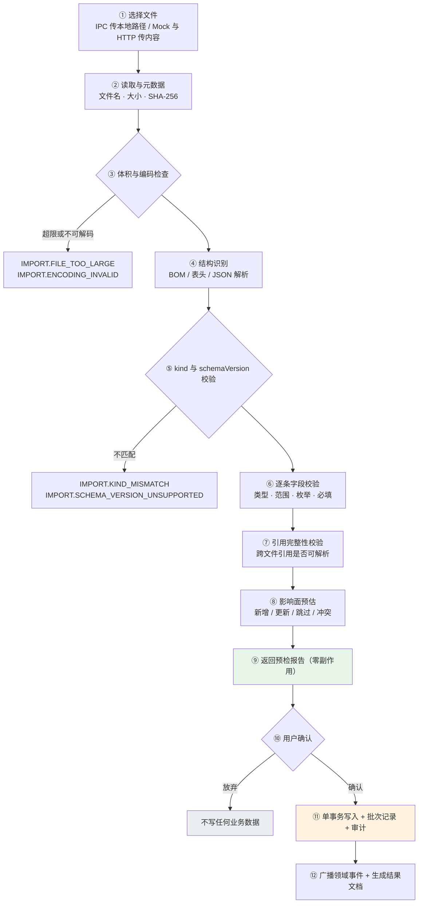
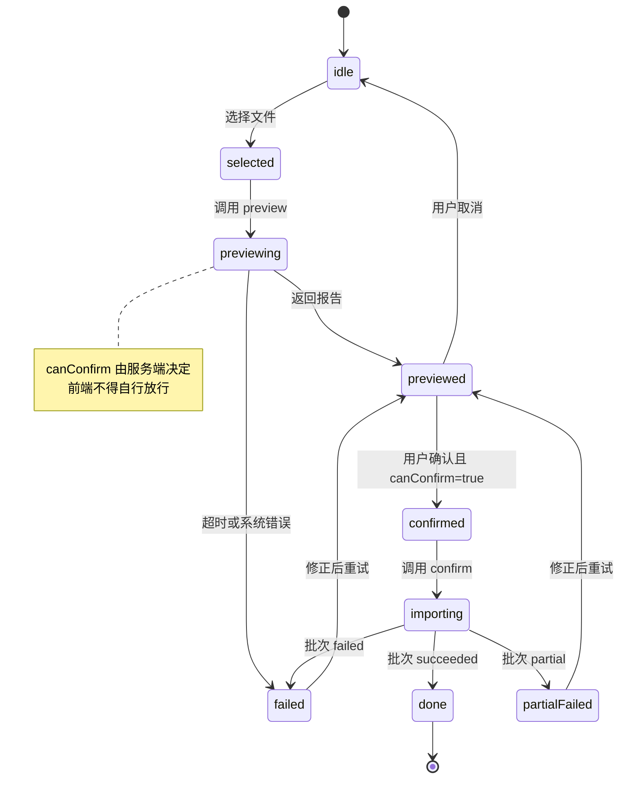

# 数据文件接口规范（订单 / 地图 / 车辆 / 算法）

> 版本：v0.2（**草案，调研中**；2026-09-15 与订单设计去重）
> 状态：仅接口与文件契约设计，**不包含实现**；字段与接口均待评审确认。
> 关联：[`design.md`](../design.md) §5（算法）· §6（数据模型）· [`docs/api.md`](./api.md) §1（通用约定）· [`docs/database.md`](./database.md）

### 与 `docs/order-data-map-design.md` 的分工（去重后）

两份文档曾有重叠并已出现实际分歧（错误码命名、批次表名、导入接口路径），现已一次性去重。
**同一主题只保留一处**，引用时请按下表取用，不要在两处各写一份：

| 主题 | 唯一来源 |
| --- | --- |
| 文件格式与字段契约（四类文件）、导入管线、错误模型、`mode`、幂等、导入接口、批次表 | **本文件** |
| 地区目录（`regions` / `region_aliases` / `region_dataset_versions`）与匹配语义 | `order-data-map-design.md` §3 |
| 订单数据文档内容与表（`orders` / `order_import_rows`） | `order-data-map-design.md` §4 |
| 订单与地图的联动、订单专属接口、订单落地节奏 | `order-data-map-design.md` §5-§8 |

## 0. 阅读提示

本文件把四类「外部文件 → 系统数据」的入口统一成一套契约，四类分别是：

| 编号 | 文件 | 承载 | 主格式 |
| --- | --- | --- | --- |
| F1 | 订单数据集 | 待配送订单（外部系统导出） | CSV |
| F2 | 仿真地图 | 路网节点 / 有向边 / 站点 / 禁行规则 | JSON |
| F3 | 配送车辆参数 | 车队物理参数与服务能力 | JSON |
| F4 | 配送算法配置 | 策略、代价权重、约束阈值 | JSON |

设计基调：**格式契约（文件长什么样）+ 导入管线（怎么安全落库）** 两件事分开描述。前者面向使用文件的人，后者面向实现者与前端。

---

## 1. 目标与边界

### 1.1 目标

1. 让四类文件都有**唯一、可校验、可版本化**的格式定义，避免「按当前代码猜字段」。
2. 导入必须**先预览、后生效**：预检零副作用，确认才写库（沿用 D-03 的既有原则）。
3. 错误必须**可定位、可解释、可导出**：CSV 给到行列，JSON 给到 JSON Pointer。
4. 同一份文件重复导入**结果可比对**，且默认不产生重复业务数据。
5. 支撑「离线仿真」：地图 + 车辆 + 算法三件套可组合成一个**场景包**（见 §2.7），同一场景可重复跑出可复现结果。

### 1.2 首期不做

- 不做真实地图服务与联网地理编码（沿用 `order-data-map-design.md` §1）。
- 不做文件内容的长期归档与云同步；只留元数据与校验和。
- 不做多租户隔离、不做增量同步协议（只做整文件导入）。
- 不做文件可视化编辑器；导入页只做预览、校验与确认（编辑走既有 CRUD 界面）。

---

## 2. 通用文件契约

以下约定对 F1-F4 **全部适用**，各章只描述差异部分。

### 2.1 编码与体积

| 项 | 约定 |
| --- | --- |
| 编码 | F1 支持 `UTF-8`（含 BOM）与 `GB18030/GBK`；F2-F4 固定 `UTF-8`（含 BOM） |
| 换行 | `LF` / `CRLF` 均可 |
| 体积上限 | 单文件默认 20 MB；F1 行数上限 10,000（沿用订单接入设计） |
| 超限行为 | 解析**之前**即拒绝，返回 `IMPORT.FILE_TOO_LARGE`，不进入逐行校验 |
| 解析方式 | 流式解析，禁止把不受限文件一次性读入内存（前端不得先整份读进内存再上传） |

> **为什么 F1 要支持 GBK**：中文场景下由 Excel 另存为的订单 CSV 常为 GBK，一味按 UTF-8 解码会把中文列名变成乱码，导致「表头识别失败」这种看似无解的问题。编码嗅探顺序：BOM → UTF-8 严格解码成功则采信 → 否则按 GB18030 解码并返回 `IMPORT.ENCODING_ASSUMED` 警告，**要求用户在预览页确认**，不静默采信。

### 2.2 信封与版本

F2-F4 为 JSON，统一顶层信封；F1 为 CSV，把版本信息放在**导入参数**里（CSV 无法承载元数据，这是选 CSV 的代价）。

```json
{
  "schemaVersion": 1,
  "kind": "map",
  "meta": {
    "name": "园区演示地图",
    "description": "4×3 网格，步长 20m",
    "source": "hand-authored",
    "createdAt": "2026-09-15T00:00:00.000Z",
    "author": "demo"
  },
  "data": { }
}
```

| 字段 | 必填 | 说明 |
| --- | --- | --- |
| `schemaVersion` | 是 | 整数。当前统一为 `1`；未知版本直接拒绝 |
| `kind` | 是 | `map` / `vehicle-fleet` / `dispatch-algorithm`，与接口 `{kind}` 必须一致 |
| `meta` | 否 | 仅供展示与审计，不参与业务校验 |
| `data` | 是 | 各自的有效载荷（§4/§5/§6） |

版本策略：

1. **只增不改**：新增可选字段 → `schemaVersion` 不变；语义变化、必填项变化、类型变化 → 必须升版本。
2. 旧版本文件在声明「兼容读取」前一律拒绝，**不做静默猜测式迁移**。
3. 拒绝时返回 `IMPORT.SCHEMA_VERSION_UNSUPPORTED`，并在 `detail` 中给出 `supportedVersions` 与升级建议。

### 2.3 统一导入管线



阶段约束（实现时按此判定违规）：

1. **预检绝不写业务库**。允许写「批次临时状态」以便前端轮询，但不得新增/修改任何业务实体。
2. **确认在单个事务内完成**；任一致命错误整体回滚，批次标记为失败。
3. **轻量错误（warning）不阻断导入**，但必须在结果文档与批次记录中留痕。
4. **导入不触发业务流转**：地图/车辆/算法导入后，任务状态、车辆运行态均不得被隐式改变。

### 2.4 统一错误模型 `ImportIssue`

前端渲染导入结果只需要处理这一种结构：

```json
{
  "severity": "error",
  "code": "ORDER.FIELD_FORMAT",
  "locator": { "type": "csv", "row": 17, "column": "cargoKg", "columnIndex": 5 },
  "field": "cargoKg",
  "value": "五十",
  "message": "载重必须是数字",
  "suggestion": "改为 50",
  "autoFixable": false
}
```

JSON 文件用 JSON Pointer 定位：

```json
{
  "severity": "error",
  "code": "MAP.EDGE_NODE_NOT_FOUND",
  "locator": { "type": "json", "pointer": "/data/edges/3/fromCode" },
  "field": "fromCode",
  "value": "N09",
  "message": "边引用了不存在的节点编码 N09",
  "suggestion": "在 nodes 中补充 N09，或修正该编码"
}
```

| 字段 | 说明 |
| --- | --- |
| `severity` | `error` 阻断该条目（不影响其它条目） / `warning` 导入但提示 / `info` 仅告知 |
| `code` | 错误码，见各章；**前端文案按 code 本地化，不解析 message** |
| `locator` | `type=csv` 用 `row`(1 基，含表头行号口径见 §3.1) + `column`/`columnIndex`；`type=json` 用 `pointer` |
| `field` | 标准字段名，便于前端按列聚合 |
| `value` | 原始值（可能为 `null`）；敏感字段需脱敏后再返回 |
| `message` | 服务端生成的人类可读描述（中文） |
| `suggestion` | 修复建议，前端显示为提示 |
| `autoFixable` | 预留：是否可一键修复（首期一律 `false`） |

> **对前端的硬性要求**：`message` 仅供展示，判断与分组一律用 `code` + `severity` + `field`。否则服务端改文案就会打挂前端逻辑。

### 2.5 幂等与批次

| 项 | 约定 |
| --- | --- |
| 幂等键 | `contentSha256 + schemaVersion + mappingVersion + targetScope` |
| 默认行为 | 命中相同幂等键 → 返回**上一次成功批次**结果，不重复写业务数据 |
| 显式重导 | 请求带 `forceReimport: true` 才创建新批次（需前端二次确认） |
| 批次记录 | 每次导入无论成败都落一条批次记录：文件摘要、统计、操作者、耗时、错误摘要 |
| 结果文档 | 批次完成后生成**不可变快照**，可再次下载；修正后重导生成新版本并保留旧版（与订单接入设计一致） |

> `targetScope` 用于区分「导进哪套数据」：地图为 `mapId`（首期仅一套，值固定 `default`），车辆为车队范围（首期固定 `default`），算法配置为配置集键（首期固定 `default`）。无此分量会导致「同一份地图导进两个场景」被误判为重复。

### 2.6 导入模式

四类文件共用 `mode`，语义必须一致，避免「地图是合并、车辆是覆盖」这类隐性差异：

| mode | 语义 | 明确不做的事 |
| --- | --- | --- |
| `validateOnly` | 只预检，不写库 | — |
| `merge`（默认） | 按业务主键 upsert；未出现的既有数据**保持不动** | 不删除任何既有数据 |
| `replace` | 先校验，后在单事务内清空该 scope 的既有数据再写入 | 不清空其它 scope；不影响历史任务与日志 |
| `appendOnly` | 只新增，已存在即跳过或报错（由 `onDuplicate` 决定） | 不更新既有数据 |

`replace` 的高危约束：

1. 必须前端二次确认（与 D-07 软删、D-04 版本化留痕同级的破坏性操作）。
2. **被引用的对象不得因 replace 消失**。例如地图 `replace` 时，若某节点被「进行中任务的路线」或「启用中的禁行规则」引用，则该节点必须保留或整体拒绝。首期简化为：存在非终态任务引用路网时，直接拒绝 `replace`（`IMPORT.IN_USE_CONFLICT`，`detail.refs` 列出引用者）。
3. 旧数据不物理删除：按 D-07 置 `disabled` 并保留，历史路线仍可回放。

### 2.7 场景包（仿真组合）

地图 + 车辆 + 算法是仿真的最小可复现单元。首期**不做压缩包格式**，而是用「同一 `scenarioId` 顺序导入三个文件」表达，批次记录中写入同一 `scenarioId`，即可复现「当时用了哪版地图、哪版车队、哪版算法」。

组合校验（三件套齐备时执行，返回为 warning 而非阻断）：

| 校验 | 不通过时 |
| --- | --- |
| 车队中每辆车类型在算法配置中都有对应参数 | `SCENARIO.VEHICLE_TYPE_UNCOVERED` warning |
| 算法配置要求的必需参数均已由全局默认或车辆级参数提供 | `SCENARIO.PARAM_MISSING` warning |
| 车辆参数的 `speedMps` 与地图边限速不冲突 | `SCENARIO.SPEED_LIMIT_CONFLICT` info |

> 缺失参数不阻断导入，但**阻断调度预览**（M4）时由既有约束评估给出 `BATTERY_INSUFFICIENT` 等具体拒绝原因，避免两处各自报错、口径不一。

---

## 3. F1 订单数据集（CSV）

### 3.1 文件结构

```csv
orderNo,title,from,to,cargoKg,priority,timeWindowStart,timeWindowEnd,cargoDesc
SO-2026-0001,晨间补货,A-01,B-02,120,high,2026-09-15T08:00:00.000Z,2026-09-15T10:00:00.000Z,常温饮品
SO-2026-0002,空箱回收,B-02,A-01,60,,,,
```

- 第 1 行为表头（**必需**），数据从**第 2 行**开始；报错行号一律指**文件物理行号**（表头为第 1 行），便于用户直接在 Excel 中定位。
- 分隔符：默认 `,`；可在预检时选择 `,` / `;` / `\t`。首行按候选分隔符统计出现次数，取最一致者并返回 `IMPORT.DELIMITER_ASSUMED` 提示。
- 空行：跳过且不计入错误；连续多个空行合并。
- 字段值为空字符串与字段缺失**视为等价**。

### 3.2 字段契约

| 字段 | 必填 | 类型 | 约束 | 缺失/非法 |
| --- | --- | --- | --- | --- |
| `orderNo` | 是 | string | 1-64 字符；同批次内唯一 | `ORDER.FIELD_REQUIRED` / `ORDER.DUPLICATE_ORDER` |
| `title` | 否 | string | ≤200 字符 | 缺省取 `orderNo` |
| `from` | 是 | string | 站点/地区编码、名称或别名 | `ORDER.FIELD_REQUIRED`；解析失败见 §3.4 |
| `to` | 是 | string | 同上 | 同上 |
| `cargoKg` | 是 | number | ≥0，≤ 车辆最大载重的宽松上限（默认 100000） | `ORDER.FIELD_REQUIRED` / `ORDER.FIELD_FORMAT` |
| `priority` | 否 | enum | `low/normal/high/urgent` | 非法 → `ORDER.FIELD_FORMAT`；缺省 `normal` |
| `timeWindowStart` | 否 | datetime | ISO 8601；与 `timeWindowEnd` **成对出现** | `ORDER.TIMEWINDOW_PAIR_MISSING` |
| `timeWindowEnd` | 否 | datetime | 必须晚于 `timeWindowStart` | `ORDER.TIMEWINDOW_INVALID` |
| `cargoDesc` | 否 | string | ≤500 字符 | — |
| `sourceUpdatedAt` | 否 | datetime | ISO 8601，仅审计用 | — |

数值解析宽容度：允许前后空白；允许 `1,200` 这类千分位（预检时提示 `ORDER.NUMBER_NORMALIZED` warning）。**不接受**中文数字、单位后缀（如 `120kg`）——一律报 `ORDER.FIELD_FORMAT` 并给出建议，不做猜测式解析。

时间解析：接受 ISO 8601；接受 `YYYY-MM-DD HH:mm:ss` 并在预检中提示按本地时区（`Asia/Shanghai`）解释；**必须在预览页显式标注时区**，避免跨时区误读。

### 3.3 列名映射

外部系统列名不可能与我们一致，故提供两层映射：

1. **别名自动识别**：内置常见别名表（如 `order_no/订单号/单号` → `orderNo`，`起点/发货地/src` → `from`），预检时返回建议映射与置信度。
2. **显式映射覆盖**：确认导入时传 `mapping`，优先级高于自动识别。

```json
{
  "mapping": {
    "orderNo": "订单编号",
    "from": "发货仓",
    "to": "收货点",
    "cargoKg": "重量(kg)"
  }
}
```

规则：

- 标准字段**必须全部有来源**；`mapping` 未覆盖且别名识别失败 → `IMPORT.MAPPING_INCOMPLETE`，列出缺失字段。
- 一个标准字段不可映射到多列；多列指向同字段 → `IMPORT.MAPPING_CONFLICT`。
- 未被映射的列**原样保存在该行 `extraJson`**，且**不得覆盖**任何标准字段（防止外部列名意外命中标准名）。
- 映射结果参与幂等键（`mappingVersion`），映射变了即视为不同批次。

### 3.4 名称解析与歧义

`from` / `to` 的解析优先级以 [`docs/order-data-map-design.md`](./order-data-map-design.md) §3.1 为唯一来源
（标准编码 → 规范化名称 → 别名 → 归一化唯一命中；**多候选与无候选都不猜测**），本节只登记**错误码与 severity**。

匹配结果需保存 `inputValue` / `matchedRegionId` / `matchedCode` / `matchType` / `confidence` / `datasetVersion`，
字段含义见 `order-data-map-design.md` §3.2。

| 情况 | code | severity |
| --- | --- | --- |
| 无命中 | `ORDER.REGION_NOT_FOUND` | error |
| 多候选 | `ORDER.REGION_AMBIGUOUS` | error（`detail.candidates` 给出候选编码） |
| 命中但站点已禁用 | `ORDER.SITE_DISABLED` | warning（保留订单，导入后不可调度） |
| 命中但路网不可达 | `ORDER.ROUTE_NOT_FOUND` | warning（地区存在 ≠ 路径可达，两者不可混同） |

> 前端要点：`REGION_AMBIGUOUS` 必须能把 `detail.candidates` 渲染成候选选择器，供用户选定后重试该行；这是「部分成功导入」体验的关键，不能只报一句「匹配到多个」。

### 3.5 重复订单策略

| `onDuplicate` | 语义 |
| --- | --- |
| `skip`（默认） | 已存在则跳过，计入 `skipped` |
| `update` | 仅更新仍为 `draft` 的本地订单；已进入流程的**禁止覆盖**，记 warning `ORDER.UPDATE_SKIPPED_STATE` |
| `reject` | 已存在即报 `ORDER.DUPLICATE_ORDER`（error） |

### 3.6 安全

- CSV 内容视为不可信输入：限制体积与行数，禁止公式注入（导出时对 `= + - @` 起始字段加前缀），禁止把原始值拼接进 SQL。
- 原始值与错误详情可能含地址等个人信息，日志只记摘要；下载接口必须鉴权并写审计。

---

## 4. F2 仿真地图（JSON）

地图描述「车辆能在哪里走」，对应既有 `nodes` / `edges` / `sites` / `restrictions` 四张表。坐标沿用平面 `{x,y}` 米制（D-05），**禁止经纬度**。

### 4.1 完整示例

```json
{
  "schemaVersion": 1,
  "kind": "map",
  "meta": { "name": "园区演示地图", "source": "hand-authored" },
  "data": {
    "nodes": [
      { "code": "N01", "name": "西北角", "x": 0, "y": 0 },
      { "code": "N02", "name": "北中",   "x": 20, "y": 0, "status": "enabled" }
    ],
    "edges": [
      { "fromCode": "N01", "toCode": "N02", "lengthM": 20, "speedLimitMps": 2.5 },
      { "fromCode": "N02", "toCode": "N01", "lengthM": 20, "speedLimitMps": 2.5 }
    ],
    "sites": [
      { "code": "A-01", "name": "A 仓", "type": "depot", "nodeCode": "N01", "x": 0, "y": 0 }
    ],
    "restrictions": [
      {
        "type": "edge",
        "target": { "fromCode": "N01", "toCode": "N02" },
        "vehicleType": "drone",
        "startAt": "2026-09-15T00:00:00.000Z",
        "endAt": "2026-09-15T23:59:59.000Z",
        "reason": "低空禁飞区"
      }
    ]
  }
}
```

### 4.2 引用规则（本文件的关键设计）

文件内**一律用 `code` 引用，不用数据库 ID**：ID 由系统生成，外部文件无法预知；用 code 引用才能让地图文件自洽、可手写、可 diff。

| 引用方 | 字段 | 指向 |
| --- | --- | --- |
| `edges` | `fromCode` / `toCode` | `nodes[].code` |
| `sites` | `nodeCode` | `nodes[].code` |
| `restrictions` | `target.code`（node）/ `target.fromCode+toCode`（edge） | `nodes` / `edges` |

约束：

1. `code` 在各自集合内唯一；重复 → `MAP.CODE_DUPLICATE`。
2. **引用必须能在同一文件内解析**，否则 `MAP.EDGE_NODE_NOT_FOUND` / `MAP.SITE_NODE_NOT_FOUND` / `MAP.RESTRICTION_TARGET_NOT_FOUND`。不跨批次引用（避免导入顺序耦合）。
3. 允许引用 `merge` 模式下已存在于库中的 code（如只导入新增边）；预检需区分「文件内解析」与「库内解析」，后者失败报 `MAP.REFERENCE_UNRESOLVED_IN_DB`。

### 4.3 字段契约

`nodes`

| 字段 | 必填 | 类型 | 约束 |
| --- | --- | --- | --- |
| `code` | 是 | string | 1-32 字符，唯一 |
| `name` | 是 | string | ≤100 字符 |
| `x` / `y` | 是 | number | 有限数值，米制 |
| `status` | 否 | enum | `enabled`(默认) / `disabled` |
| `remark` | 否 | string | ≤500 字符 |

`edges`

| 字段 | 必填 | 类型 | 约束 |
| --- | --- | --- | --- |
| `fromCode` / `toCode` | 是 | string | 必须存在；**二者不得相同** |
| `lengthM` | 否 | number | >0；缺省按两端坐标欧氏距离计算 |
| `speedLimitMps` | 否 | number | >0；缺省 `null` 表示用车辆默认速度 |
| `status` | 否 | enum | `enabled`(默认) / `disabled` |
| `bidirectional` | 否 | boolean | 默认 `false`。为 `true` 时自动生成反向边（等价于显式写两条） |

> `bidirectional` 是为地图文件可读性加的便利字段，**落库仍是两条有向边**（`edges` 表唯一约束 `(fromNodeId,toNodeId)`）。若同时显式写了反向边又标 `bidirectional`，视为重复 → `MAP.EDGE_DUPLICATE`。

`sites`

| 字段 | 必填 | 类型 | 约束 |
| --- | --- | --- | --- |
| `code` | 是 | string | 1-32 字符，唯一 |
| `name` | 是 | string | ≤100 字符 |
| `type` | 是 | enum | `depot/dock/charging/gate/other` |
| `nodeCode` | 否 | string | 缺省 `null`；有值时必须存在 |
| `x` / `y` | 是 | number | 可为 0；若未给且 `nodeCode` 存在，预检建议取节点坐标 |

`restrictions`

| 字段 | 必填 | 类型 | 约束 |
| --- | --- | --- | --- |
| `type` | 是 | enum | `node` / `edge` |
| `target` | 是 | object | `type=node` 用 `{ "code": "N03" }`；`type=edge` 用 `{ "fromCode","toCode" }` |
| `vehicleType` | 否 | enum | `agv/carrier/drone/other`；缺省 `null` = 全部车型 |
| `startAt` / `endAt` | 否 | datetime | ISO 8601；`endAt` 必须晚于 `startAt` |
| `reason` | 是 | string | ≤200 字符，禁止为空 |

### 4.4 图结构校验

除字段级校验外，预检必须做**图级检查**——这是地图文件最容易出问题的地方，且只靠字段校验发现不了：

| 校验 | code | severity | 说明 |
| --- | --- | --- | --- |
| 边数为 0 | `MAP.EMPTY_GRAPH` | warning | 无任何可行路径，地图不可用 |
| 存在孤立节点（无任何边） | `MAP.ISOLATED_NODE` | warning | 列出 code；可能是编辑遗漏 |
| 站点未绑定节点 | `MAP.SITE_WITHOUT_NODE` | warning | 该站点无法参与路径规划 |
| 图不连通（存在多个连通分量） | `MAP.GRAPH_DISCONNECTED` | warning | 列出各分量节点数，提示跨区任务不可达 |
| 存在自环边 | `MAP.EDGE_SELF_LOOP` | error | 阻断 |
| 重复有向边 | `MAP.EDGE_DUPLICATE` | error | 阻断 |
| 限速为 0 或负 | `MAP.EDGE_INVALID_SPEED` | error | 阻断 |

> 设计取舍：图不连通只报 warning 不阻断。因为「多园区各自成网」是合法场景，硬性阻断会挡住正常用法；但必须让用户在预览页**一眼看到**，否则后续到达不了的报错会被误当成算法缺陷。

### 4.5 导入模式差异

| mode | 地图行为 |
| --- | --- |
| `merge` | 按 code upsert 节点/边/站点/禁行；未出现的既有对象保持不动 |
| `replace` | 校验通过后置既有节点/边/站点为 `disabled`（D-07 软删），再写入文件内容；**存在非终态任务引用路网时整体拒绝**（`IMPORT.IN_USE_CONFLICT`，`detail.refs` 列出任务） |
| `appendOnly` | 仅新增；命中的 code 按 `onDuplicate` 处理 |

### 4.6 导入后的表现

- `GET /api/map/overview` 立即返回新路网（地图为快照读取，无需重算缓存）。
- **不自动触发**「任务重算」或告警评估；仅在预览报告中提示「有 N 个进行中任务的路线可能受影响」，由调度员决定是否 `recompute`（与 M4 既有语义一致）。

---

## 5. F3 配送车辆参数（JSON）

### 5.1 与既有 `vehicles` 表的关系

既有 `vehicles` 表字段（`capacityKg` / `maxSpeedMps` / `battery` / `loadKg` …）描述**运行态**，由管理接口与执行器维护；本文件描述**物理参数与服务能力**，是仿真输入，**不是运行态**。

因此本文件**不写运行态字段**，明确禁止：

| 禁止出现的字段 | 原因 |
| --- | --- |
| `status` | 运行态，由调度与执行器管理；文件导入不得把车直接置 `busy` |
| `x` / `y` / `currentNodeId` | 运行态位置；导入时统一置为 `homeNodeCode` 对应节点 |
| `battery` | 运行态电量；导入时统一置 100（或由 `initialBattery` 指定，见下） |
| `loadKg` | 运行态载重；导入时置 0 |

若文件里出现上述字段，按 `VEHICLE.RUNTIME_FIELD_REJECTED` **报错阻断**，而不是静默忽略——静默忽略会让使用者误以为配置生效。

### 5.2 完整示例

```json
{
  "schemaVersion": 1,
  "kind": "vehicle-fleet",
  "meta": { "name": "演示车队", "source": "hand-authored" },
  "data": {
    "vehicles": [
      {
        "code": "AGV-01",
        "name": "搬运一号",
        "type": "agv",
        "capacityKg": 500,
        "maxSpeedMps": 1.5,
        "homeNodeCode": "N01",
        "initialBattery": 100,
        "energy": {
          "consumptionWhPerKm": 60,
          "batteryCapacityWh": 2400,
          "minBatteryPercent": 20,
          "chargeRateWhPerMin": 120
        },
        "service": {
          "supportedSiteTypes": ["depot", "dock"],
          "loadTimeSPerTask": 120,
          "unloadTimeSPerTask": 90,
          "maxConcurrentTasks": 1
        }
      },
      {
        "code": "DRN-01",
        "name": "无人机一号",
        "type": "drone",
        "capacityKg": 5,
        "maxSpeedMps": 12,
        "homeNodeCode": "N01",
        "service": { "supportedSiteTypes": ["depot", "gate"] }
      }
    ]
  }
}
```

### 5.3 字段契约

基础参数（必填）

| 字段 | 类型 | 约束 | 对应既有列 |
| --- | --- | --- | --- |
| `code` | string | 1-32 字符，唯一 | `vehicles.code` |
| `name` | string | ≤100 字符 | `vehicles.name` |
| `type` | enum | `agv/carrier/drone/other` | `vehicles.type` |
| `capacityKg` | number | >0 | `vehicles.capacity_kg` |
| `maxSpeedMps` | number | >0 | `vehicles.max_speed_mps` |

可选参数

| 字段 | 类型 | 缺省 | 说明 |
| --- | --- | --- | --- |
| `homeNodeCode` | string | `null` | 车辆停放/起始节点；必须存在于地图 |
| `initialBattery` | number | `100` | 0-100，仅导入时初值 |
| `remark` | string | `null` | ≤500 字符 |
| `energy` | object | 见 §5.4 | 能耗模型 |
| `service` | object | 见 §5.5 | 服务能力 |

### 5.4 能耗模型 `energy`

本模型直接服务于 M4 约束评估的第 6 步（电量充足性），并取代既有实现里含糊的 `kmToWh(总里程)`。

| 字段 | 类型 | 缺省 | 约束 | 说明 |
| --- | --- | --- | --- | --- |
| `consumptionWhPerKm` | number | 全局缺省 | >0 | 每公里耗电（Wh）；按载重线性修正见下 |
| `batteryCapacityWh` | number | `null` | >0 | 电池总容量；提供后可用「Wh 口径」计算，否则仅用百分比近似 |
| `minBatteryPercent` | number | `20`（`MIN_BATTERY_PERCENT`） | 0-100 | 低于此值视为电量不足 |
| `chargeRateWhPerMin` | number | `null` | >0 | 充电速率，用于二期充电调度；首期仅存储 |
| `loadFactorPerKg` | number | `0` | ≥0 | 载重附加能耗系数：`effWhPerKm = consumptionWhPerKm × (1 + loadFactorPerKg × 载重kg / 1000)` |

耗电估算（供 M4 使用，与既有 `chargeRisk` 权重配套）：

```
预计耗电Wh = effWhPerKm × 总里程km
预计剩余百分比 = battery - (预计耗电Wh / batteryCapacityWh × 100)   // 缺 batteryCapacityWh 时退化为百分比线性估算
电量不足判定 = 预计剩余百分比 < minBatteryPercent
```

> **单位口径必须统一为 Wh**：既有代码注释里出现过 `kmToWh` 这种把「里程直接当耗电」的写法，量纲不成立。本文件把口径固定为「每公里耗电 × 里程」，并要求 `batteryCapacityWh` 与 `consumptionWhPerKm` 同时提供时才是精确计算，否则退化为百分比近似并在预检中给 `VEHICLE.ENERGY_MODEL_APPROXIMATE` warning。

### 5.5 服务能力 `service`

| 字段 | 类型 | 缺省 | 约束 | 说明 |
| --- | --- | --- | --- | --- |
| `supportedSiteTypes` | string[] | 全部 | 取值为 `siteType` 枚举 | 只能服务这些类型的站点；用于候选筛选 |
| `loadTimeSPerTask` | number | `0` | ≥0 | 装货耗时，计入 `executeTimeS` |
| `unloadTimeSPerTask` | number | `0` | ≥0 | 卸货耗时，计入 `executeTimeS` |
| `maxConcurrentTasks` | number | `1` | ≥1 | 首期调度为单车单任务，>1 仅记录，不改变既有算法语义 |

> 明确边界：`maxConcurrentTasks > 1` 与既有「单车×单任务」占用区间模型冲突（`module-M4-dispatch.md` §6）。首期允许文件声明但不参与计算，预检给 `VEHICLE.CONCURRENCY_UNSUPPORTED` warning，待二期算法扩展后再启用。**不得悄悄改变既有调度语义。**

### 5.6 与地图的交叉校验

| 校验 | code | severity |
| --- | --- | --- |
| `homeNodeCode` 在地图中不存在 | `VEHICLE.HOME_NODE_NOT_FOUND` | error |
| `homeNodeCode` 存在但为孤立节点 | `VEHICLE.HOME_NODE_ISOLATED` | warning（该车无法出发） |
| `supportedSiteTypes` 内没有任何站点存在 | `VEHICLE.SITE_TYPE_UNCOVERED` | warning（车队无法服务该类任务） |
| 同 `type` 车辆 `maxSpeedMps` 离散度过大（最高/最低 >5 倍） | `VEHICLE.SPEED_OUTLIER` | info |

> 交叉校验需要地图已导入。若地图为空（`nodes` 表为空），则跳过校验并返回 `IMPORT.CROSS_CHECK_SKIPPED` warning，**不要**把「没有地图」当成「节点不存在」而报错。

### 5.7 导入模式差异

| mode | 车辆行为 |
| --- | --- |
| `merge` | 按 `code` upsert 物理参数；**不覆盖运行态字段**（status/位置/电量/载重保持原值） |
| `replace` | 文件中未出现的车辆置 `disabled`（软删，D-07）；**存在未完成任务的车辆不得被禁用**，否则整体拒绝 `IMPORT.IN_USE_CONFLICT` |
| `appendOnly` | 仅新增；code 重复按 `onDuplicate` 处理 |

---

## 6. F4 配送算法配置（JSON）

### 6.1 覆盖范围

本文件为**调度与路径算法的参数集**，对应三段既有实现：

| 段落 | 既有来源 | 本文件字段 |
| --- | --- | --- |
| 策略选择 | `dispatch.defaultStrategy` 设置项 | `dispatch.defaultStrategy` |
| 代价权重 | `DISPATCH_COST_WEIGHTS` 常量（D-12：P4 进常量，不进设置表） | `dispatch.costWeights` |
| 路径算法 | `route.defaultAlgorithm` 设置项 | `route.defaultAlgorithm` |
| 约束阈值 | `MIN_BATTERY_PERCENT`、`task.timeoutToleranceS` | `constraints.*` |
| 规模上限 | D-12：`taskIds≤50`、车辆`≤30` | `limits.*` |

> **D-12 的例外说明**：D-12 决定 P4 把权重做成常量，理由是「先用常量闭环，二期再迁设置表」。本文件是**导入型配置**，与「运行时热改设置」不是同一件事：它作为一次性输入在导入时落库为 `default` 配置集，`preview` 时读取快照。这样既满足可复现的仿真诉求，又**不引入运行时热更新**（`settings` 表仍不接管权重）。

### 6.2 完整示例

```json
{
  "schemaVersion": 1,
  "kind": "dispatch-algorithm",
  "meta": { "name": "演示配置", "source": "hand-authored" },
  "data": {
    "dispatch": {
      "defaultStrategy": "greedy",
      "enabledStrategies": ["greedy", "hungarian"],
      "costWeights": { "deadhead": 1, "execute": 1, "wait": 0.8, "late": 2, "chargeRisk": 1000 },
      "priorityWeight": { "low": 1, "normal": 2, "high": 3, "urgent": 4 }
    },
    "route": {
      "defaultAlgorithm": "aStar",
      "referenceSpeedMps": 1.5,
      "allowViaNodes": true
    },
    "constraints": {
      "minBatteryPercent": 20,
      "lateToleranceS": 300,
      "maxDetourRatio": 3
    },
    "limits": {
      "maxTasksPerPreview": 50,
      "maxVehiclesPerPreview": 30,
      "hungarianMaxCells": 1500
    }
  }
}
```

### 6.3 字段契约

`dispatch`

| 字段 | 类型 | 缺省 | 约束 |
| --- | --- | --- | --- |
| `defaultStrategy` | enum | `greedy` | `greedy` / `hungarian` / `genetic`（`genetic` 首期预留） |
| `enabledStrategies` | enum[] | `["greedy","hungarian"]` | 非空；必须包含 `defaultStrategy` |
| `costWeights` | object | `DISPATCH_COST_WEIGHTS` | 见下 |
| `priorityWeight` | object | `PRIORITY_WEIGHT` | 四个优先级各为正数 |

`costWeights`（**键名必须与既有常量完全一致**，避免两套命名并存）：

| 键 | 缺省 | 含义 |
| --- | --- | --- |
| `deadhead` | 1 | 空驶时间权重 |
| `execute` | 1 | 执行时间权重 |
| `wait` | 0.8 | 早到等待权重 |
| `late` | 2 | 迟到惩罚权重 |
| `chargeRisk` | 1000 | 电量风险罚项权重 |

约束：

1. 五项权重取值范围 `0 ≤ w ≤ 10000`，且**不得全部为 0**（`ALGO.WEIGHTS_ALL_ZERO` error）——全 0 会让所有指派代价相同，策略退化为任意选择，属于配置错误而非合法配置。
2. 权重差异过大（`max/min > 1000`，且均非 0）→ `ALGO.WEIGHT_IMBALANCE` **warning**：提示该项会实质支配其它项，代价对比失去意义。
3. 权重为负 → `ALGO.WEIGHT_NEGATIVE` error。

`route`

| 字段 | 类型 | 缺省 | 约束 |
| --- | --- | --- | --- |
| `defaultAlgorithm` | enum | `aStar` | `aStar` / `dijkstra` |
| `referenceSpeedMps` | number | `1.5` | >0；A* 启发式 `h = 欧氏距离 / 参考速度` 用，**影响搜索速度而非最优性**（要求 h 可采纳） |
| `allowViaNodes` | boolean | `true` | 关闭后 `/api/routes/plan` 的 `viaNodeIds` 一律拒绝 `ROUTE.VIA_NOT_ALLOWED` |

> `referenceSpeedMps` 的设计约束：为保证 A* 最优性，`h` 必须不高估真实代价，故该值**应 ≤ 全网最小实际速度**。若配置值大于网中最慢边速度，预检给 `ALGO.HEURISTIC_NOT_ADMISSIBLE` warning（可能导致路径非最优，与 Dijkstra 基线对比时不一致）。

`constraints`

| 字段 | 类型 | 缺省 | 约束 |
| --- | --- | --- | --- |
| `minBatteryPercent` | number | 20 | 0-100 |
| `lateToleranceS` | number | 300 | ≥0；超出该容忍直接拒绝 `TIMEWINDOW_CONFLICT`，容忍内计入 `penaltyLateS` |
| `maxDetourRatio` | number | 3 | ≥1；实际里程/直线距离上限，超出记 `ROUTE.DETOUR_EXCEEDED` warning |

`limits`

| 字段 | 类型 | 缺省 | 约束 | 说明 |
| --- | --- | --- | --- | --- |
| `maxTasksPerPreview` | number | 50 | 1-200 | 与 D-12 `taskIds≤50` 一致为缺省 |
| `maxVehiclesPerPreview` | number | 30 | 1-200 | 与 D-12 车辆≤30 一致为缺省 |
| `hungarianMaxCells` | number | 1500 | ≥1 | `任务数 × 车辆数` 上限；超出则拒绝 `hungarian` 并要求改用 `greedy` |

> 为何上限可配置但**不建议调大**：匈牙利为 O(n³)，50×30 已接近首期可接受范围。调大上限属于「明确知道自己在做什么」的操作，预检会在超缺省值时给 `ALGO.LIMIT_RAISED` warning 并在审计中留痕。

### 6.4 交叉校验（与既有设置项）

配置集导入后**与 `settings` 表的关系必须明确**，否则会出现两处都能改、以谁为准的问题：

| 项 | 优先级 | 说明 |
| --- | --- | --- |
| `dispatch.defaultStrategy` 等运行时设置 | `settings` 表优先 | 用户在设置页显式改过的值，不应被后来导入的文件静默覆盖 |
| 其余参数（权重、约束、上限） | 算法配置集优先 | `settings` 表不承载这些键（D-12），无冲突 |

冲突时的行为：预检返回 `ALGO.SETTINGS_CONFLICT` **info**，在报告中列出「文件值 vs 当前设置值 vs 生效值」，让用户明确知道哪一项没生效。**禁止静默覆盖用户显式设置过的项。**

### 6.5 导入后的生效时机

1. 配置集落库后，**下一次 `preview` / `plan` 立即生效**（每次调用读快照，与 D-03 快照语义一致）。
2. **已 apply 的派发计划不受影响**：既有 `dispatch_plans` 是历史事实，其 `costDetail` 保留当时权重计算结果，便于复核（D-04 版本化留痕）。
3. 生效变更写审计，`before` / `after` 记录完整配置差异。
4. 广播 `settings.changed` 事件（复用既有事件名），载荷 `{ key: "algorithm.config", value: { configSetId, version } }`。

---

## 7. 接口草案

> 待评审通过后回写 [`docs/api.md`](./api.md)。所有接口沿用统一信封、`traceId`、分页与错误结构（`api.md` §1）；下表权限点为建议值。

### 7.1 通用导入接口（四类文件共用）

设计取舍：**不做四个结构相似的接口**，而是用 `{kind}` 参数化。理由：四类文件的导入管线、错误模型、幂等语义完全一致，前端也只需要一个导入向导组件；但**预检报告与确认参数按 kind 分叉**，不强行统一。

| 方法/路径 | 权限 | 说明 |
| --- | --- | --- |
| `POST /api/imports/preview` | 见 §7.2 | 预检：零副作用，返回报告 |
| `POST /api/imports/confirm` | 见 §7.2 | 确认导入：单事务写入 |
| `GET /api/imports` | `base:read` | 批次列表：`kind/status/page/pageSize` |
| `GET /api/imports/{id}` | `base:read` | 批次详情（含统计与错误摘要） |
| `GET /api/imports/{id}/issues` | `base:read` | 错误明细：可分页、可按 `severity`/`code`/`field` 过滤 |
| `GET /api/imports/{id}/document` | `base:read` | 下载结果文档（JSON；CSV 仅 F1 平面明细） |

#### 7.1.1 预检

`POST /api/imports/preview`

```json
{
  "kind": "orders",
  "fileName": "orders-2026-09-15.csv",
  "content": "<base64 或缺省，见下>",
  "filePath": "/Users/me/orders-2026-09-15.csv",
  "options": {
    "delimiter": ",",
    "encoding": "auto",
    "mapping": { "orderNo": "订单编号" },
    "mode": "merge",
    "onDuplicate": "skip"
  }
}
```

| 字段 | 说明 |
| --- | --- |
| `kind` | `orders` / `map` / `vehicle-fleet` / `dispatch-algorithm` |
| `content` | 文件内容（base64）。Mock 与 HTTP 适配器使用 |
| `filePath` | 本地绝对路径。**仅 IPC 适配器使用**：主进程直接读盘，避免大文件先经渲染层再回传 |
| `options` | 按 kind 分叉的可选参数（分隔符/编码/映射/模式等） |

> **前端要点**：`content` 与 `filePath` 二选一。Electron 下必须走 `filePath`——让 20MB 文件在前端读成 base64 再经 IPC 传输，会额外占用约 27MB 内存与一次全量拷贝，是明确的性能陷阱。Mock 适配器则走 `content` 以保持浏览器可用。

响应：

```json
{
  "batchId": null,
  "kind": "orders",
  "summary": {
    "totalRows": 120, "validRows": 112, "errorRows": 6, "warningRows": 2,
    "insertCount": 110, "updateCount": 2, "skipCount": 0, "conflictCount": 0
  },
  "detected": { "encoding": "utf-8", "delimiter": ",", "hasHeader": true, "columns": ["订单编号", "发货仓"] },
  "suggestedMapping": { "orderNo": { "column": "订单编号", "confidence": 0.95 } },
  "issues": [ { "severity": "error", "code": "ORDER.FIELD_FORMAT", "locator": { "type": "csv", "row": 17, "column": "cargoKg", "columnIndex": 5 }, "field": "cargoKg", "value": "五十", "message": "载重必须是数字", "suggestion": "改为 50", "autoFixable": false } ],
  "samples": [ { "row": 2, "normalized": {}, "extra": {} } ],
  "graphReport": null,
  "canConfirm": false
}
```

| 字段 | 说明 |
| --- | --- |
| `issues` | 统一 `ImportIssue` 结构（§2.4）。首期返回**前 200 条**，总数在 `summary` 中，其余经 `/issues` 分页拉取 |
| `samples` | 前 N 条标准化结果（默认 10，`options.sampleSize` 可调），供用户核对映射是否正确 |
| `graphReport` | 仅 `kind=map`：图结构校验结果（连通分量、孤立节点等） |
| `canConfirm` | 是否允许确认导入。存在 `error` 级问题时为 `false`（`onDuplicate=reject` 场景除外） |

> **超时现实**：2 万行 CSV 的全量预检在首期实现下可能超过 IPC 的默认等待。接口必须支持 `options.previewLimit`（默认 5000 行）只预检前 N 行并返回 `truncated: true`，避免前端长时间无响应。完整预检作为批次的一部分在 `confirm` 阶段执行。

#### 7.1.2 确认导入

`POST /api/imports/confirm`

```json
{
  "kind": "orders",
  "filePath": "/Users/me/orders-2026-09-15.csv",
  "contentSha256": "…",
  "mapping": { "orderNo": "订单编号" },
  "mode": "merge",
  "onDuplicate": "skip",
  "forceReimport": false,
  "targetScope": "default",
  "createTasks": false
}
```

响应：

```json
{
  "batchId": "imp-20260915-0001",
  "status": "succeeded",
  "summary": { "totalRows": 120, "insertCount": 110, "updateCount": 2, "skipCount": 2, "errorCount": 6 },
  "documentId": "doc-…",
  "affected": { "orders": 112, "tasks": 0, "nodes": 0, "vehicles": 0 },
  "issues": []
}
```

约束：

1. `contentSha256` 由预检返回，确认时**必须回传**，服务端重新计算并比对——防止「预览的是 A 文件、确认的是 B 文件」。不一致 → `IMPORT.FILE_CHANGED`（409）。
2. `forceReimport=false` 且命中相同幂等键 → 返回上次批次，`status: "duplicated"`，不重复写数据。
3. `createTasks` 仅 `kind=orders` 有效；其余 kind 忽略该字段（不报错）。
4. 批次级致命错误 → 整体回滚，`status: "failed"`，`detail.fatal` 给出原因。

### 7.2 各 kind 的权限与专属参数

| kind | 预检权限 | 确认权限 | 专属 options | 审计模块名 |
| --- | --- | --- | --- | --- |
| `orders` | `task:read` | `task:write` | `mapping` / `onDuplicate` / `createTasks` | `order-import` |
| `map` | `base:read` | `base:write` | `bidirectionalDefault` | `map-import` |
| `vehicle-fleet` | `base:read` | `base:write` | `skipCrossCheck` | `vehicle-import` |
| `dispatch-algorithm` | `dispatch:read` | `settings:write` | — | `algo-config-import` |

> `dispatch-algorithm` 的确认权限取 `settings:write` 而非 `dispatch:apply`：它改的是全局参数，属于配置变更而非调度动作。这一点建议评审时重点确认。

### 7.3 算法配置的读取与导出

| 方法/路径 | 权限 | 说明 |
| --- | --- | --- |
| `GET /api/algorithm-config` | `dispatch:read` | 返回当前生效配置集 + 来源（导入/缺省常量） |
| `GET /api/algorithm-config/validate` | `dispatch:read` | 对当前配置做静态校验，返回 issues（不写库） |
| `POST /api/algorithm-config/preview` | `dispatch:preview` | 用候选配置对指定 `taskIds` 跑一次 dry-run 预览，对比与当前配置的差异 |

`preview` 的意义：配置改错代价高（直接改变所有后续派发结果）。该接口让用户在生效前看到「同一批任务在新权重下会被派给谁、总代价变化多少」：

```json
{
  "baseline": { "configVersion": 3, "summary": { "assigned": 8, "totalCost": 4210 } },
  "candidate": { "configVersion": 4, "summary": { "assigned": 9, "totalCost": 3980 } },
  "changedPlans": [ { "taskId": "t-1", "fromVehicleId": "v-1", "toVehicleId": "v-3", "costDelta": -120 } ],
  "issues": []
}
```

### 7.4 地图与车辆的导出（对称能力）

导入要有配套导出，否则「改坏了没法回退、也没法给别人复现」：

| 方法/路径 | 权限 | 说明 |
| --- | --- | --- |
| `GET /api/map/export` | `map:read` | 导出当前路网为 §4 格式 JSON（含 code 引用，可直接再导入） |
| `GET /api/vehicles/export` | `base:read` | 导出当前车队为 §5 格式 JSON（**不含运行态字段**） |
| `GET /api/orders/export` | `task:read` | 导出订单为 §3 CSV（公式注入防护见 §3.6） |

导出必须满足**往返一致**：`导出 → 不经修改 → 重新导入` 应得到等价的数据库状态，且在 `merge` 模式下 `insertCount=0`、`updateCount=0`（全部命中已存在）。这是验证两类契约是否自洽的最简测试，建议列为契约测试用例。

---

## 8. 错误码汇总

### 8.1 通过导入管线（通用）

| code | severity | 说明 |
| --- | --- | --- |
| `IMPORT.FILE_TOO_LARGE` | error | 超过体积或行数上限 |
| `IMPORT.ENCODING_INVALID` | error | 无法解码 |
| `IMPORT.ENCODING_ASSUMED` | warning | 按 GB18030 解码，需用户确认 |
| `IMPORT.DELIMITER_ASSUMED` | warning | 分隔符为推断值 |
| `IMPORT.KIND_MISMATCH` | error | `kind` 与接口不符 |
| `IMPORT.SCHEMA_VERSION_UNSUPPORTED` | error | 版本不支持 |
| `IMPORT.MAPPING_INCOMPLETE` | error | 标准字段缺少来源列 |
| `IMPORT.MAPPING_CONFLICT` | error | 多列映射到同一标准字段 |
| `IMPORT.FILE_CHANGED` | error | 确认时校验和与预检不一致 |
| `IMPORT.IN_USE_CONFLICT` | error | 被进行中的任务/规则引用，禁止 replace |
| `IMPORT.CROSS_CHECK_SKIPPED` | warning | 依赖数据缺失，跳过交叉校验 |
| `IMPORT.BATCH_FAILED` | error | 批次致命错误，已整体回滚 |

### 8.2 订单（F1）

| code | severity | 说明 |
| --- | --- | --- |
| `ORDER.FIELD_REQUIRED` | error | 必填缺失 |
| `ORDER.FIELD_FORMAT` | error | 类型或格式非法 |
| `ORDER.NUMBER_NORMALIZED` | warning | 数值被规范化（如千分位） |
| `ORDER.DUPLICATE_ORDER` | error | 批次内或库中重复 |
| `ORDER.UPDATE_SKIPPED_STATE` | warning | 目标订单非 `draft`，跳过更新 |
| `ORDER.TIMEWINDOW_PAIR_MISSING` | error | 时间窗未成对出现 |
| `ORDER.TIMEWINDOW_INVALID` | error | 结束早于开始 |
| `ORDER.REGION_NOT_FOUND` | error | 起终点无法匹配 |
| `ORDER.REGION_AMBIGUOUS` | error | 匹配到多个候选 |
| `ORDER.SITE_DISABLED` | warning | 站点已禁用 |
| `ORDER.ROUTE_NOT_FOUND` | warning | 地区已匹配但路网不可达 |

### 8.3 地图（F2）

| code | severity | 说明 |
| --- | --- | --- |
| `MAP.CODE_DUPLICATE` | error | code 重复 |
| `MAP.EDGE_NODE_NOT_FOUND` | error | 边引用节点不存在 |
| `MAP.SITE_NODE_NOT_FOUND` | error | 站点引用节点不存在 |
| `MAP.RESTRICTION_TARGET_NOT_FOUND` | error | 禁行目标不存在 |
| `MAP.REFERENCE_UNRESOLVED_IN_DB` | error | `merge` 模式下库内也无法解析引用 |
| `MAP.EDGE_SELF_LOOP` | error | 自环边 |
| `MAP.EDGE_DUPLICATE` | error | 重复有向边 |
| `MAP.EDGE_INVALID_SPEED` | error | 限速非正 |
| `MAP.EMPTY_GRAPH` | warning | 无任何边 |
| `MAP.ISOLATED_NODE` | warning | 孤立节点 |
| `MAP.SITE_WITHOUT_NODE` | warning | 站点未绑定节点 |
| `MAP.GRAPH_DISCONNECTED` | warning | 图不连通 |

### 8.4 车辆（F3）

| code | severity | 说明 |
| --- | --- | --- |
| `VEHICLE.RUNTIME_FIELD_REJECTED` | error | 文件中出现运行态字段 |
| `VEHICLE.HOME_NODE_NOT_FOUND` | error | 起始节点不存在 |
| `VEHICLE.HOME_NODE_ISOLATED` | warning | 起始节点孤立 |
| `VEHICLE.SITE_TYPE_UNCOVERED` | warning | 声明可服务的站点类型无对应站点 |
| `VEHICLE.ENERGY_MODEL_APPROXIMATE` | warning | 缺 `batteryCapacityWh`，退化为百分比近似 |
| `VEHICLE.CONCURRENCY_UNSUPPORTED` | warning | `maxConcurrentTasks>1` 首期不生效 |
| `VEHICLE.SPEED_OUTLIER` | info | 同类型车辆速度离散度过大 |

### 8.5 算法配置（F4）

| code | severity | 说明 |
| --- | --- | --- |
| `ALGO.WEIGHT_NEGATIVE` | error | 权重为负 |
| `ALGO.WEIGHTS_ALL_ZERO` | error | 权重全为 0 |
| `ALGO.WEIGHT_IMBALANCE` | warning | 权重差异过大 |
| `ALGO.HEURISTIC_NOT_ADMISSIBLE` | warning | 参考速度可能导致 A* 非最优 |
| `ALGO.LIMIT_RAISED` | warning | 规模上限被调高 |
| `ALGO.SETTINGS_CONFLICT` | info | 与 `settings` 表既有值冲突 |
| `ALGO.STRATEGY_NOT_ENABLED` | error | `defaultStrategy` 不在 `enabledStrategies` 中 |

### 8.6 路径（F4 配置项的运行时后果）

| code | severity | 说明 |
| --- | --- | --- |
| `ROUTE.VIA_NOT_ALLOWED` | error | 配置关闭 `allowViaNodes` 后仍传了 `viaNodeIds` |
| `ROUTE.DETOUR_EXCEEDED` | warning | 实际里程超出 `maxDetourRatio` 上限 |

### 8.7 场景组合

| code | severity | 说明 |
| --- | --- | --- |
| `SCENARIO.VEHICLE_TYPE_UNCOVERED` | warning | 车队车型在算法配置中无参数 |
| `SCENARIO.PARAM_MISSING` | warning | 必需参数缺失 |
| `SCENARIO.SPEED_LIMIT_CONFLICT` | info | 车速与边限速冲突 |

---

## 9. 前端落地要点

> 本节面向渲染层实现，是本文件与 `docs/api.md` 的差异所在：接口文档给契约，这里给「前端该怎么用」。

### 9.1 导入向导状态机

四类文件共用一个向导，状态由**服务端返回驱动**，前端不自造状态：



硬性约束：

1. **`canConfirm` 由服务端返回**，前端不得根据「错误数量为 0」自行推断可提交。
2. `confirm` 必须回传预检返回的 `contentSha256`，否则拒绝。
3. `replace` 模式与 `forceReimport=true` 必须二次确认（沿用 Req-M3-5 对破坏性操作的既有要求）。
4. 导入中禁用重复提交；批次完成前不允许离开页面（或明确提示会丢失进度）。

### 9.2 组件拆分建议

| 组件 | 职责 | 关键点 |
| --- | --- | --- |
| `ImportWizard` | 状态机宿主、调用适配器 | 只持有向导态，不持有文件内容 |
| `FileDropZone` | 选文件、本地预校验（体积/扩展名） | 体积检查前置，避免白等一次 IPC 往返 |
| `MappingEditor` | 列映射，展示置信度 | 低置信度（<0.8）高亮，要求人工确认 |
| `IssueTable` | 错误列表 | **虚拟滚动**（万行级）；按 `severity`/`code`/`field` 分组过滤 |
| `GraphReportPanel` | 仅地图：连通分量/孤立节点 | 与地图画布联动高亮问题节点 |
| `ConfigDiffPanel` | 仅算法：与当前配置对比 | 复用 `algorithm-config/preview` 的 `changedPlans` |
| `ImportHistory` | 批次列表与结果文档下载 | 分页；失败批次可一键重试 |

### 9.3 性能与体验要点

1. **大文件不走渲染层**：Electron 下传 `filePath`，禁止把文件读成 base64（§7.1.1 已述）。
2. **错误列表必须虚拟滚动**：2 万行文件可能有上千条 issue，全量渲染会直接卡死主线程。
3. **预检要有进度与可中断**：`previewLimit` 截断时明确告知「仅预检前 N 行」，不要让用户误以为全文已校验。
4. **错误定位要能跳转**：`locator.row` 用于对齐原始文件行号，提供「复制行号/复制该行」便于反馈给数据提供方。
5. **不解析 `message` 做逻辑**：分组与图标一律用 `code` + `severity`（§2.4）。
6. 导入完成后**按需刷新**受影响视图（地图/车辆列表/配置页），不要整页重载。

### 9.4 适配器差异（三层契约一致性的落点）

| 能力 | Mock | IPC | HTTP |
| --- | --- | --- | --- |
| 传文件 | `content`(base64) | `filePath` | `content` 或 multipart |
| 选文件 | `<input type="file">` | Electron `dialog` + 路径 | `<input type="file">` |
| 预检 | 内存内实现，随机/固定样例 | 真实解析 | 真实解析 |
| 进度 | 模拟 | 需主进程 push（见下） | SSE 或轮询 |

> **已知缺口**：`confirm` 对 2 万行文件可能耗时数秒到数十秒，而现有事件总线的 `event_log` 事件（`task.changed` 等）**不适合承载导入进度**。需新增 `import.progress` 事件（`{ batchId, phase, processed, total }`，节流 ≥ 250ms）或改为轮询 `GET /api/imports/{id}`。建议评审时定夺，本文件不擅自新增事件名。

---

## 10. 数据模型新增建议

> 待评审；去重后**统一为一个迁移 `0002_data_import.sql`**（原 `order-data-map-design.md` 建议的 `0002_order_ingestion.sql` 已作废，避免出现两个同号迁移）。建表细节并入 [`docs/database.md`](./database.md)。

| 表 | 用途 | 关键列 |
| --- | --- | --- |
| `import_batches` | 四类导入批次（统一一张表，用 `kind` 区分） | `id`、`kind`、`file_name`、`file_size`、`content_sha256`、`schema_version`、`mapping_version`、`target_scope`、`mode`、`status`、`summary`(JSON)、`issue_count`、`created_by`、`created_at`、`finished_at` |
| `import_issues` | 错误明细（可分页查询，不塞进批次 JSON） | `id`、`batch_id`、`severity`、`code`、`locator`(JSON)、`field`、`value`、`message`、`row_no` |
| `algorithm_configs` | 算法配置集版本化（D-04 同思路） | `id`、`version`、`status`(active/superseded)、`payload`(JSON)、`source_batch_id`、`created_by`、`created_at` |
| `regions` / `region_aliases` / `region_dataset_versions` | 地区目录与别名、版本 | **主定义在 [`docs/order-data-map-design.md`](./order-data-map-design.md) §3**，此处仅登记归属 |
| `orders` / `order_import_rows` | 订单标准记录与逐行结果 | **主定义在 [`docs/order-data-map-design.md`](./order-data-map-design.md) §4.1**，此处仅登记归属 |

设计取舍：

1. `import_issues` **独立成表**而非塞进 `import_batches.summary`。原因：错误明细可能上千条，塞进单个 JSON 列会让「按 code 分组统计」「分页拉取」都要全量反序列化。
2. `algorithm_configs` 用版本化 + `superseded`，而非直接 UPDATE 一行。与 D-04 一致，可对比、可回滚、可复核「当时用的是哪版权重」。
3. `import_batches.kind` 收口四类而非建四张表：统计、审计、前端列表都能复用一套查询。
4. 订单领域的三组表（地区目录、订单、逐行结果）由 `order-data-map-design.md` 定义，但**同属 `0002` 迁移**，不在本文件重复列 DDL。

索引建议：`import_batches(kind, created_at)`、`import_batches(content_sha256, target_scope)`（幂等查询）、`import_issues(batch_id, severity)`、`algorithm_configs(status)`。

---

## 11. 测试清单（建议）

### 11.1 契约与解析

| 编号 | 场景 | 期望 |
| --- | --- | --- |
| C1 | 四类文件各导一份合法样本 | `canConfirm=true`，确认后批次 `succeeded` |
| C2 | **往返一致**：导出 → 原样重导 | `merge` 下 `insertCount=0`、`updateCount=0` |
| C3 | `schemaVersion=999` | `IMPORT.SCHEMA_VERSION_UNSUPPORTED`，不写库 |
| C4 | `kind` 与接口不符（地图文件传 orders） | `IMPORT.KIND_MISMATCH` |
| C5 | 空文件 / 仅表头 / 仅 BOM | 明确报错，不抛未捕获异常 |

### 11.2 订单（F1）

| 编号 | 场景 | 期望 |
| --- | --- | --- |
| O1 | 含 A→B、未知起点、歧义起点、重复单号各一行 | 逐行解释；合法行入库，非法行进 issue |
| O2 | GBK 编码文件 | 正确解码 + `ENCODING_ASSUMED` warning |
| O3 | 千分位 `1,200` | 规范化 + warning |
| O4 | 时间窗只填一端 | `ORDER.TIMEWINDOW_PAIR_MISSING` |
| O5 | 同一文件重复上传 | 命中幂等键，返回上次批次，业务表无新增 |
| O6 | `onDuplicate=update` 但订单已 `assigned` | 跳过 + `ORDER.UPDATE_SKIPPED_STATE` warning |
| O7 | 导出含 `=` 起始字段 | 导出值被加前缀，防公式注入 |

### 11.3 地图（F2）

| 编号 | 场景 | 期望 |
| --- | --- | --- |
| M1 | 声明 `bidirectional` | 落库两条有向边 |
| M2 | 同时显式写反向边 + `bidirectional` | `MAP.EDGE_DUPLICATE` |
| M3 | 边引用不存在节点 | `MAP.EDGE_NODE_NOT_FOUND` |
| M4 | 自环边 / 重复边 / 限速为 0 | 分别阻断 |
| M5 | 两片区各自成网 | `MAP.GRAPH_DISCONNECTED` warning **不阻断** |
| M6 | 存在非终态任务时 `replace` | `IMPORT.IN_USE_CONFLICT`，`detail.refs` 有任务 |
| M7 | `replace` 后 | 旧节点为 `disabled`（软删），历史路线仍可查 |

### 11.4 车辆（F3）

| 编号 | 场景 | 期望 |
| --- | --- | --- |
| V1 | 文件含 `status`/`x`/`y` | `VEHICLE.RUNTIME_FIELD_REJECTED` 阻断 |
| V2 | `homeNodeCode` 不存在 | 报错；地图为空时改为 `CROSS_CHECK_SKIPPED` |
| V3 | 缺 `batteryCapacityWh` | `ENERGY_MODEL_APPROXIMATE` warning |
| V4 | `maxConcurrentTasks=2` | warning，且调度行为仍为单车单任务 |
| V5 | `merge` 导入 | 运行态字段（status/电量/载重）**未被覆盖** |

### 11.5 算法配置（F4）

| 编号 | 场景 | 期望 |
| --- | --- | --- |
| A1 | 权重全 0 | `ALGO.WEIGHTS_ALL_ZERO` 阻断 |
| A2 | `defaultStrategy` 不在 `enabledStrategies` | `ALGO.STRATEGY_NOT_ENABLED` |
| A3 | 权重 max/min > 1000 | warning，仍可导入 |
| A4 | 与 `settings` 表既有 `defaultStrategy` 冲突 | `ALGO.SETTINGS_CONFLICT` info，**沿用设置值** |
| A5 | 配置导入后 | 下次 preview 生效；既有 `dispatch_plans.costDetail` 不变 |
| A6 | `limits.hungarianMaxCells` 调小后跑 `hungarian` | 明确拒绝并提示改用 `greedy` |

---

## 12. 待评审问题

> 以下为**需要决策的开放问题**，本文件给出倾向但不擅自定论。评审通过后再回写 `design.md` / `docs/api.md` / `docs/database.md`，并新增 D 编号。

| 编号 | 问题 | 建议倾向 | 影响面 |
| --- | --- | --- | --- |
| Q1 | 导入接口用统一 `{kind}` 参数化，还是四个独立接口？ | 统一（§7.1）：管线与错误模型完全一致，前端复用一套向导 | 接口层、前端 |
| Q2 | 算法配置的确认权限用 `settings:write` 还是 `dispatch:apply`？ | `settings:write`：属配置变更而非调度动作 | 权限点、角色矩阵 |
| Q3 | 算法配置与 `settings` 表重叠项如何取舍？ | `settings` 优先并给 info 提示（§6.4）：不静默覆盖用户显式设置 | D-12 边界 |
| Q4 | 车辆能耗参数放全局默认 + 车型 + 单车三级，还是一级？ | 先做「全局默认 + 单车覆盖」两级 | 数据模型、M4 |
| Q5 | 地图/车辆是否允许局部导入（只传 `edges`）？ | 允许，但引用需能在库内解析（§4.2） | 导入语义 |
| Q6 | 导入进度用新增 `import.progress` 事件还是轮询？ | 倾向轮询起手（改动小），大文件再补事件 | 事件总线、前端 |
| ~~Q7~~ | ~~迁移编号 `0002` 归订单接入还是数据导入？~~ | **已定（2026-09-15 去重）**：合并为一个 `0002_data_import.sql`，两文档均按此执行 | 数据库 |
| Q8 | 订单 CSV 是否支持 xlsx？ | 首期不做（体积/依赖成本），仅提示用户另存为 CSV | 前端体验 |
| Q9 | `replace` 是否需要「预演回滚」快照？ | 首期仅软删 + 审计，不做回滚快照 | 数据安全 |
