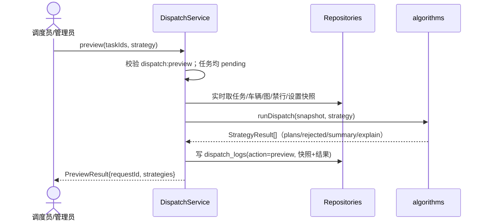
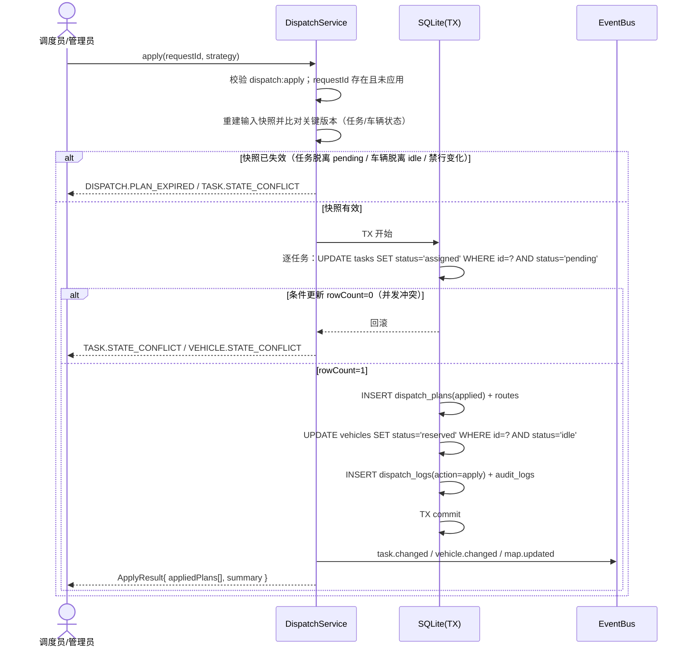

# 模块开发文档：调度引擎（M4）

> 版本：v1.0 · 面向开发
> 关联文档：`design.md` §4.4/§5、`docs/api.md` §3.4
> 本文目标是让开发者在 P4 阶段**不回头翻全量文档即可实现 M4**：给出文件划分、核心类型与方法签名、约束与算法细节、事务/事件/审计边界、测试与验收清单。任何实现偏差必须先回写本文档与 `AGENTS.md`。
> **文档边界**：本文件只负责「M4 调度引擎的模块内实现口径」。其余事实按 [`docs/api.md`](./api.md) §0「文档事实单一来源」引用，**不复述可漂移的数值**。

## 1. 模块定位

调度引擎是「任务 × 车辆」的**决策中枢**：

- 输入：一批 `pending` 任务 + 当前车辆/路网/设置快照。
- 输出：**可解释的派发预览**（含多策略对比与拒绝原因）；用户确认后 apply 才产生落库的 `dispatch_plans`、`routes` 并推进任务/车辆状态。
- 原则：**算法只算不算账**——纯函数层不做任何写库；所有副作用由 `DispatchService` 在一个受控边界内完成，全程审计留痕。

本模块**不负责**：任务 CRUD（M3）、路线搜索细节（M5）、执行器推进（M7）、告警生成规则（M8）。它通过领域事件与这些模块协作。

## 2. 范围与依赖

### 2.1 功能范围（对应 Req-M4）

| 需求 | 能力 | 接口 |
| --- | --- | --- |
| Req-M4-1 | 多策略结果对比 | `preview(strategy=all)` |
| Req-M4-2 | 约束不满足给结构化拒绝原因 | `rejected[]` |
| Req-M4-3 | 预览不污染业务数据 | 预览仅写 `dispatch_logs` |
| Req-M4-4 | 手动指派（带原因） | `manualAssign` |
| Req-M4-5 | 数据变化后重算 | `recompute` |
| Req-M4-6 | 预览/应用/重算全留痕 | `dispatch_logs` + `audit_logs` |
| Req-M4-7 | 车辆占用区间冲突检测 | 时间窗相交校验 |

### 2.2 依赖与数据来源

| 数据 | 来源（Repository） | 何时获取 |
| --- | --- | --- |
| 任务（pending，含站点/坐标/时间窗） | `TaskRepository` | 每次预览前实时取 |
| 车辆（状态/载重/电量/位置/当前占用） | `VehicleRepository` | 每次预览前实时取 |
| 路网（有效节点/有向边） | `GraphRepository` | 构图前实时取 |
| 禁行规则（生效中） | `RestrictionRepository` | 构图前实时取 |
| 默认策略/阈值权重 | `SettingsRepository` | 每次调用取 |
| 目标路线 | 调用 M5 路径服务（同一主进程内服务，不跨进程） | 代价评估阶段 |

> 实时取数的原因：`base:write` 或任务变更要**即时影响调度候选集**（Req-M2-7 / Req-M4-5），不允许使用缓存快照超过一次调用周期。

## 3. 代码结构规划

```text
shared/src/types.ts             # 追加 M4 对外契约类型（DTO 见 docs/api.md）
shared/src/enums.ts             # 追加 dispatchStrategy / rejectReason 等（唯一来源）
desktop/src/domain/dispatch/
├── dispatch.service.ts         # 编排：鉴权参数→快照→算法→事务落库→日志/审计/事件
├── snapshot.ts                 # buildSnapshot：组装 DispatchSnapshot + 构图（调用 M5 图构建）
├── evaluate.ts                 # 单车×单任务约束评估（顺序固定）+ 代价计算
├── occupancy.ts                # 占用区间模型（区间相交检测）
├── explain.ts                  # 人类可读 explain 生成
└── errors.ts                   # M4 错误码常量与构造器
desktop/src/db/repositories/     # 对应 Repository（已有通用实现，本模块只用查询/受控写入）
├── task.repo.ts  vehicle.repo.ts  graph.repo.ts  restriction.repo.ts
├── dispatch-plan.repo.ts  route.repo.ts  dispatch-log.repo.ts
```

**算法内核的实际归属：`shared/src/dispatch-*.ts`（不是 `desktop/src/algorithms/`）** —— 与 M5 的
`route-search.ts` 同一条理由（D-49 / D-51）：内核是**纯函数、无 IO**，而浏览器 Mock 形态迟早要复用
（三层一致性是项目不变量）；只有「从哪个存储读快照」留在各端（主进程 `repositories/`、Mock 内存库）。
落地形态：

```text
shared/src/dispatch-types.ts        # 快照/视图类型 + 算法内部常量（纯类型与数字）
shared/src/dispatch-evaluate.ts     # 占用区间 + 单车×单任务评估 + 代价函数
shared/src/dispatch-strategies.ts   # 贪心 + 匈牙利（含 solveAssignment）
shared/src/dispatch.ts              # runDispatch(snapshot, strategy) 分派与再导出
```

边界约束：

1. `shared/src/dispatch-*.ts` 不得 import 任何 db/domain 实现，只消费传入快照。
2. `dispatch.service.ts` 不写 SQL，只调用 Repository 方法。
3. `dispatch.service.ts` 不 import 算法文件以外任何 UI 内容。

## 4. 核心类型契约（实现时以 `shared/src/types.ts` 为准）

```ts
// 算法层输入快照（纯数据）—— 实现以 `shared/src/dispatch-types.ts` 为准
interface DispatchSnapshot {
  tasks: DispatchTaskView[];      // fromNodeId/toNodeId 已由快照组装阶段从站点解析好
  vehicles: DispatchVehicleView[];// 含 status/capacityKg/loadKg/battery/x/y/startNodeId/freeAt
  nodes: RouteNodeInput[];        // 原始图输入（未按车种裁剪）
  edges: RouteEdgeInput[];
  restrictions: RouteRestrictionInput[];
  occupiedSlots: OccupiedSlot[];  // 车辆未来已占用区间（apply 后产生）
  weights: DispatchCostWeights;   // 来自 `DISPATCH_COST_WEIGHTS`
  now: string;
}

> **与本文档 §4 原草案的两处差异（已按实现回写）**：
> **(1)** 快照带的是**原始图输入**而不是一张 `graph`：构图与禁行判定**按车种**各做一次
> （AGV 与无人机默认速度不同、禁行规则可只针对某车种），统一由 `buildRouteGraph` 处理 ——
> 若快照只给一张「已剔除禁行项」的图，就会把权限与速度差异糊掉。内核内按车种缓存构图结果。
> **(2)** `settings` 收窄为 `weights`：P4 的代价权重是常量（§7.3），不读 `settings` 表。

interface CostDetail {
  deadheadTimeS: number;  // 车→起点的空驶时间
  executeTimeS: number;   // 起点→终点行驶时间
  waitTimeS: number;      // 早到等待
  penaltyLateS: number;   // 预计晚到惩罚秒数
  chargeRisk: number;     // 电量不足风险系数 0-1
}

interface PlanPreview {
  taskId: string;
  vehicleId: string;
  vehicleCode: string;
  route: { fromNodeId: string; toNodeId: string; nodeIds: string[]; distanceM: number; durationS: number } | null;
  cost: number;
  costDetail: CostDetail;
  occupiedFrom: string; // ISO
  occupiedTo: string;   // ISO
}

type RejectReason =
  | 'VEHICLE_NOT_AVAILABLE' | 'LOAD_EXCEEDED' | 'TIMEWINDOW_CONFLICT'
  | 'BATTERY_INSUFFICIENT' | 'UNREACHABLE' | 'RESTRICTION_VIOLATED'
  | 'NO_AVAILABLE_VEHICLE';

interface RejectItem {
  taskId: string;
  reason: RejectReason;
  message: string;                       // 人读
  detail: Record<string, unknown>;       // 结构化上下文
}

interface StrategyResult {
  strategy: DispatchStrategy;
  plans: PlanPreview[];
  rejected: RejectItem[];
  summary: { totalTasks: number; assigned: number; rejectedCount: number; totalCost: number; elapsedMs: number };
  explain: string[];
}

interface PreviewResult {
  requestId: string;
  strategies: StrategyResult[];
}

interface AppliedPlan {
  planId: string;
  taskId: string;
  taskCode: string;
  vehicleId: string;
  routeId: string;
  cost: number;
  occupiedFrom: string;
  occupiedTo: string;
}

interface ApplyResult {
  requestId: string;
  appliedPlans: AppliedPlan[];
  summary: StrategySummaryLike;
}
```

## 5. 单车×单任务评估（evaluate.ts）

对每个 `(task, vehicle)` 对按**固定顺序**评估，命中即短路返回 `RejectItem`：

| 步骤 | 校验 | 失败 → reason | message 模板 |
| --- | --- | --- | --- |
| 1 | `vehicle.status === 'idle'` 且非 disabled/offline/fault/charging | `VEHICLE_NOT_AVAILABLE` | 车辆 {code} 当前不可用（状态 {status}） |
| 2 | `capacityKg - loadKg >= cargoKg` | `LOAD_EXCEEDED` | 任务载重 {cargoKg}kg 超过 {code} 剩余载重 {remain}kg |
| 3 | 车辆位置可达（构图后起点节点存在出边/连通） | `UNREACHABLE` | {code} 无法到达任务起点（节点不连通） |
| 4 | 按约束构图求路线（M5）；无解区分原因 | `UNREACHABLE`（不连通/断开）或 `RESTRICTION_VIOLATED`（禁行封闭） | 无可行路径 / 途经禁行区 / 图断开 |
| 5 | 时间窗：`freeAt + deadheadTimeS` 起，`executeTimeS` 后完成 ≤ `timeWindowEnd + penaltyLateLimit`；与既有 `occupiedSlots` 不相交 | `TIMEWINDOW_CONFLICT` | {code} 在 {区间} 已被占用或无法满足时间窗 |
| 6 | 电量：`battery - kmToWh(总里程) ≥ minBattery` | `BATTERY_INSUFFICIENT` | 预计耗电超过剩余电量 |

**短路顺序即优先顺序**：同一任务多个候选都不满足时，取第一个失败原因（按车辆排序稳定）。

`message/detail` 必须带上车辆编码与具体数值，保证「拒绝可解释」（Req-M4-2）。

## 6. 占用区间模型（occupancy.ts）

车辆被成功指派后形成不可再派的占用区间：

```
deadhead 到达起点时刻 t1 = max(now, vehicle.freeAt)
实际开工 t2 = max(t1, task.timeWindowStart)          // 早到则等待
预计完成 t3 = t2 + executeTimeS
occupied = [t2, t3]                                   // 与其它任务时间窗做区间相交
```

区间规则：

1. `now` 取服务端时钟，同一请求内所有策略共用同一个 `now`（确定性，Req-M4-6 可复核）。
2. 相交判定采用半开区间 `[a,b) ∩ [c,d) ≠ ∅` → 冲突。**空区间（`from === to`）永不冲突**：
   谓词里先判 `aFrom < aTo && bFrom < bTo` —— 少了这一步，「空槽落在对方内部」会被判成相交
   （`from === to` 时 `aFrom < bTo && bFrom < aTo` 仍可能为真），见 `ISS-067`。
3. 预览阶段：策略内部在内存中维护「已被本批预览占用的槽位」；多策略各自独立维护。
4. apply 阶段：`occupiedFrom/occupiedTo` 落库到 `dispatch_plans`，作为后续候选筛选的真实占用（`VehicleView.freeAt` 由最大 `occupiedTo` 推导）。

## 7. 策略实现

### 7.1 greedy（贪心，默认）

```text
1. 任务排序：priority 权值（urgent=4, high=3, normal=2, low=1）降序，
   再按 timeWindowStart 升序；时间窗更早者先派。
2. 遍历任务：
   a. 遍历候选车辆（状态 idle 集合）；
   b. 对每辆车执行 §5 评估；可行则记录 cost（§7.3）；
   c. 取 cost 最小车辆，否则记 rejected（取首个失败原因）；
   d. 选中后把 [t2, t3] 加入该车辆内存占用槽，继续下一任务。
3. 输出 plans / rejected / explain。
```

### 7.2 hungarian（匈牙利，整体指派）

```text
1. 建任务×车辆代价矩阵 C[n][m]：
   - §5 评估不通过 → C[i][j] = ∞；
   - 通过 → 任务 timeWindow 与占用槽冲突则 ∞，否则 cost（§7.3）。
2. n > m 时：先对 n-m 个「无法满足任何车辆或优先级最低」的任务预拒绝
   （reason=NO_AVAILABLE_VEHICLE），直到 n ≤ m，保证 n×m 矩阵可指派。
3. 对剩余任务执行匈牙利算法求最小总代价指派。
4. 任一行全 ∞ → 该任务进 rejected（记录全部失败原因之首）。
5. 生成与 greedy 同构的输出。
```

实现注意：n、m 上限在 P4 取 `50×30`（非功能指标内）；实现用 O(n³) 标准匈牙利；矩阵用 `number`，∞ 用 `Number.POSITIVE_INFINITY` 表示并在输入前完成裁剪。

### 7.3 代价函数（evaluate.ts 共用）

```
cost = w1*deadheadTimeS + w2*executeTimeS + w3*waitTimeS
     + w4*penaltyLateS + w5*chargeRisk
```

- 权重默认值：`w1=1, w2=1, w3=0.8, w4=2, w5=1000`。P4 以 **`shared/src/constants.ts` 的 `DISPATCH_COST_WEIGHTS`** 常量落地（不进设置表），二期接入系统设置时再补键。
- 其余阈值在 `shared/src/dispatch-types.ts`（与快照类型同文件，避免再多一个只放数字的文件）：
  `DISPATCH_LATE_TOLERANCE_S`（晚点容忍秒数，超过直接拒绝）、`DISPATCH_CHARGE_COMFORT_PERCENT`
  （低于它才产生续航风险分 —— 若与硬门槛同值，风险项恒为 0，等于没实现）、
  `DISPATCH_BATTERY_PERCENT_PER_KM`（车辆未给耗电率时的兜底）、`DISPATCH_MAX_TASKS` / `DISPATCH_MAX_VEHICLES`
  （§16 第 1 条的规模上限）、`DISPATCH_FORBIDDEN_COST`（匈牙利矩阵的「不可行」有限大数）。
- `penaltyLateS`：预计完成时刻晚于 `timeWindowEnd` 的秒数（≤ 容忍阈值内计入代价，超过阈值直接拒绝）。
- `chargeRisk`：`预计完成剩余电量 < chargeMinBattery` 时按缺口比例计风险分，否则 0。
- 每条 `PlanPreview` 必须携带完整 `costDetail` 供 UI 展开解释。

## 8. explain 生成规则（explain.ts）

每条 explain 一句话、可读、可复核：

- 派发：「任务 {code} 派给 {vehicleCode}：空驶 {s}s + 执行 {s}s，预计 {time} 完成」。
- 拒绝：「任务 {code} 拒绝：{reason 中文}（{detail 摘要}）」。
- 策略对比：「策略 {strategy} 共指派 {assigned}/{totalTasks}，总代价 {totalCost}」。

中文文案统一放 renderer 侧的文案模块（当前仍内联在 `renderer/src/pages/`；**尚无 `shared/i18n/`**，落地时再建），算法层只产出结构化原因，**文案在表现层/服务层翻译**（算法保持语言无关）。

## 9. DispatchService 方法签名

```ts
interface ActionContext {
  actorId: string; actorName: string; role: Role;
  permissions: string[]; traceId: string; now?: string;
}

class DispatchService {
  // POST /api/dispatch/preview —— 校验 pending + 组装快照 + runDispatch + 写 dispatch_logs(action=preview)
  preview(cmd: { taskIds: string[]; strategy: 'greedy' | 'hungarian' | 'all' }, ctx: ActionContext): Promise<PreviewResult>;

  // POST /api/dispatch/apply —— requestId 幂等 + 事务落库 + 事件
  apply(cmd: { requestId: string; strategy: DispatchStrategy }, ctx: ActionContext): Promise<ApplyResult>;

  // POST /api/dispatch/manual-assign —— 单任务指定车辆，校验通过直接生效（前端二次确认）
  manualAssign(cmd: { taskId: string; vehicleId: string; reason: string }, ctx: ActionContext): Promise<ApplyResult>;

  // POST /api/dispatch/recompute —— 先回收再预览，返回新 PreviewResult（不自动应用）
  recompute(cmd: { taskId: string; reason: string; strategy: DispatchStrategy | 'all' }, ctx: ActionContext): Promise<PreviewResult>;

  // GET /api/dispatch/logs
  listLogs(filter: DispatchLogFilter, page: PageRequest, ctx: ActionContext): Promise<Page<DispatchLogListItem>>;
}
```

每个公开方法第一行做权限校验（`dispatch:preview` / `dispatch:apply` / `dispatch:read`），失败抛 `AUTH.FORBIDDEN`。

## 10. 核心流程与事务边界

### 10.1 preview（预览）



要点：

1. 预览**不创建** `dispatch_plans` / `routes`，不改任务与车辆状态。
2. 每次 preview 生成新 `requestId` 并落一条 `dispatch_logs`，供后续 apply 引用与复核。
3. requestId 仅内存/日志内有效；退出应用后旧预览不可 apply（`DISPATCH.PLAN_EXPIRED` 语义由快照失效触发，见 §11）。

### 10.2 apply（应用派发）



事务内保护：

1. **条件更新即乐观锁**：`UPDATE … WHERE status='pending'` 未命中视为并发冲突回滚。
2. 同一事务内写 `dispatch_plans` / `routes` / 车辆 `reserved` / 日志 / 审计，任何一步失败整体回滚。
3. apply 成功后任务进入 `assigned`；车辆 `reserved`。执行器 start（M7）时再 `reserved→busy`、`assigned→running`。

### 10.3 manualAssign（手动指派）

与 apply 同一事务模板，但只处理单任务：

1. 前置：任务 `pending`、车辆 `idle`、约束评估全部通过（否则抛对应业务错误）。
2. 事务内落 `dispatch_plans`、`routes`、车辆 `reserved`、任务 `assigned`。
3. 日志 action=`manual_assign`，`reason` 必填（前端二次确认）。

### 10.4 recompute（重算）

触发条件：任务 `assigned / running / paused` 且发生封路/车辆故障等需要重新指派。步骤：

1. 事务 A：原 `dispatch_plans` → `superseded`；车辆按原计划回收（`busy/reserved → idle`）；任务 → `pending`。
2. 记录 `dispatch_logs(action=recompute, reason, before)`。
3. 随后按同一 reason 生成一次 `preview` 并返回（不自动 apply）。
4. 若任务因车辆故障触发，同时给告警模块发 `route_blocked/task_failed` 判定信号（由 M7/M8 监听决定是否建告警）。

## 11. 快照失效与幂等

| 场景 | 处理 | 错误码 |
| --- | --- | --- |
| 同一 requestId 被 apply 两次 | 第二次拒绝 | `DISPATCH.ALREADY_APPLIED` |
| apply 前任务被取消/编辑（脱离 pending） | 事务条件更新失败 → 拒绝 | `TASK.STATE_CONFLICT` |
| apply 前车辆被占用/下线（脱离 idle） | 事务条件更新失败 → 拒绝 | `VEHICLE.STATE_CONFLICT` |
| 无任何可用车辆 | 预览返回全量 rejected；手动指派直接抛 | `DISPATCH.NO_CANDIDATE` |
| requestId 不存在 | apply 拒绝 | `DISPATCH.REQUEST_NOT_FOUND` |

实现约定：`dispatch_plans.requestId` 与 `dispatch_logs.requestId` 对齐；apply 前置查询 requestId 最近一条 `dispatch_logs(action=preview|recompute)` 的存在性。

## 12. 日志 / 审计 / 事件

### 12.1 dispatch_logs（每次动作一条，Req-M4-6）

| 字段 | preview | apply | manual_assign | recompute |
| --- | --- | --- | --- | --- |
| inputSnapshot | ✓ | ✓（重建比对用，可不重复落） | ✓ | ✓ |
| outputSnapshot | ✓ | ✓ | ✓ | ✓ |
| summary/rejected | ✓ | ✓ | 单条 | ✓ |
| operatorId/elapsedMs | ✓ | ✓ | ✓ | ✓ |
| reason | – | – | 必填 | 必填 |

### 12.2 audit_logs

- 每个动作一条审计：`module='dispatch'`，`action='preview'|'apply'|'manual_assign'|'recompute'`，`objectType='task'/'vehicle'`，`result=success/failure`，`costMs`。
- apply/recompute 的审计 `after` 关联 `requestId + 受影响任务/车辆清单`。

### 12.3 事件（渲染层订阅）

| 事件 | 触发动作 | 载荷要点 |
| --- | --- | --- |
| `task.changed` | apply / manual_assign / recompute（回收时） | `{ taskId, status: 'assigned' / 'pending', … }` |
| `vehicle.changed` | apply / manual_assign / recompute（回收时） | `{ vehicleId, status: 'reserved' / 'idle', … }` |
| `map.updated` | 以上全部 | `{ eventSeq }` |
| `alert.created` | recompute 检测到封路/故障时（由 M7/M8 落） | 见 docs/api.md §4 |

## 13. 错误映射（本模块）

| 错误码 | source | 抛出点 |
| --- | --- | --- |
| `AUTH.FORBIDDEN` | auth | 无 dispatch 权限点 |
| `TASK.NOT_FOUND` | business | 入参任务不存在 |
| `TASK.STATE_CONFLICT` | business | 任务非 pending / 并发条件更新失败 |
| `VEHICLE.STATE_CONFLICT` | business | 车辆非 idle（手动指派/apply） |
| `DISPATCH.REQUEST_NOT_FOUND` / `DISPATCH.ALREADY_APPLIED` / `DISPATCH.PLAN_EXPIRED` | business | apply / recompute 前置 |
| `DISPATCH.NO_CANDIDATE` | business | 手动指派无候选 |
| `ROUTE.NOT_FOUND_PATH` / `GRAPH.*` | business | 路线层无解透传 |
| `VALIDATION.FAILED` | validation | taskIds 空 / strategy 非法 / reason 缺失 |
| `SYS.INTERNAL` | system | 未预期异常 |

---

## 14. 测试与验收清单

> **落地进度（2026-09-27）**：**Step 1-5 全部落地**。内核在 `shared/src/dispatch-*.ts`（D-51）；
> 服务层在 `desktop/src/domain/dispatch/`（`snapshot` / `explain` / `dispatch.service`）+ 两个 Repository；
> 六条路由在 `desktop/src/ipc/api.ts`（`api.dispatch.test.ts` 守契约）；调度台在 `renderer/src/dispatch/`，
> 浏览器形态由 `renderer/src/api/mock-dispatch.ts` 复用同一份内核承载。
>
> 逐项：U1-U11 与 S1-S8 全绿；本模块用例分布见下表与 `docs/api.md` §3.4 的「已实现范围」。
> 需求条目 Req-M4-1..7 的验收走查（§14.4）已在 Electron（真实 SQLite + IPC）与浏览器 Mock 两种形态各跑一遍，
> 结论逐项相同、控制台错误 0 条。
>
> **尚未落地的相邻能力（有意，不是本模块欠账）**：执行器（M7）未开工，故车辆停在 `reserved` 不会自动变
> `busy`，也不会产生位置事件；遗传策略（`genetic`）按设计返回 `enabled: false`。

### 14.1 单元测试（算法层，纯函数，无 DB）

| 编号 | 用例 | 断言 |
| --- | --- | --- |
| U1 | 车辆全部非 idle | 全任务 `VEHICLE_NOT_AVAILABLE` |
| U2 | 载重不足 | `LOAD_EXCEEDED` + detail 含 cargoKg/剩余载重 |
| U3 | 禁行封闭必经节点 | `RESTRICTION_VIOLATED` 或拒派 |
| U4 | 时间窗与占用槽相交 | `TIMEWINDOW_CONFLICT` |
| U5 | 电量不足 | `BATTERY_INSUFFICIENT` |
| U6 | greedy 优先级+时间窗排序 | 高优/更早任务先派 |
| U7 | greedy 单批内同车两次被选 | 第二次时间窗冲突被拒或改派他车 |
| U8 | hungarian 3×2 | 整体代价 ≤ greedy 或相等，矩阵含 ∞ 不崩 |
| U9 | n>m 裁剪 | 多余任务 reason=`NO_AVAILABLE_VEHICLE` |
| U10 | 确定性 | 相同快照+now 两次输出一致（explain 亦一致） |
| U11 | explain 非空 | 每条 plan/reject 均有可读文案 |

### 14.2 服务层测试（内存 Repository 或 SQLite 临时库）

| 编号 | 用例 | 断言 |
| --- | --- | --- |
| S1 | preview 不改任务/车辆状态、不生成 plans 行 | 只多一条 dispatch_logs |
| S2 | apply 成功：任务 assigned、车辆 reserved、plan/route/log/audit 齐 | 事务完整性 |
| S3 | apply 二次同一 requestId | `DISPATCH.ALREADY_APPLIED` |
| S4 | apply 前任务被人取消 | `TASK.STATE_CONFLICT` 且无脏数据 |
| S5 | manualAssign 成功/失败路径 | 约束违反抛对应错误；成功后留痕含 reason |
| S6 | recompute：superseded→回收→pending→新 preview | dispatch_logs 成对 |
| S7 | 事件广播 | task.changed/vehicle.changed/map.updated 均发出 |
| S8 | 权限 | dispatcher 可通过；monitor 调 preview 返回 `AUTH.FORBIDDEN` |
| S9 | 同一车在一批里出现两条计划（占用区间不重叠） | apply 一次派成两条，两条任务都 `assigned`、车辆只 `reserved` 一次 |
| S10 | 跨批次：车辆已 `reserved` | 另起一次预览时该车不进候选，任务得 `VEHICLE_NOT_AVAILABLE`（有意的保守边界） |
| S11 | 重算回收同车两单中的一单 | 另一单仍 `assigned`、车辆**不**置 `idle`；两单都回收后才回 `idle` |

### 14.2.1 三条写路由的方法护栏（ISS-066 回归）

`POST /api/dispatch/preview` / `/apply` / `/manual-assign` / `/recompute` 全部以 `POST` 注册；
用 `GET` 访问同一路径一律 `API.ROUTE_NOT_FOUND`。这条性质由 `api.dispatch.test.ts` 逐路由断言 ——
此前 `/api/auth/login` 曾以默认 `GET` 注册（`Router.invoke` 不传 method 就是 `GET`），
前端按契约发 `POST` 时得到「接口不存在」，而两侧各自单测都是绿的。

### 14.3 契约测试（走统一 API 信封）

- `POST /api/dispatch/preview` / `apply` / `manual-assign` / `recompute` / `strategies` / `logs` 的请求-响应与 `docs/api.md` §3.4 逐字段比对。
- MockAdapter 与 IpcAdapter 跑同一组用例结果一致。

### 14.4 验收走查（对照 Req-M4-1..7）

1. 建 3 个 `pending` 任务 + 2 辆 `idle` 车 → preview(strategy=all) 两策略均返回 plans 与 summary（Req-M4-1）。
2. 人为给任务超高载重 → rejected 带 reason/message/detail（Req-M4-2）。
3. 预览后查库：无 `dispatch_plans` 新增，仅 `dispatch_logs`（Req-M4-3）。
4. 手动指派指定车辆并写原因 → 生效且 audit/dispatch_logs 可查（Req-M4-4）。
5. 封路后对 assigned 任务 recompute → 车辆回收、任务回 pending、产出新预览（Req-M4-5）。
6. 任一步骤后查询 dispatch_logs 可见输入/输出快照与耗时（Req-M4-6）。
7. 两个任务时间窗重叠且只剩一辆车 → 只有一个被指派，另一个 `TIMEWINDOW_CONFLICT`（Req-M4-7）。

## 15. 开发顺序与完成标准（DoD）

```text
Step 1  M4 类型（复用 shared/src/types.ts 既有契约；内核自带快照类型）  → 编译通过          ✅ 已落地
Step 2  内核：occupancy → evaluate → greedy → hungarian                → U1-U10 绿        ✅ 已落地
        （explain 归服务层，U11 随 Step 3 —— 见 §8：文案面向人、含中文）
Step 3  domain/dispatch：snapshot → explain → dispatch.service(preview/apply/manual/recompute)
        + Repository 方法（dispatch-plan / dispatch-log）              → U11 + S1-S8 绿    ✅ 已落地
Step 4  IPC 注册 + 鉴权中间件 + 契约测试                                → §3.4 全部通过     ✅ 已落地
Step 5  前端调度中心页接入（策略选择/预览对比/应用/日志）               → 走查 1-7 通过      ✅ 已落地
```

### 15.1 落地位置（按文档找文件用）

| 关注点 | 位置 |
| --- | --- |
| 六步评估 / 占用区间 / 代价 | `shared/src/dispatch-evaluate.ts` |
| 贪心 / 匈牙利 | `shared/src/dispatch-strategies.ts`（顺序与常量在 `dispatch-types.ts`） |
| 快照组装（读库 → `DispatchSnapshot`） | `desktop/src/domain/dispatch/snapshot.ts` |
| 人读解释文案（唯一作者） | `desktop/src/domain/dispatch/explain.ts` |
| 五个方法（preview/apply/manualAssign/recompute/list*） | `desktop/src/domain/dispatch/dispatch.service.ts` |
| 计划落库与乐观锁 | `desktop/src/db/repositories/dispatch-plan.repo.ts` |
| 日志写入与存档读取 | `desktop/src/db/repositories/dispatch-log.repo.ts` |
| 六条路由与事件广播 | `desktop/src/ipc/api.ts`（`emitDispatchEffects`） |
| 调度台 UI | `renderer/src/dispatch/`（`DispatchConsole` / `ConfirmDispatchDialog` / `DispatchLogPanel` / `model.ts`） |
| 浏览器形态的存储 | `renderer/src/api/mock-dispatch.ts`（与主进程逐项对齐由 `mock-dispatch.test.ts` 守） |

DoD 定义：需求条目全部通过验收走查、dispatch_logs/audit 有断言覆盖、事件已广播、文档无欠账（改动即回写本文档与 design/api）、提交前按 AGENTS 纪律记录。

## 16. 风险与备注

1. 匈牙利矩阵规模失控 → 入口校验 taskIds ≤ 50（超过提示分批），车辆 ≤ 30 之外只参与 greedy。
2. 时间窗语义复杂（跨天/重复任务）→ 首期只支持单次即时任务，二期再加重复计划。
3. 并发双调度 → 依赖 SQLite 单写者 + 条件 UPDATE 兜底，不允许跨进程直接写库。
4. preview 快照不落库 → 若要回放「为什么当时那样派」，以 dispatch_logs.inputSnapshot 为准。
5. `reserved` 车辆超时未 start → 由监控模块巡检并提示（P5），本期只落状态。
