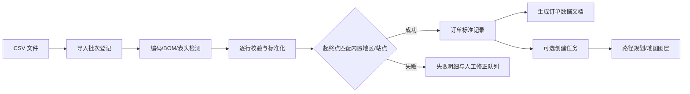

# 订单数据接入与地图生成设计

> 版本：v1.0（设计阶段）  
> 状态：仅文档，不包含实现  
> 关联：`design.md` §4.3（M3 任务管理）、§4.6（M6 地图可视化）、§6（数据模型）、`docs/api.md` §3.3/§3.6

## 1. 目标与边界

本功能接收外部订单 CSV，将每一行转换为可追踪的订单记录，并在后台完成：

1. 原始文件留痕、格式校验、逐行解析与部分成功反馈；
2. 起点/终点名称或编码与内置地区/站点数据匹配；
3. 将合法订单转换为任务（`draft` 或 `pending`，由导入选项决定）；
4. 生成订单数据文档，记录导入批次、字段映射、匹配结果、任务结果和异常明细；
5. 为地图提供订单起点、终点、匹配置信度和路线生成所需的标准化坐标。

首期不做真实地图服务、地址联网地理编码、自动创建未知地区、订单计费和多租户隔离。地图继续使用本项目的平面 `{x,y}` 米制坐标。

## 2. 核心概念与处理流程

处理必须可重入：同一文件重复上传不重复创建任务；以 `contentSha256 + mappingVersion` 作为默认幂等键，用户明确选择“重新导入”时才生成新的批次。

## 3. 内置地区数据模型

现有 `sites` 是业务站点，不能直接承担所有外部地址别名。设计新增“地区目录”概念（建议迁移 `0002_order_ingestion.sql`）：

- `regions`：地区标准编码、名称、类型、所属父级、关联节点/站点、坐标、启用状态、数据版本；
- `region_aliases`：别名、规范化别名、语言/来源、关联 `region_id`；
- `region_dataset_versions`：地区数据集版本、来源、导入时间、校验和、是否当前版本。

匹配优先级固定为：

1. 精确标准编码（如 `A`、`B` 或 `site:A-01`）；
2. 精确规范化名称；
3. 精确别名；
4. 同义词/大小写/全半角/空白归一化后的唯一命中；
5. 多候选或无候选均不得自动猜测，进入失败明细。

规范化只用于检索，不覆盖原始值。每个匹配结果保存 `inputValue`、`matchedRegionId`、`matchedCode`、`matchType`、`confidence`、`datasetVersion`，确保可复核。

“起点 A、终点 B 是否存在 AB”解释为：分别查找起点 `A` 与终点 `B`，并在当前启用路网中检查是否存在从 A 对应节点到 B 对应节点的可行路径。只有地区存在但路网不可达时，才返回“地区已匹配、路径不可达”，不能混同为地区不存在。

## 4. CSV 接收策略

### 4.1 文件级策略

- 接受 `.csv`，默认 UTF-8；兼容 UTF-8 BOM，拒绝无法解码的文件。
- 默认大小上限 20 MB、行数上限 10,000；超限在解析前拒绝。
- 第一行必须是表头；分隔符默认逗号，可在导入预览中选择逗号/分号/制表符。
- 原始文件只保存元数据（文件名、大小、SHA-256、上传者、时间），不把整份文件内容写入业务表；是否保留原文件由部署保留策略决定。
- 解析采用流式方式，禁止一次性将不受限文件载入内存。

### 4.2 推荐字段

| 字段 | 必填 | 说明 |
| --- | --- | --- |
| `orderNo` | 是 | 外部订单号；同一租户/系统内唯一 |
| `title` | 否 | 订单标题，缺省使用 `orderNo` |
| `from` | 是 | 起点编码、名称或别名 |
| `to` | 是 | 终点编码、名称或别名 |
| `cargoKg` | 是 | 货物重量，数值且 ≥0 |
| `priority` | 否 | `low/normal/high/urgent`，缺省 `normal` |
| `timeWindowStart` | 否 | ISO 8601 时间；必须与结束时间成对出现 |
| `timeWindowEnd` | 否 | ISO 8601 时间，且晚于开始时间 |
| `cargoDesc` | 否 | 货物描述 |
| `sourceUpdatedAt` | 否 | 外部系统更新时间，用于审计与增量判断 |

允许通过导入映射把外部列名映射到上述标准字段。未知列保存在该行的 `extraJson` 中，但不得覆盖标准字段。

### 4.3 导入阶段与结果

导入分为“预检预览”和“确认导入”两步：

1. 预检只解析、校验、匹配和估算结果，不创建任务；返回表头识别、字段映射、前 N 条样例及错误统计。
2. 确认后在单个导入批次内逐行处理；合法行写入订单记录，按选项创建任务；非法行保留失败原因。
3. 单行失败不回滚其它合法行；批次级系统错误才整体回滚当前事务。
4. 支持 `duplicatePolicy=skip|update|reject`：默认 `skip`。`update` 仅更新仍为 `draft` 的本地订单，禁止覆盖已执行任务。
5. 导入完成生成不可变的订单数据文档快照，可再次下载 JSON/CSV；修正后的重新导入生成新版本并保留旧版本。

### 4.4 错误分类

错误至少分为：`FILE_INVALID`、`HEADER_MISSING`、`FIELD_REQUIRED`、`FIELD_FORMAT`、`DUPLICATE_ORDER`、`REGION_NOT_FOUND`、`REGION_AMBIGUOUS`、`ROUTE_NOT_FOUND`、`SITE_DISABLED`、`TASK_CREATE_FAILED`。每条错误带行号、列名、原始值（必要时脱敏）和建议动作。

## 5. 订单数据文档

“数据文档”不是随意生成的文本，而是可审计的批次快照。建议新增：

- `order_import_batches`：批次 ID、文件摘要、映射版本、地区数据版本、状态、统计、操作者、时间；
- `orders`：外部订单号、标准化起终点、匹配结果、载重、时间窗、来源批次、当前版本、关联 `task_id`；
- `order_import_rows`：原始行号、原始 JSON、标准化 JSON、状态、错误 JSON、匹配详情。

文档输出固定包含：批次摘要、字段映射、地区数据版本、成功/失败/跳过数量、订单标准记录、任务创建结果、起终点匹配详情、路径检查结果、错误明细和审计引用。默认生成 JSON；CSV 仅用于平面明细导出，不能表达嵌套匹配详情。

## 6. 地图生成与联动

订单匹配成功后，地图不直接读取 CSV，而读取统一的 `map/overview` 快照：

- 起点/终点使用地区关联节点坐标；若地区只有站点坐标，则先解析到站点节点；
- A→B 路径调用现有 M5 路径服务，遵守禁行、节点/边状态和车辆类型约束；
- 地图图层增加 `orders`（待处理订单）和 `orderEndpoints`（起终点）；现有任务路线仍由 `tasks/routes` 提供；
- 无法匹配地区的订单显示在“未定位订单”列表，不伪造坐标；地区匹配但无路网路径的订单显示起终点标记与 `route_unavailable` 状态；
- 点击订单应联动订单文档、任务详情和地图端点；批次筛选、匹配状态筛选和失败原因筛选均为页面态。

建议扩展 `GET /api/map/overview?include=orders,orderEndpoints`，返回订单 ID、批次 ID、起终点原始值、标准编码、坐标、匹配类型、匹配置信度和路径状态。

## 7. 权限、审计与安全

- 上传/确认导入：`task:write`；预检与批次查询：`task:read`；文档导出：`task:read`（若导出含审计字段，沿用 `audit:read`）。
- 每个批次、订单版本、任务创建和人工修正均写 `audit_logs`，记录文件哈希、映射版本、地区版本和统计摘要。
- CSV 内容视为不可信输入：限制大小/行数，禁止公式注入（导出到表格时对 `= + - @` 开头字段加前缀），禁止把原始字段拼接进 SQL。
- 订单原始值与错误详情可能含个人或地址信息，日志只记录摘要；下载接口必须鉴权并记录审计。

## 8. 接口草案（实现前需回写 `docs/api.md`）

- `POST /api/orders/import/preview`：上传元数据或文件引用，返回映射建议、样例、匹配统计和错误预览。
- `POST /api/orders/import/confirm`：确认批次、映射、重复策略和 `createTasks` 选项，返回批次结果。
- `GET /api/orders/imports`、`GET /api/orders/imports/{id}`：查询批次、行级结果与生成文档摘要。
- `GET /api/orders/imports/{id}/document`：下载 JSON/CSV 结果文档。
- `GET /api/orders`：按批次、匹配状态、任务状态、关键词分页查询。
- `POST /api/orders/{id}/rematch`：地区目录更新后重新匹配；不得静默改动已运行任务。

所有接口沿用统一 API 信封、`traceId`、分页和错误结构；预览不写业务订单和任务，确认才产生持久化副作用。

## 9. 分阶段落地建议

1. P1/P2：确定地区目录格式、CSV 字段契约、错误码和迁移草案；补充 A/B 演示地区数据。
2. P3：实现预检、批次、订单记录与任务创建，先接 Mock 地图。
3. P3/P4：接入 M5 路径检查和 M6 订单端点图层，完成列表/地图/文档联动。
4. P5：补充大文件、重复导入、地区歧义、路网不可达和导出安全测试。

验收主线：上传包含 A→B、未知起点、歧义起点和重复订单的 CSV；预检能逐行解释；确认后合法订单生成任务与数据文档；A/B 在内置目录且路网连通时地图显示端点/路线；其它行不伪造位置并可在失败明细中修正和重试。
