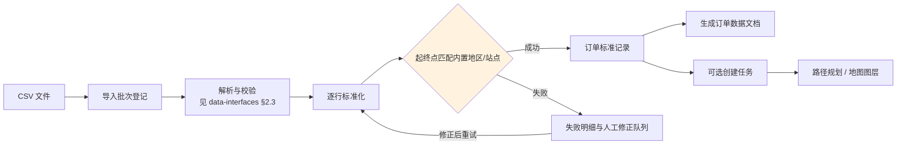

# 订单数据接入与地图生成设计（订单领域语义）

> 版本：v1.1（已去重，2026-09-15）
> 状态：仅设计文档，不含实现
> 定位：本文件**只保留订单领域语义**（地区目录、订单数据文档、地图联动、落地节奏）。
> **文件契约与导入管线不在此重复**，唯一来源为 [`docs/data-interfaces.md`](./data-interfaces.md)。
> 关联：`design.md` §4.3（M3）· §4.6（M6）· §6（数据模型）· `docs/api.md` §3.3/§3.6

## 0. 去重说明（v1.0 → v1.1）

v1.0 与 `docs/data-interfaces.md` 在「文件怎么收、怎么校验、怎么报错、接口长什么样」上存在大面积重复。
两者口径已出现实际分歧（错误码命名、批次表名、导入接口路径），故做一次性去重：**同一主题只保留一处**。

| 主题 | 唯一来源 | v1.0 中的位置（已移除） |
| --- | --- | --- |
| CSV 文件级策略（体积/编码/分隔符/流式解析） | `data-interfaces.md` §2.1 · §3.1 | §4.1 |
| 订单 CSV 字段契约 | `data-interfaces.md` §3.2 | §4.2 |
| 导入阶段与结果（预检→确认） | `data-interfaces.md` §2.3 | §4.3 |
| 错误分类与错误码 | `data-interfaces.md` §2.4 · §8.2 | §4.4 |
| 幂等与批次 | `data-interfaces.md` §2.5 | §2 末段 |
| 列名映射 | `data-interfaces.md` §3.3 | §4.2 末段 |
| 重复订单策略 | `data-interfaces.md` §3.5 | §4.3 第 4 条 |
| 安全与注入防护 | `data-interfaces.md` §3.6 | §7 后半 |
| 导入接口草案 | `data-interfaces.md` §7 | §8 |
| 批次表 | `data-interfaces.md` §10（`import_batches`） | §5（`order_import_batches`） |
| 地区目录版本表 | 本文件 §3（`regions` 系列为该表的主定义处） | §3 |

**顺带修正的三处口径分歧**（v1.0 与 `data-interfaces.md` 不一致）：

1. **错误码统一为带命名空间的形式**：v1.0 的 `FILE_INVALID` / `FIELD_REQUIRED` / `DUPLICATE_ORDER` / `REGION_NOT_FOUND` /
   `REGION_AMBIGUOUS` / `ROUTE_NOT_FOUND` / `SITE_DISABLED` 对应 `data-interfaces.md` §8 的
   `IMPORT.ENCODING_INVALID` / `ORDER.FIELD_REQUIRED` / `ORDER.DUPLICATE_ORDER` / `ORDER.REGION_NOT_FOUND` /
   `ORDER.REGION_AMBIGUOUS` / `ROUTE.NOT_FOUND_PATH` / `ORDER.SITE_DISABLED`。
   以 `data-interfaces.md` §8 为唯一错误码登记处，此处不再另立名单。
2. **批次表合并为一张**：v1.0 的 `order_import_batches` 并入通用 `import_batches`（`kind='orders'`），避免「四类文件各有一张批次表」。
3. **导入接口路径统一**：v1.0 的 `POST /api/orders/import/preview` / `confirm` 改为 `POST /api/imports/preview` / `confirm` 且 `kind="orders"`。
   本文件 §6 只保留**订单专属**接口。

---

## 1. 目标与边界

接收外部订单 CSV，将每一行转为可追踪的订单记录，并完成：

1. 逐行解析与部分成功反馈（管线见 `data-interfaces.md` §2.3）；
2. 起点/终点名称或编码与内置地区/站点数据匹配（§3）；
3. 将合法订单转为任务（`draft` 或 `pending`，由导入选项决定）；
4. 生成订单数据文档，记录批次、字段映射、匹配结果、任务结果与异常明细（§4）；
5. 为地图提供订单起点、终点、匹配置信度与路线生成所需的标准化坐标（§5）。

**首期不做**：真实地图服务、联网地理编码、自动创建未知地区、订单计费、多租户隔离。
地图继续使用平面 `{x,y}` 米制坐标（D-05）。

---

## 2. 订单领域流程

上图中「解析与校验」「预检/确认」等通用环节的细节以 `data-interfaces.md` 为准；本文件只定义**匹配**（§3）、**文档**（§4）与**联动**（§5）。

---

## 3. 内置地区数据模型

现有 `sites` 是业务站点，不能直接承担所有外部地址别名。故新增「地区目录」概念（与 §4 其余表同属迁移 `0002_data_import.sql`）：

- `regions`：地区标准编码、名称、类型、所属父级、关联节点/站点、坐标、启用状态、数据版本；
- `region_aliases`：别名、规范化别名、语言/来源、关联 `region_id`；
- `region_dataset_versions`：地区数据集版本、来源、导入时间、校验和、是否当前版本。

### 3.1 匹配优先级（固定，不得调整）

1. 精确标准编码（如 `A`、`B` 或 `site:A-01`）；
2. 精确规范化名称；
3. 精确别名；
4. 同义词/大小写/全半角/空白归一化后的唯一命中；
5. 多候选或无候选均**不得自动猜测**，进入失败明细。

### 3.2 可复核性要求

规范化只用于检索，**不覆盖原始值**。每个匹配结果必须保存：

| 字段 | 说明 |
| --- | --- |
| `inputValue` | 外部文件中的原始值 |
| `matchedRegionId` | 命中的地区 ID（未命中为 `null`） |
| `matchedCode` | 命中的标准编码 |
| `matchType` | 命中方式：`code` / `name` / `alias` / `normalized` |
| `confidence` | 置信度 0-1，供 UI 排序与人工复核 |
| `datasetVersion` | 当时使用的地区数据集版本 |

> 保存 `datasetVersion` 是关键：地区目录更新后，历史批次仍能解释「当时为什么匹配到它」。

### 3.3 「起点 A、终点 B 是否存在 AB」

含义为：分别查找起点 `A` 与终点 `B`，再在当前启用路网中检查是否存在从 A 对应节点到 B 对应节点的**可行路径**。

必须区分三种结果，不可混同：

| 情况 | 结果 | 错误码 |
| --- | --- | --- |
| 地区未匹配 | 无法定位 | `ORDER.REGION_NOT_FOUND` |
| 地区已匹配、路网不可达 | 端点已知但无路径 | `ROUTE.NOT_FOUND_PATH`（warning） |
| 地区已匹配、路径可行 | 可用 | — |

---

## 4. 订单数据文档

「数据文档」是可审计的批次快照，不是随意生成的文本。

### 4.1 相关表

| 表 | 归属 | 说明 |
| --- | --- | --- |
| `import_batches` | `data-interfaces.md` §10 | 批次主记录（`kind='orders'`），含文件摘要、映射版本、地区数据版本、统计、操作者 |
| `import_issues` | `data-interfaces.md` §10 | 校验问题明细（`severity`/`code`/`locator`/`field`） |
| `orders` | 本文件 | 外部订单号、标准化起终点、匹配结果、载重、时间窗、来源批次、当前版本、关联 `task_id` |
| `order_import_rows` | 本文件 | 原始行号、原始 JSON、标准化 JSON、状态、错误 JSON、匹配详情 |

> `order_import_rows` 与 `import_issues` 的分工：前者是**每行结果**（成功行也有记录，供数据文档还原），
> 后者是**问题清单**（仅出问题的行/字段）。两者不互相替代，不要合并。

### 4.2 文档输出内容（固定，不得裁剪）

批次摘要、字段映射、地区数据版本、成功/失败/跳过数量、订单标准记录、任务创建结果、
起终点匹配详情、路径检查结果、错误明细、审计引用。

- 默认生成 **JSON**（可表达嵌套的匹配详情）；
- **CSV 仅用于平面明细导出**，无法表达嵌套匹配详情，导出时须在文件头注明该限制。

---

## 5. 地图生成与联动

订单匹配成功后，地图**不直接读取 CSV**，而是读取统一的 `map/overview` 快照：

- 起点/终点使用地区关联节点坐标；若地区只有站点坐标，则先解析到站点节点；
- A→B 路径调用 M5 路径服务，遵守禁行、节点/边状态与车辆类型约束；
- 地图图层增加 `orders`（待处理订单）与 `orderEndpoints`（起终点）；任务路线仍由 `tasks/routes` 提供；
- **无法匹配地区的订单进入「未定位订单」列表，不伪造坐标**；
- 地区匹配但无路网路径的订单，显示起终点标记并置 `route_unavailable` 状态；
- 点击订单联动订单文档、任务详情与地图端点；批次筛选、匹配状态筛选、失败原因筛选均为**页面态**。

建议扩展 `GET /api/map/overview?include=orders,orderEndpoints`，返回订单 ID、批次 ID、起终点原始值、
标准编码、坐标、匹配类型、匹配置信度与路径状态。

---

## 6. 订单专属接口

> 导入类接口统一为 `data-interfaces.md` §7.1 的 `POST /api/imports/preview` / `confirm`（`kind="orders"`），
> 本文件不另立路径，避免两套导入入口。

| 方法/路径 | 权限 | 说明 |
| --- | --- | --- |
| `GET /api/orders` | `task:read` | 按批次、匹配状态、任务状态、关键词分页查询 |
| `GET /api/orders/{id}` | `task:read` | 订单详情（含匹配详情与关联任务） |
| `POST /api/orders/{id}/rematch` | `task:write` | 地区目录更新后重新匹配；**不得静默改动已运行任务** |
| `GET /api/imports/{id}/document` | `task:read` | 下载该批次的结果文档（通用接口，见 `data-interfaces.md` §7.1） |

`rematch` 的硬约束：目标订单若已关联非终态任务，仅更新匹配元数据并返回提示，
**不得**自动改写任务起终点、不得触发重排；需由调度员显式决定。

---

## 7. 权限与审计（订单部分）

- 预检与批次查询：`task:read`；确认导入与 `rematch`：`task:write`；文档导出：`task:read`
  （若导出含审计字段，沿用 `audit:read`）。通用约定见 `data-interfaces.md` §7.2。
- 每个批次、订单版本、任务创建与人工修正均写 `audit_logs`，记录文件哈希、映射版本、地区版本与统计摘要。
- 订单原始值与错误详情可能含个人或地址信息：**日志只记摘要**；下载接口必须鉴权并记录审计。
- 安全基线（体积/行数限制、公式注入防护、禁止拼接 SQL）以 `data-interfaces.md` §3.6 为准，此处不重复。

---

## 8. 分阶段落地建议

1. **P1/P2**：确定地区目录格式、CSV 字段契约（已由 `data-interfaces.md` 定义）、错误码与迁移草案；补充 A/B 演示地区数据。
2. **P3**：实现预检、批次、订单记录与任务创建，先接 Mock 地图。
3. **P3/P4**：接入 M5 路径检查与 M6 订单端点图层，完成列表/地图/文档联动。
4. **P5**：补充大文件、重复导入、地区歧义、路网不可达与导出安全测试。

**验收主线**：上传包含 A→B、未知起点、歧义起点与重复订单的 CSV；预检能逐行解释；
确认后合法订单生成任务与数据文档；A/B 在内置目录且路网连通时地图显示端点/路线；
其它行不伪造位置，可在失败明细中修正并重试。
